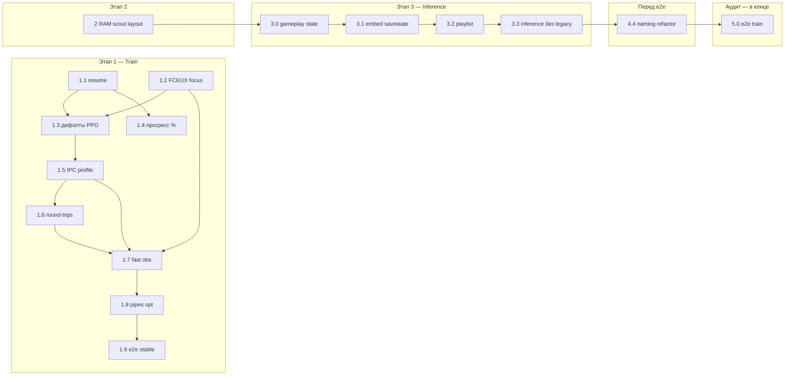

# BACKLOG

Задачи вне текущего спринта. Формат: краткое описание, контекст, критерий готовности, **чеклист сессии**.  
Паттерны кода: [DESIGN.md](DESIGN.md). Гигиена артефактов (уровни 1–3): DESIGN § [Гигиена](DESIGN.md#гигиена-артефактов); уровни 4–6 — этапы [4.1–4.3](#41-smoke-единый-run_smokepy-facade).

### Как пользоваться чеклистом

1. Выберите этап из [таблицы порядка](#порядок-выполнения) (один этап = одно контекстное окно).
2. Откройте секцию `## [X.X] …` ниже — там `### Чеклист сессии` с шагами `- [ ]`.
3. В чат: `@docs/BACKLOG.md` + «проработай [1.2]»; подгрузите файлы из [шпаргалки](#чеклист-шпаргалка).
4. По ходу работы отмечайте `- [x]`; критерии в `### Критерий готовности` — определение «этап закрыт».
5. Этапы с подфазами (напр. **[1.9]**) — чеклист по фазам A→B→C; длинные прогоны только в финальной фазе.
6. **Полный аудит** — см. [ниже](#полный-аудит); **e2e train — только последний шаг** (долгий wall-clock).

**Правило:** задачи внутри этапа — по номеру; между этапами **Train** и **Inference** зависимостей нет (можно вести параллельно). **Phase 0** — только между прогонами train.

**Принцип (разработка):** обратная совместимость со старыми артефактами и split-контрактами **не поддерживаем** — тестовые данные пересобираются; приоритет — прозрачность кода и минимум артефактов. Чистка legacy-веток — в **3.3** (inference/replay) и **4.4** (bridge/RAM/именование).

### Полный аудит

**Цель:** закрыть все открытые этапы BACKLOG и финально подтвердить train end-to-end.

**Правило (обязательно):** любой **e2e train** (`benchmark_train.py`, `train_ppo` на 8 `SubprocVecEnv`, длинный train «первая модель») — **только в конце аудита**, после кода, smoke и pytest. Между правками — tier 0–2 ([1.9](#19-train-стабильность-end-to-end-8-env-reset-ipc)), не полный PPO.


| Шаг   | Этап                                              | Статус | Что проверяем                                                         |
| ----- | ------------------------------------------------- | ------ | --------------------------------------------------------------------- |
| 1     | **[2]** Phase 0 — раскладка scout / `ram_resolve` | done   | миграция путей, smoke `ram_scout` / `build_playthrough` / `smoke_env` |
| 2     | **[3.0]** gameplay save state после intro         | done   | `inference_cp0` = кадр 18, room `0x00`                                |
| 3     | **[3.1]** self-contained FM2                      | done   | ROM + один `.fm2` без внешнего `-loadstate`                           |
| 4     | **[3.2]** playlist self-contained клипы           | done   | embed в плейлисте; чистка split → **3.3**                             |
| 5     | **[3.3]** inference без legacy + `inference_config` | done   | только embedded FM2; `inference_states.py`                          |
| 6     | **[4.4]** рефакторинг: именование и техдолг в коде   | todo   | etalon naming; RAM fallback; IPC v2 — см. [4.4](#44-рефакторинг-именование-и-техдолг-перед-e2e) |
| 7     | **[4.1–4.3]** гигиена (регрессия)                 | done   | `run_smoke.py`, `pytest tests/smoke/` — быстро                        |
| **8** | **[5.0]** финальный e2e train                     | todo   | **последний шаг** — только после **4.4**                              |


Этапы **1.1–1.9**, **4.1–4.3** и закрытые шаги аудита — done; при регрессии в шагах 3.x–4.4 — быстрые smoke/pytest, **не** e2e train.

**Следующий шаг аудита (на 2026-07-10):** **[4.4]** рефакторинг (именование + RAM fallback + IPC v2).

---


## Порядок выполнения


| Этап    | Задача                                               | Приоритет | Зависит от                                                 | Параллельно с                  |
| ------- | ---------------------------------------------------- | --------- | ---------------------------------------------------------- | ------------------------------ |
| **1.1** | Train: сохранение при остановке и автовозобновление  | high      | —                                                          | —                              |
| **1.2** | Train: FCEUX без перехвата фокуса (эксперимент)      | medium    | —                                                          | 3.x                            |
| **1.3** | Train: дефолты PPO под i7-3770                       | medium    | 1.1 (рекомендуется), **1.2 (рекомендуется)**               | 3.x                            |
| **1.4** | Train: прогресс обучения в % в консоли               | low       | 1.1                                                        | 3.x                            |
| **1.5** | Train: FCEUX IPC — профилирование (baseline)         | medium    | **1.3 (рекомендуется)**, 1.2 (рекомендуется)               | 3.x                            |
| **1.6** | Train: FCEUX IPC — round-trips и `load_lock`         | medium    | 1.5                                                        | 3.x                            |
| **1.7** | Train: FCEUX IPC — fast obs (без GD-файла)           | medium    | 1.5, **1.2 (обязательно)**                                 | 3.x                            |
| **1.8** | Train: FCEUX IPC — pipes/shared mem (опц.)           | low       | 1.7                                                        | 3.x                            |
| **1.9** | Train: стабильность e2e (8 env, reset IPC)           | high      | **1.8**, 1.3 (рекомендуется)                               | 3.x                            |
| **2**   | Phase 0: разнести RAM scout и inference-логи         | low       | —                                                          | 3.x (не во время active train) |
| **3.0** | Inference: save state после intro (gameplay start)   | high      | Phase 0 (`reference/clear.fm2`, `human_playthrough.jsonl`) | 1.x, 2                         |
| **3.1** | Inference: self-contained FM2                        | medium    | **3.0 (рекомендуется)**                                    | 1.x, 2                         |
| **3.2** | Playlist и replay: self-contained FM2 клипы          | medium    | 3.1, **3.0 (рекомендуется)**                               | 1.x, 2                         |
| **3.3** | Inference: без legacy replay + убрать `inference_config.py` | low       | 3.1, 3.2                                                   | 1.x, 2                         |
| **4.1** | Smoke: единый `run_smoke.py` (Facade)                | medium    | —                                                          | 1.x, 3.x                       |
| **4.2** | Train: `--smoke` / без `runs/` для коротких прогонов | low       | 1.1 (рекомендуется), **1.9 (рекомендуется — e2e stable)**  | 1.x                            |
| **4.3** | Тесты: pytest smoke + `conftest` cleanup             | low       | 4.1 (рекомендуется)                                        | 1.x, 3.x                       |
| **4.4** | Рефакторинг: именование и техдолг в коде             | medium    | **3.3**; DESIGN § именование                               | — (**перед 5.0**)              |
| **5.0** | **Аудит: финальный e2e train**                       | high      | **3.0–3.3**, **4.4**; 4.3 (рекомендуется)                  | — (**последний шаг аудита**)   |





### Дорожные карты по цели

**Полный аудит (текущая цель):** **[2]** → **3.0** → 3.1 → 3.2 → 3.3 → **[4.4]** → **[5.0] e2e train**. Подробности — [§ Полный аудит](#полный-аудит).

**Длинный train «первая модель»:** после закрытия аудита (**5.0**), не между шагами 2–3.x. Предпосылки train-трека (1.1–1.9) уже выполнены. **Ускорение IPC (1.5–1.8)** — только между прогонами train (меняется `bridge.lua`).

**Throughput train (IPC):** 1.3 → **1.5 (baseline)** → 1.6 (round-trips / `load_lock`) → **1.7 (fast obs)** → 1.8 (опц.). **1.7 только после приёмки 1.2** — obs через `gdscreenshot` при minimize/off-screen. Без 1.5 нельзя честно сравнивать выигрыш; без 1.3 замеры на `n_envs=4` не отражают целевой `load_lock` при 8 env.

**E2E train (wall-clock fps):** bridge benchmark (~21 env-steps/s) ≠ полный PPO на 8 `SubprocVecEnv`. Этап **1.9** закрыт (gate tier 3 был в фазе C). **Повторный e2e train при аудите — только [5.0](#50-аудит-финальный-e2e-train)**, после 2 и 3.x; не после каждой правки. Между шагами аудита — tier 0–2 ([1.9](#19-train-стабильность-end-to-end-8-env-reset-ipc)). Не во время active train (меняется `fceux_bridge.py`).

**Комфортный train на Windows:** 1.2 перед повышением `n_envs` — иначе 8 окон FCEUX усилят перехват фокуса.

**Эфир / inference-демо:** **3.0** → 3.1 → 3.2 → 3.3. **3.0 обязателен до осмысленного inference/плейлиста** (сейчас `inference_cp0` / `cp0` = кадр 1 эталона, intro + ложная смерть по `lives`). Train не блокирует; без эталона (Phase 0) кадр gameplay не определить.

**Чистка репозитория (Phase 0):** этап 2 закрыт; fallback `logs/ram_*` — удалить в **[4.4](#44-рефакторинг-именование-и-техдолг-перед-e2e)**.

---


## Чеклист: шпаргалка

Сводка для старта сессии. Детальные шаги — в `### Чеклист сессии` у соответствующей задачи `[X.X]`.

Один этап за сессию — копируйте в чат **только секцию** `[X.X]` ниже + файлы из таблицы.


| Этап | Файлы (минимум)                                                                                                                                                                              |
| ---- | -------------------------------------------------------------------------------------------------------------------------------------------------------------------------------------------- |
| 1.1  | `src/train/train_ppo.py`                                                                                                                                                                     |
| 1.2  | `src/fceux_bridge.py`, `fceux/lua/bridge.lua`, `scripts/smoke_bridge.py`                                                                                                                     |
| 1.3  | `src/train/train_ppo.py`, `scripts/train_local.sh`                                                                                                                                           |
| 1.4  | `src/train/train_ppo.py`                                                                                                                                                                     |
| 1.5  | `src/fceux_bridge.py`, `fceux/lua/bridge.lua`, `scripts/smoke_env.py` (+ новый `scripts/benchmark_bridge.py`)                                                                                |
| 1.6  | `src/fceux_bridge.py`, `fceux/lua/bridge.lua`, `scripts/smoke_bridge.py`                                                                                                                     |
| 1.7  | `src/fceux_bridge.py`, `fceux/lua/bridge.lua`, `src/env/base_nes_env.py`, `scripts/smoke_env.py`                                                                                             |
| 1.8  | `src/bridge_ipc.py`, `src/fceux_bridge.py`, `fceux/lua/bridge.lua`                                                                                                                           |
| 1.9  | `src/fceux_bridge.py`, `src/env/base_nes_env.py`, `scripts/test_parallel_env.py`, `scripts/benchmark_train.py` (новый), `scripts/smoke_bridge.py`, `scripts/smoke_env.py`, `docs/SCRIPTS.md` |
| 2    | `scripts/ram_scout.py`, `src/ram_map_load.py`, `scripts/build_playthrough.py`                                                                                                                |
| 3.0  | `scripts/build_inference_states.py`, `reference/human_playthrough.jsonl`, `src/inference_states.py`, `src/stream/run_inference.py`                                                           |
| 3.1  | `src/fm2_export.py`, `scripts/export_fm2.py`, `src/stream/run_inference.py`                                                                                                                  |
| 3.2  | `src/achievements/playlist.py`, `scripts/play_inference_fm2.py`, `scripts/build_playlist.py`, `fceux/lua/achievement_overlay.lua`                                                           |
| 3.3  | `src/inference_states.py`, `src/fm2_export.py`, `scripts/play_inference_fm2.py`, `fceux/lua/achievement_overlay.lua`                                                     |
| 4.1  | `scripts/run_smoke.py`, `scripts/smoke_*.py`, `scripts/test_parallel_env.py`, `docs/DESIGN.md`                                                                                               |
| 4.2  | `src/train/train_ppo.py`, `docs/SCRIPTS.md`                                                                                                                                                  |
| 4.3  | `tests/conftest.py`, `tests/smoke/`, `requirements.txt` (pytest)                                                                                                                             |
| 4.4  | `docs/DESIGN.md`, `src/phase0_config.py` → `etalon_build_config.py`, `src/project_paths.py`, `src/bridge_ipc.py`, `src/fceux_bridge.py`, `games/.../phase0.yaml`, `docs/SCRIPTS.md`          |
| 5.0  | `scripts/benchmark_train.py`, `src/train/train_ppo.py`, `docs/SCRIPTS.md` — **только после 4.4**                                                                                             |


**Параллельные треки:** Train (1.x) и Inference (3.x) — параллельно; Phase 0 (2) — не во время active train, параллельно с 3.x OK. **1.5–1.9** меняют bridge/env — не во время active train (как этап 2); 1.5 (benchmark bridge) и **5.0** (e2e train) — только между прогонами train / **в конце аудита**.

---


## [1.1] Train: сохранение при остановке и автовозобновление

**Статус:** done  
**Этап:** 1.1  
**Приоритет:** high  
**Зависит от:** —  
**Файлы:** `src/train/train_ppo.py` (опц. `src/train/checkpointing.py`), `docs/SCRIPTS.md`  
**Контекст в чат:** эта секция + `src/train/train_ppo.py`

### Чеклист сессии

- [x] `finally` / SIGTERM / Ctrl+C → атомарный save `*.tmp.zip` → rename
- [x] (опц.) `checkpoints/latest.zip` на `on_rollout_end`
- [x] `--resume`: `PPO.load`, `reset_num_timesteps=False`, `total_timesteps = target - done`
- [x] BC не повторять при resume
- [x] Sidecar `*.train.json`: `target_timesteps`, `game`, `mission`, `n_envs`, `save_state`
- [x] Несовпадение `n_envs` с sidecar → предупреждение/отказ
- [x] `docs/SCRIPTS.md` — `--resume`, прерывание
- [x] Smoke: Ctrl+C → resume → дотренировать до target


### Контекст

Сейчас `model.save(checkpoint_out)` вызывается только после полного `model.learn()`. Промежуточные чекпоинты — раз в `--save-every` (50k шагов). При Ctrl+C, kill или сбое прогресс теряется. `ML_CONCEPT.md` описывает finetune как `PPO.load` + continue, но автоматики при stop/start нет.

### Задача

1. **Сохранение при любой остановке** — в `finally` (и при `KeyboardInterrupt` / SIGTERM): если `model.num_timesteps > 0`, писать `checkpoint_out` атомарно (`*.tmp.zip` → rename).
2. **Опционально:** callback `on_rollout_end` → `checkpoints/latest.zip` (потеря не больше одной итерации PPO при жёстком kill).
3. **Автовозобновление** — флаг `--resume` (дефолт on или off — на выбор при реализации): если `checkpoint_out` существует, `PPO.load` + `learn(..., reset_num_timesteps=False)` с `total_timesteps = target - model.num_timesteps`.
4. **Не повторять BC** при resume, если веса уже из checkpoint.
5. **Sidecar** `*.train.json` рядом с zip: `target_timesteps`, `game`, `mission`, `n_envs`, `save_state`, timestamps.


### Критерий готовности

- [x] Остановка Ctrl+C сохраняет `.zip` с корректным `num_timesteps`.
- [x] Повторный запуск с `--resume` продолжает обучение до `target_timesteps`, не с нуля.
- [x] Нормальное завершение по-прежнему пишет финальный `checkpoint_out`.
- [x] `docs/SCRIPTS.md` документирует `--resume` и поведение при прерывании.


### Заметки

- При смене `n_envs` между запусками SB3 требует тот же `num_envs` — предупреждение или отказ при несовпадении с sidecar.
- Replay buffer PPO on-policy не сохранять; достаточно весов + `num_timesteps`.
- Блокирует осмысленную реализацию процента в 1.4 (нужен `target_timesteps` и resume).

---


## [1.2] Train: FCEUX без перехвата фокуса (эксперимент)

**Статус:** done  
**Этап:** 1.2  
**Вердикт (2026-07-07):** **принят** — smoke/obs/fps OK; субъективный фокус при 4 env — проверять локально при train.
**Приоритет:** medium  
**Зависит от:** —  
**Блокирует (рекомендуется):** 1.3 (дефолты `n_envs=8`)  
**Файлы:** `src/fceux_bridge.py`, `src/fceux_helpers.py`, `fceux/lua/bridge.lua`, `scripts/smoke_bridge.py`, `scripts/smoke_env.py`, `docs/SCRIPTS.md`  
**Контекст в чат:** эта секция + `src/fceux_bridge.py`, `fceux/lua/bridge.lua`

### Чеклист сессии

- [x] Флаг: `WAIT_FCEUX_NO_FOCUS=1` или `train.yaml`
- [x] Гипотеза A: `STARTUPINFO` + `SW_SHOWMINNOACTIVE` / `SW_MINIMIZE` в `FceuxBridge` (+ `fceux_helpers` при необходимости)
- [x] Гипотеза B (если A мало): Lua `winapi` minimize/off-screen на 1-м кадре
- [x] Гипотеза C (опц.): `-bginput 1`
- [x] `smoke_bridge.py` — PING, RAM, obs OK
- [x] `smoke_env.py --steps 20` — obs `(4,84,84)` не чёрный
- [x] Train-smoke: `--n-envs 4 --timesteps 500 --dummy-vec`
- [x] 4 env подряд: фокус не уходит с IDE/терминала *(A+B; субъективно — при локальном train)*
- [x] FPS train: регрессия ≤10% vs baseline *(~2%)*
- [x] `docs/SCRIPTS.md` — что включено, что не гарантируется
- [x] **Вердикт:** принят → 1.3 (`n_envs=8`) разблокирован


### Контекст

При train `SubprocVecEnv` поднимает несколько `fceux64.exe` (stagger 5 с на rank). `show_window=False` и `CREATE_NO_WINDOW` **не** прячут GUI FCEUX на Windows — окно появляется и может забирать фокус при каждом старте. FCEUX не имеет true headless; кадры идут через `gui.gdscreenshot()` в `bridge.lua`.

**Статус подхода:** эксперимент с критериями приёмки, не гарантированное решение.

### Гипотезы (проверять по порядку, остановиться на первой прошедшей приёмку)


| #   | Подход                                                                                                       | Ожидание                                           |
| --- | ------------------------------------------------------------------------------------------------------------ | -------------------------------------------------- |
| A   | `STARTUPINFO.wShowWindow = SW_SHOWMINNOACTIVE` / `SW_MINIMIZE` в `FceuxBridge.start()` и `run_fceux_movie()` | Окно не активируется при старте                    |
| B   | Lua в `bridge.lua`: `winapi.find_window` → minimize или off-screen на первом кадре                           | Нет мелькания в foreground (или ≤1 с)              |
| C   | Флаг `-bginput 1` в cmdline FCEUX                                                                            | Дополнение к A/B: ввод без фокуса (не лечит старт) |


Не в scope: патч исходников FCEUX, виртуальный рабочий стол вручную.

### Задача

1. Реализовать **один** переключаемый режим (env `WAIT_FCEUX_NO_FOCUS=1` или флаг в `train.yaml`), включающий гипотезу A и при необходимости B.
2. Прогнать smoke на Windows: `smoke_bridge.py`, `smoke_env.py --steps 20`.
3. Прогнать train-smoke: `train_ppo.py --n-envs 4 --timesteps 500 --dummy-vec` (или минимальный прогон) — убедиться, что obs/reward не сломались.
4. Зафиксировать результат в `docs/SCRIPTS.md`: что включено, что не гарантируется.


### Критерии приёмки (эксперимент считается успешным, если все выполнены)

- [x] При запуске **4** env подряд (как при train) фокус **остаётся** в окне, где был до старта (терминал/IDE) — субъективно и/или без всплывания FCEUX на передний план.
- [x] `smoke_bridge` и `smoke_env`: PING, RAM, obs `(4, 84, 84)` без регрессий.
- [x] `gui.gdscreenshot()` / decode obs — не чёрный/пустой кадр при свёрнутом/off-screen окне.
- [x] Нет падения fps train >10% относительно baseline без эксперимента (грубый замер на 1–2 мин).
- [x] Поведение документировано; при провале критериев — явная пометка «не решено», `n_envs=8` (1.3) откладывается или идёт с override.


### Заметки

- **Не трогать** inference-профиль (`headless: false`) и `play_inference_fm2.py` — эксперимент только для train/bridge headless.
- Если A+B не проходят приёмку — зафиксировать в BACKLOG и рассмотреть снижение stagger-нагрузки или отдельный виртуальный дисплей как follow-up.
- Параллельно с этапом 3 (inference) — можно, файлы почти не пересекаются.

---


## [1.3] Train: дефолты PPO под i7-3770 (16 GB ОЗУ)

**Статус:** done  
**Этап:** 1.3  
**Приоритет:** medium  
**Зависит от:** 1.1 (рекомендуется — sidecar фиксирует `n_envs`), **1.2 (рекомендуется — приёмка фокуса перед** `n_envs=8`**)**  
**Файлы:** `src/train/train_ppo.py`, опционально `docs/SCRIPTS.md`  
**Контекст в чат:** эта секция + `src/train/train_ppo.py`, `scripts/train_local.sh`  
**Предусловие:** 1.2 принят или осознанный override на 8 env.

### Чеклист сессии

- [x] `--n-envs` default: **8**
- [x] `--threads` default: **2**
- [x] `train_ppo.py --help` — новые дефолты
- [x] `train_local.sh` без аргументов → `n_envs=8`, `threads=2`
- [x] `docs/SCRIPTS.md` — пример «первая модель»
- [x] Не перезапускать уже идущий train


### Контекст

Сейчас дефолты `--n-envs 4`, `--threads 4`. На целевом железе (i7-3770, 4 ядра / 8 потоков, 16 GB ОЗУ) замеры показали:

- train ~0.5 env-step/с при 4 env; CPU часто простаивает из‑за IPC Python↔FCEUX;
- footprint train ~~500–900 MB — запас по ОЗУ большой (~~10 GB доступно);
- `ML_CONCEPT.md` планирует 4–8 `SubprocVecEnv` и `torch.set_num_threads(4–6)`.


### Задача

Изменить дефолты CLI в `train_ppo.py`:


| Параметр    | Сейчас | Целевое |
| ----------- | ------ | ------- |
| `--n-envs`  | 4      | **8**   |
| `--threads` | 4      | **2**   |


Остальные дефолты (`--n-steps`, `--batch-size`, …) не трогать: при `n_envs=8` буфер `128×8=1024`, `batch_size=256` по-прежнему делится нацело.

### Критерий готовности

- [x] `train_ppo.py --help` показывает новые дефолты.
- [x] `./scripts/train_local.sh` без аргументов стартует с `n_envs=8`, `threads=2`.
- [x] В `docs/SCRIPTS.md` пример «первая модель» согласован с новыми дефолтами (или явно документирован override).


### Заметки

- Не перезапускать уже идущие прогоны — смена дефолтов влияет только на новые запуски.
- Resume с другим `n_envs` (sidecar из 1.1) — отказ или предупреждение, не молчаливый continue.
- Повышение `n_envs` до 8 — после успешной приёмки **1.2** или осознанный override (больше окон FCEUX → сильнее перехват фокуса).
- Если bottleneck останется на `bridge_load_lock` при коротких эпизодах (`ep_len_mean≈2`) — см. **1.5–1.6**, не откат дефолтов.

---


## [1.4] Train: прогресс обучения в процентах в консоли

**Статус:** done  
**Этап:** 1.4  
**Приоритет:** low  
**Зависит от:** 1.1  
**Файлы:** `src/train/train_ppo.py`, опционально `docs/SCRIPTS.md`  
**Контекст в чат:** эта секция + `src/train/train_ppo.py`  
**Предусловие:** 1.1 (resume + `target_timesteps`).

### Чеклист сессии

- [x] SB3 callback: `pct = 100 * num_timesteps / target`
- [x] Формат: `train: 42.3% (211500/500000 steps)`
- [x] Throttling (`\r` или раз в N сек) — не забивать лог
- [x] Resume: % от полного target, не от остатка
- [x] `--progress` (tqdm) не сломан; `--no-progress-pct` (опц.)
- [x] `docs/SCRIPTS.md` — UX по умолчанию


### Контекст

При `model.learn()` сейчас в консоль попадают только стартовая строка (`timesteps=…`) и периодический лог SB3 (`verbose=1`: reward, `ep_len_mean`, fps). Явного **процента** от `target_timesteps` нет. Флаг `--progress` включает progress bar (tqdm+rich), но он opt-in и не даёт простой однострочный «42%» в обычном терминале без rich.

### Задача

Выводить в консоль **прогресс обучения в процентах** при запуске `./scripts/train_local.sh` / `train_ppo.py`:

1. **Callback** (например, на `on_rollout_end` или по интервалу env-steps): `pct = 100 * model.num_timesteps / target_timesteps`, печать в stderr/stdout одной строкой с перезаписью (`\r`) или с редким throttling (раз в N секунд / каждый rollout), чтобы не засорять лог.
2. **Формат** — минимум `train: 42.3% (211500/500000 steps)`; опционально ETA по скользящему fps.
3. **Поведение по умолчанию** — включено без отдельного флага (или `--no-progress-pct` для отключения); не ломать существующий `--progress` (tqdm).
4. При **resume** (1.1) — процент от полного `target_timesteps`, не от оставшегося окна.


### Критерий готовности

- [x] Во время `train_local.sh` / `train_ppo.py` в консоли виден растущий процент до 100%.
- [x] Процент согласован с `model.num_timesteps` и `--timesteps` (или `task.ppo_timesteps`).
- [x] Лог SB3 (`verbose=1`) и чекпоинты по `--save-every` работают как раньше.
- [x] В `docs/SCRIPTS.md` кратко описан вывод (если меняется UX по умолчанию).


### Заметки

- Не требовать tqdm/rich для базового процента — только stdlib + callback SB3.
- Throttling обязателен: при `n_envs=8` (1.3) rollout'ы частые, печать каждого шага забьёт терминал.

---


## [1.5] Train: FCEUX IPC — профилирование (baseline)

**Статус:** done  
**Этап:** 1.5  
**Приоритет:** medium  
**Зависит от:** 1.3 (рекомендуется — замер при целевых `n_envs=8`), 1.2 (рекомендуется — тот же режим minimize, что в train)  
**Блокирует:** 1.6, 1.7  
**Файлы:** `scripts/benchmark_bridge.py` (новый), `src/fceux_bridge.py`, `fceux/lua/bridge.lua`, `scripts/smoke_env.py`, `docs/SCRIPTS.md`  
**Контекст в чат:** эта секция + `src/fceux_bridge.py`, `fceux/lua/bridge.lua`

### Чеклист сессии

- [x] `scripts/benchmark_bridge.py`: замер **step** (N× `bridge.step` + decode obs), **reset** (hot `LOAD`+`GET_OBS` под `bridge_load_lock`), **cold start**
- [x] Режимы: `n_envs=1` и `n_envs=8` (`SubprocVecEnv` или параллельный spawn), `--frame-skip` 4
- [x] Метрики: ms/step, ms/reset, env-steps/s (агрегат), доля времени в IPC poll / obs decode / эмуляция (грубо)
- [x] Зафиксировать baseline в `docs/SCRIPTS.md` или комментарии к benchmark (железо, дата)
- [x] Подтвердить гипотезу: bottleneck — IPC + `gdscreenshot` + файловый obs, не PPO/torch
- [x] При `ep_len_mean≈2`: отдельная строка «reset/step ratio» — нужен ли приоритет 1.6 над 1.7


### Контекст

Сейчас train ~**0.5 env-step/с** при 4 env; CPU простаивает в ожидании Python↔FCEUX. Протокол: файлы `request.json` / `response.json` (`POLL_INTERVAL=0.01`), на каждый step — `gui.gdscreenshot()` → `.gd` ~246 KB → Python grayscale+resize 84×84. Hot reset: глобальный `bridge_load_lock` сериализует `LOAD` + `GET_OBS` между env.

Без baseline нельзя оценить эффект 1.6–1.8 и не регрессировать fps при других изменениях (1.2, 1.3).

### Задача

1. Добавить воспроизводимый benchmark (stdlib + существующий bridge, без правок протокола).
2. Прогнать на целевом железе после **1.3** (или с явным `--n-envs 8` override).
3. Записать цифры «до оптимизаций» и рекомендацию: что делать первым — 1.6 или 1.7.


### Критерий готовности

- [x] `benchmark_bridge.py` запускается одной командой, печатает таблицу метрик.
- [x] Baseline зафиксирован для `n_envs=8`, `frame_skip=4` (или документирован override).
- [x] В backlog/SCRIPTS явно: узкое место step vs reset при типичном `ep_len_mean`.


### Заметки

- **Не менять** протокол IPC в этой задаче — только замеры.
- Параллельно с 1.4 и 3.x OK; с активным long train — только чтение, без правок bridge.
- Turbo/nothrottle уже включён в `bridge.lua` — в отчёте не путать с «ещё не включённым throttle».

---


## [1.6] Train: FCEUX IPC — round-trips и `load_lock`

**Статус:** done  
**Этап:** 1.6  
**Приоритет:** medium  
**Зависит от:** 1.5  
**Блокирует (рекомендуется):** 1.7  
**Файлы:** `src/fceux_bridge.py`, `fceux/lua/bridge.lua`, `scripts/smoke_bridge.py`, `scripts/smoke_env.py`, `docs/SCRIPTS.md`  
**Контекст в чат:** эта секция + `src/fceux_bridge.py`, `fceux/lua/bridge.lua`

### Чеклист сессии

- [x] Команда `LOAD_OBS` (или аналог): один IPC вместо `LOAD` + `GET_OBS` на hot reset
- [x] Обновить `reset_to_state()` — один `request`, без лишнего round-trip
- [x] `POLL_INTERVAL`: снизить до 1–2 ms (замер регрессии на Windows)
- [x] `bridge_load_lock`: scope — один LOAD_OBS (gdscreenshot); глобальный lock сохранён
- [x] `smoke_bridge` + `smoke_env --steps 20` без регрессий
- [x] `benchmark_bridge.py`: прирост ≥10% env-steps/s **или** ≥15% снижение ms/reset *(−21% / −34% ms/reset)*
- [x] `docs/SCRIPTS.md` — изменения протокола (если есть)


### Контекст

Дешёвые оптимизации без смены формата obs: меньше JSON round-trips, меньше latency polling, ослабление сериализации при 8 env. Особенно важно при коротких эпизодах, когда reset доминирует над step.

### Задача

1. Объединить hot reset в одну команду Lua↔Python.
2. Уменьшить overhead polling (измерить до/после).
3. Пересмотреть `bridge_load_lock` — не держать lock на два IPC, если obs в одной команде; исследовать, нужен ли глобальный lock при per-session `ipc_dir`.


### Критерий готовности

- [x] Hot reset — один IPC round-trip (или документировано, почему два неизбежны).
- [x] Benchmark 1.5: измеримый выигрыш на reset и/или суммарный env-steps/s.
- [x] Smoke train: obs `(4,84,84)`, hot reset без рестарта процесса.


### Заметки

- **Не трогать** формат `.gd` / decode — это **1.7**.
- Совместимость: `record_playthrough` / demos, если используют тот же bridge — прогнать smoke.
- Если 1.2 ещё не принят — smoke на видимом окне; после 1.2 — повторить с `WAIT_FCEUX_NO_FOCUS`.

---


## [1.7] Train: FCEUX IPC — fast obs (без GD-файла)

**Статус:** done  
**Этап:** 1.7  
**Приоритет:** medium  
**Зависит от:** 1.5, **1.2 (обязательно — приёмка minimize + не чёрный кадр)**  
**Блокирует (рекомендуется):** 1.8  
**Файлы:** `fceux/lua/bridge.lua`, `src/fceux_bridge.py`, `src/env/base_nes_env.py`, `scripts/smoke_bridge.py`, `scripts/smoke_env.py`, `docs/SCRIPTS.md`  
**Контекст в чат:** эта секция + `fceux/lua/bridge.lua`, `src/fceux_bridge.py`

### Чеклист сессии

- [x] Obs: **raw grayscale 84×84** (или эквивалент) из Lua → файл `obs_*.raw` / inline path; убрать GD 256×240 где возможно
- [x] Downscale/grayscale в Lua **или** минимальный binary без JSON metadata на кадр
- [x] `decode_obs_from_response` — ветка `format: raw`; fallback `gd` для отладки (опц.)
- [x] Убрать лишний `frameadvance` в `capture_obs`, если кадр уже готов после `FRAME_SKIP`
- [x] `smoke_env`: obs не чёрный при **minimize** (критерий 1.2)
- [x] `benchmark_bridge.py`: целевой прирост ≥30% ms/step vs baseline 1.5 *(n=8: −50%; n=1: −16%)*
- [x] Train-smoke: `--n-envs 4 --timesteps 500` — reward/obs OK
- [x] `docs/SCRIPTS.md` + кратко в `ML_CONCEPT.md` (контракт IPC)


### Контекст

Главная стоимость step: `FCEU.setrenderplanes` + `gui.gdscreenshot()` + запись ~246 KB + `cv2.resize` в Python. Цель — один компактный буфер на step и меньше работы на границе Lua↔Python.

### Задача

1. Новый fast path obs для train (профиль `train.yaml` / turbo).
2. Сохранить корректность stack `(4,84,84)` в `BaseNesEnv`.
3. Прогнать приёмку 1.2 (не чёрный кадр при свёрнутом окне).


### Критерий готовности

- [x] Step использует fast obs по умолчанию в train-профиле.
- [x] Benchmark: существенный выигрыш ms/step vs 1.5 baseline.
- [x] Критерии 1.2 по obs не нарушены (если 1.2 принят).
- [x] `smoke_bridge` / `smoke_env` зелёные.


### Заметки

- Inference-профиль (`headless: false`) может остаться на GD до отдельного решения — не ломать `play_inference_fm2` overlay.
- BC/demos: если пересборка `seg_*.npz` зависит от obs pipeline — smoke `record` или документировать re-record.
- **Не начинать** до **1.2**, если minimize — целевой режим train: иначе риск чёрных кадров обнаружится поздно.

---


## [1.8] Train: FCEUX IPC — pipes / shared memory (опционально)

**Статус:** done  
**Этап:** 1.8  
**Приоритет:** low  
**Зависит от:** 1.7 (рекомендуется — сначала исчерпать файловый протокол)  
**Файлы:** `src/bridge_ipc.py`, `src/fceux_bridge.py`, `fceux/lua/bridge.lua`, `scripts/benchmark_bridge.py`, `docs/SCRIPTS.md`  
**Контекст в чат:** эта секция + `src/bridge_ipc.py`, `src/fceux_bridge.py`, `fceux/lua/bridge.lua`

### Чеклист сессии

- [x] Оценка: named pipe / localhost socket vs файлы на Windows (FCEUX Lua `io` ограничения — **нет socket/pipe в std API**)
- [x] PoC: замена `request.json`/`response.json` на `request.v2`/`response.v2` с length-prefix (`WQST`/`WAIT`)
- [x] Obs: inline в response v2 вместо отдельного `obs_*.raw` (не shared mem — file PoC)
- [x] Fallback на v1 (default; env `WAIT_FCEUX_IPC=v1|v2`) — v2 PoC; **удалить код v2 в 4.4** §C
- [x] Benchmark vs post-1.7 baseline — **v2 медленнее**, default остаётся v1
- [x] Документация протокола v2 (`src/bridge_ipc.py`, `SCRIPTS.md`)


### Контекст

После 1.7 останется overhead JSON + fs notify/poll. Имеет смысл только если benchmark показывает, что IPC latency всё ещё ≥15–20% step time.

### Задача

Опциональный транспорт v2; не блокировать train, если 1.7 уже даёт приемлемый fps.

### Критерий готовности

- [x] PoC на Windows + smoke; измеримый выигрыш **или** явное «не делаем» с цифрами в SCRIPTS.
- [x] Train по умолчанию может остаться на v1, если выигрыш <10%.


### Вердикт (2026-07-07)

**Не включаем v2 по умолчанию.** PoC замер: ms/step n=1 **26.7 vs 16.6** (+61%). Код v2 оставлен как reference — **удалить в 4.4** §C (на этапе разработки обратная совместимость не нужна).

### Заметки

- Высокий риск сложности (Lua socket, антивирус, права). Делать **только** при провале целевого fps после 1.7.
- Параллельно с 3.x осторожно: общий `bridge.lua`.

---


## [1.9] Train: стабильность end-to-end (8 env, reset IPC)

**Статус:** done  
**Вердикт (2026-07-09):** e2e gate зелёный — `benchmark_train` + `train_ppo` 8×2048 без crash (после `cleanup_bridge_sessions`); ~**5** env-step/s wall vs ~**0.5** pre-1.x; bridge parallel step-only ~**22** (e2e ~0.21× bridge).  
**Этап:** 1.9  
**Приоритет:** high  
**Зависит от:** **1.8** (закрыт IPC-трек), **1.3 (рекомендуется — дефолт** `n_envs=8`**)**  
**Блокирует (рекомендуется):** длинный train «первая модель», **4.2** (`--smoke` train)  
**Файлы:** `src/fceux_bridge.py`, `src/env/base_nes_env.py`, `scripts/test_parallel_env.py`, `scripts/benchmark_train.py` (новый), `scripts/smoke_bridge.py`, `scripts/smoke_env.py`, `docs/SCRIPTS.md`  
**Контекст в чат:** эта секция + `src/fceux_bridge.py`, `src/env/base_nes_env.py`

### Порядок работы (принято)

Этап делится на **три фазы**. Длинный e2e (PPO + 8 `SubprocVecEnv`) — **один раз в конце**, после всех правок и инфраструктуры.


| Фаза                   | Содержание                                 | Проверка после шага                       |
| ---------------------- | ------------------------------------------ | ----------------------------------------- |
| **A — правки**         | cold path, Windows IPC, `bridge_load_lock` | tier 0–2 (см. ниже)                       |
| **B — инфраструктура** | `benchmark_train.py`, пути `tmp/bench/`    | скрипт запускается; dry-run не обязателен |
| **C — финальный gate** | train-smoke + benchmark + SCRIPTS          | tier 3; закрывает этап                    |


**Не гонять** train-smoke / `benchmark_train` после каждого пункта A — только быстрые smoke между правками.

### Пирамида тестов


| Tier  | Команды                                                                                  | Назначение                  | Когда                 |
| ----- | ---------------------------------------------------------------------------------------- | --------------------------- | --------------------- |
| **0** | `smoke_bridge.py`, `smoke_env.py --steps 20`                                             | PING, RAM, obs, один env    | после каждой правки A |
| **1** | `test_parallel_env.py` — **8 env**, цикл reset→step (расширить скрипт при необходимости) | IPC/lock без PPO/torch      | после п. 2–3 фазы A   |
| **2** | `benchmark_bridge.py --n-envs 8`                                                         | регрессия throughput bridge | опционально после A   |
| **3** | `train_ppo.py --n-envs 8 --timesteps 2048` (без `--dummy-vec`); `benchmark_train.py`     | стабильность + fps e2e      | **только фаза C**     |


`--dummy-vec` **не** считается приёмкой 1.9 — не воспроизводит межпроцессный IPC Windows.

### Чеклист сессии


#### Фаза A — правки (между пунктами — tier 0; после блока — tier 1)

- [x] `reset_to_state` **cold path:** после `start(load_state)` + `cache_state` — `load_obs(key)` вместо `GET_OBS` + `GET_RAM` (лишний round-trip; таймауты на `train_7`)
- [x] **Windows IPC:** `_safe_unlink` best-effort (не fatal); при необходимости — retry read/unlink, без краша worker
- [x] `bridge_load_lock`**:** таймаут/конкуренция при `ep_len≈2` и 8 env — tier 1 (`test_parallel_env` 8 env, несколько reset) без `IPC timeout` / `FCEUX bridge is not running`


#### Фаза B — инфраструктура (без полного e2e)

- [x] `scripts/benchmark_train.py`**:** PPO `learn`, `n_envs=8`, JSON в `tmp/bench/`; флаги `--timesteps` (gate vs fps — см. заметки)
- [x] **Checkpoint path:** абсолютный `tmp/bench/` в benchmark (не `mission/tmp/…`)


#### Фаза C — финальный gate (один прогон после A+B)

- [x] **train-smoke:** `train_ppo.py --n-envs 8 --timesteps 2048` (SubprocVecEnv) — завершается без IPC timeout / worker crash
- [x] `**benchmark_train.py`:** env-steps/s; сравнение с `benchmark_bridge.py` и историческим ~0.5 env-step/s (4 env, pre-1.x)
- [x] `**docs/SCRIPTS.md`:** таблица «bridge vs e2e train fps», % до/после 1.x (с оговоркой методики)
- [x] **Регрессия:** `smoke_bridge` / `smoke_env` / `benchmark_bridge` без регрессии (parallel n=8 — только после cleanup; n=1 OK)


### Контекст

После **1.5–1.8** bridge step-only на 8 proc: **~21–24 env-steps/s** (`benchmark_bridge.py`). Полный **PPO + SubprocVecEnv** на дефолтных **8 env** нестабилен:


| Симптом                                  | Где                                        |
| ---------------------------------------- | ------------------------------------------ |
| `PermissionError` unlink `response.json` | `fceux_bridge.request` (частично смягчено) |
| `IPC timeout GET_RAM`                    | `reset_to_state` cold path после `start`   |
| `FCEUX bridge is not running`            | worker после падения/убийства FCEUX        |
| Прогон обрывается до fps                 | e2e benchmark не завершён                  |


Исторический end-to-end: **~0.5 env-step/s** (4 env, pre-1.x). Честный «% после 1.x» требует стабильного e2e замера на **8 env**.

### Задача

1. Починить reset/hot path под параллельный train (8 env, Windows).
2. Добавить воспроизводимый **e2e benchmark** (не ручной длинный `train_ppo`).
3. Зафиксировать цифры в SCRIPTS: bridge vs train, до/после 1.x.


### Критерий готовности

- [x] Фаза A: tier 0–1 зелёные (без train-smoke между пунктами).
- [x] Train-smoke **8 env × 2048** (фаза C) завершается без IPC timeout / worker crash.
- [x] `benchmark_train.py` печатает env-steps/s; отчёт в `tmp/bench/`.
- [x] В SCRIPTS — «e2e train fps» и % vs ~0.5 (или явная оговорка методики: steady-state vs wall-clock).
- [x] `smoke_bridge` / `smoke_env` / `benchmark_bridge` без регрессии.


### Заметки

- **Не откатывать** дефолты 1.3/1.7/1.8 (v1 IPC, raw obs, 8 env) — чинить стабильность, не throughput bridge.
- **2 (Phase 0)** и **3.x** параллельно OK, если не active train.
- v2 IPC (**1.8**) не использовать в train — out of scope.
- **Короткий e2e для стабильности:** `--timesteps 2048` при `n_steps=128`, `n_envs=8` ≈ 2 rollout'а; при `ep_len≈2` — достаточно reset storm для gate. Меньше 1024 — риск пропустить гонки на втором rollout.
- **Короткий e2e для fps:** wall-clock на 2048 steps **занижен** из‑за stagger 8×5 с (~35 с) и cold start; для цифры в SCRIPTS — steady-state (со 2-го rollout) или `--timesteps 8192` только в фазе C.
- **Короткий checkpoint (**`--resume`**)** не ускоряет приёмку IPC: workers всё равно cold start; для 1.9 — свежая модель + короткие `timesteps`, не готовый `.zip`.
- **Повторный e2e при аудите** — только **[5.0](#50-аудит-финальный-e2e-train)**; tier 3 здесь был одноразовым gate при закрытии 1.9.

---


## [2] Phase 0: разнести RAM scout и inference-логи по каталогам

**Статус:** done  
**Вердикт (2026-07-09):** пути в `project_paths` (`reference/scout/`, `config/ram_resolve.json`); m1 мигрирован. Fallback `logs/ram_*` + `DeprecationWarning` — **временно**; удалить в **[4.4](#44-рефакторинг-именование-и-техдолг-перед-e2e)** §B.  
**Этап:** 2  
**Приоритет:** low  
**Зависит от:** — (не во время active train без fallback)  
**Файлы:** `scripts/ram_scout.py`, `scripts/build_playthrough.py`, `src/ram_map_load.py`, `src/ram_resolve.py`, `games/…/ram_map.md`, `.gitignore`, `docs/SCRIPTS.md`, `docs/ML_CONCEPT.md`  
**Контекст в чат:** эта секция + `scripts/ram_scout.py`, `src/ram_map_load.py`, `scripts/build_playthrough.py`  
**Предусловие:** train остановлен или fallback на старые пути.

### Чеклист сессии

- [x] `reference/scout/` — `ram_scout.jsonl`, `ram_scout_candidates.json`
- [x] `config/ram_resolve.json` — чтение/запись
- [x] `load_ram_addresses` + env без регрессий
- [x] `logs/` — только `YYYYMMDD_*` inference
- [x] M1: миграция файлов; старые `logs/ram_*` удалены после проверки (2026-07-09)
- [x] (временно) deprecation warning на `logs/ram_*` — снять в **4.4** §B
- [x] `.gitignore`, `SCRIPTS.md`, `ML_CONCEPT.md`, `ram_map.md`
- [x] Smoke: `ram_scout`, `build_playthrough`, `smoke_env`


### Контекст

Сейчас в `games/…/missions/…/logs/` смешаны два разных класса артефактов:


| Класс             | Примеры                                                                    | Жизненный цикл                              |
| ----------------- | -------------------------------------------------------------------------- | ------------------------------------------- |
| Inference / эфир  | `YYYYMMDD_attempts.jsonl`, `YYYYMMDD_inference_inputs.jsonl`, FM2-плейлист | retention 4 ч, эфемерные                    |
| Phase 0 RAM scout | `ram_scout.jsonl`, `ram_scout_candidates.json`, `ram_resolve.json`         | одноразовая сборка эталона + runtime-конфиг |


Scout-артефакты — исходники пайплайна обучения (`clear.fm2` → scout → `human_playthrough.jsonl`), а не операционные логи. `ram_resolve.json` дополнительно читается в runtime (`load_ram_addresses`) и по смыслу ближе к `config/routes.yaml`, чем к логам inference.

### Задача

Целевая раскладка:

```
games/…/missions/m1/
├── reference/
│   ├── clear.fm2
│   ├── human_playthrough.jsonl
│   └── scout/
│       ├── ram_scout.jsonl
│       └── ram_scout_candidates.json
├── config/
│   ├── routes.yaml
│   ├── playthrough_manifest.yaml
│   └── ram_resolve.json
├── ram_map.md
└── logs/                          # только inference / эфир
    └── YYYYMMDD_*
```

1. Обновить пути записи/чтения в скриптах и `src/` (см. файлы выше).
2. Перенести существующие файлы m1 вручную или скриптом миграции (без удаления старых до проверки).
3. Обновить ссылки в `ram_map.md`, `.gitignore`, `SCRIPTS.md`, `ML_CONCEPT.md`.
4. ~~Опционально: fallback на старые пути `logs/ram_*`~~ — сделано временно; **удалить в 4.4** §B.


### Критерий готовности

- [x] `ram_scout.py` и `build_playthrough.py` пишут/читают scout-артефакты из `reference/scout/`.
- [x] `ram_resolve.json` лежит в `config/`; `load_ram_addresses` и env работают без регрессий.
- [x] `logs/` содержит только inference-артефакты (`YYYYMMDD_*`); scout-файлы там не создаются.
- [x] Документация и `.gitignore` согласованы с новой схемой.
- [x] M1: файлы перенесены, `ram_scout` / `build_playthrough` / smoke env проходят на новых путях.


### Заметки

- Миграцию между прогонами train; fallback `logs/ram_*` снимается в **4.4** §B.
- `ram_scout.jsonl` и `ram_scout_candidates.json` остаются вне git (как сейчас); `ram_resolve.json` — в git (конфиг миссии).
- Inference-демо и плейлисты **не** переносить — `logs/` для них корректен по `ML_CONCEPT.md`.
- Не конфликтует с этапом 3 (другие файлы и каталоги).

---


## [3.0] Inference: save state после intro (gameplay start)

**Статус:** done  
**Вердикт (2026-07-09):** gameplay start = кадр **18** (room `0x00`, вне intro); `scripts/build_inference_states.py` → `states/inference_cp0.fc0`; manifest `inference.gameplay_start_frame`; `run_inference` default — `inference_cp0`. Heuristics intro/gameplay — `games/rushn_attack/phase0.yaml` (DESIGN §2), интерпретатор `src/phase0_config.py`.  
**Этап:** 3.0  
**Приоритет:** high  
**Зависит от:** **[2]** (рекомендуется — `reference/clear.fm2`, `human_playthrough.jsonl` на целевых путях)  
**Файлы:** `scripts/build_playthrough.py`, `reference/human_playthrough.jsonl`, `src/inference_config.py`, `src/stream/run_inference.py`, `games/…/states/`  
**Контекст в чат:** эта секция + `reference/human_playthrough.jsonl`, `config/playthrough_manifest.yaml`

### Контекст

Сейчас `states/cp0.fc0` / `inference_cp0.fc0` соответствуют **кадру 1 эталона** (`clear.fm2`), а не началу gameplay. Inference и плейлист стартуют с intro и дают ложные срабатывания (напр. по `lives`). Кадр gameplay определяется по эталону Phase 0 (`human_playthrough.jsonl`).

### Чеклист сессии

- [x] Зафиксировать кадр / сегмент «gameplay start» по `human_playthrough.jsonl` (и `playthrough_manifest.yaml`)
- [x] Сгенерировать `states/inference_cp0.fc0` (train `cp0.fc0` не менялся)
- [x] `run_inference.py` / export по умолчанию используют gameplay state для inference
- [x] Smoke: reset с `inference_cp0` — frame 18, lives ≠ 255
- [x] `docs/SCRIPTS.md` + `ML_CONCEPT.md` — отличие train `cp0` vs inference `inference_cp0`
- [x] **Не трогать** `train_ppo.py` / train bridge (env manifest `cp0` — отдельный контракт)


### Критерий готовности

- [x] `inference_cp0` = save state на старте gameplay, не на кадре 1 `clear.fm2`.
- [x] Inference reset без intro-артефактов (lives ≠ 255 на старте).
- [x] Документация описывает, как пересобрать state после смены эталона.


### Заметки

- Блокирует осмысленный **3.1–3.2** (embed state должен быть gameplay, не intro).
- Train env может продолжать использовать `cp0` из manifest — согласовать явно в доке, не ломать resume.

---


## [3.1] Inference: self-contained FM2 (встроенный save state)

**Статус:** done  
**Этап:** 3.1  
**Приоритет:** medium  
**Зависит от:** **3.0 (рекомендуется)**  
**Файлы:** `src/fm2_export.py`, `src/stream/run_inference.py`, `scripts/export_fm2.py`, `tests/test_fm2_export.py`, `docs/SCRIPTS.md`, `docs/ML_CONCEPT.md`  
**Контекст в чат:** эта секция + `src/fm2_export.py`, `scripts/export_fm2.py`, `src/stream/run_inference.py`

### Чеклист сессии

- [x] `embed_savestate` в `fm2_export.py` — `savestate 0x…` + inference GUID (патч GUID эталона в `.fc0`)
- [x] CLI: `--embed-savestate` в `export_fm2.py`; в `run_inference.py` embed по умолчанию, `--no-embed-savestate` для opt-out
- [x] Sidecar: `save_state` опционален если embedded
- [x] FCEUX: Load ROM → Play Movie без `-loadstate`
- [x] Нет `length` в заголовке (не FM3)
- [x] Замер размера/времени экспорта на `inference_cp0.fc0` (~195 KB, < 2 с; `tests/test_fm2_export.py`)
- [x] `docs/SCRIPTS.md` + `ML_CONCEPT.md`
- [x] **Не трогать** `train_ppo.py` / train bridge


### Контекст

Раньше демо inference требовало несколько артефактов: `.fm2` (только input), `.overlay.json` (save_state + achievements), внешний `states/inference_cp*.fc0`, плюс `play_inference_fm2.py` для staging и `-loadstate`. С 3.1 inference-клип с embedded savestate открывается в FCEUX как **ROM + один** `.fm2` (Load ROM → Play Movie).

Формат FM2 (FCEUX) поддерживает ключ `savestate` — hex-blob FCS в заголовке; при его наличии movie стартует не с power-on. ROM по-прежнему отдельный (`romFilename` / `romChecksum` в заголовке).

### Задача

1. `embed_savestate` **в** `fm2_export.py` — читать `.fc0`, писать строку `savestate 0x…` в заголовок рядом с `guid` (inference GUID из `inference_config.INFERENCE_FM2_GUID`). Метаданные эпизода — в `comment` / `subtitle` (опц.), не дублировать в sidecar то, что уже в FM2.
2. **CLI** — `export_fm2.py`: `--embed-savestate` (opt-in); `run_inference.py`: embed по умолчанию при `--save-episode-fm2` / `--export-fm2`, opt-out через `--no-embed-savestate`.
3. **Sidecar** — `.overlay.json` оставить для achievement-overlay (Lua); поле `save_state` в sidecar становится опциональным, если state вшит.
4. **Документация** — в `SCRIPTS.md`: «открыть в FCEUX: ROM + один `.fm2`», без `cp0.fc0` для inference-клипов.
5. ~~**Убрать bootstrap-артефакты**~~ — сделано: `reference/inference_bootstrap.fm2`, `bootstrap_fm2` в конфиге, `scripts/bootstrap_inference_states.py`, `bootstrap_inference_save.lua`, `write_bootstrap_fm2()`. На train не влияет.


### Критерий готовности

- [x] Экспортированный FM2 воспроизводится в FCEUX (Load ROM → Play Movie) **без** отдельного `-loadstate` и без `play_inference_fm2.py`.
- [x] `guid` в FM2 совпадает с GUID вшитого save state; `length` по-прежнему не пишется (не FM3).
- [x] Размер и время экспорта приемлемы (замер на `inference_cp0.fc0`).
- [x] `docs/SCRIPTS.md` описывает новый поток и отличие от эталона `reference/clear.fm2`.
- [x] Bootstrap-скрипт и `reference/inference_bootstrap.fm2` удалены; GUID-bound replay — через embed `savestate`.


### Заметки

- Save state привязан к `emuVersion` FCEUX — использовать ту же portable-сборку, что при записи `cp*.fc0`.
- Achievement-overlay (трофеи) остаётся вне FM2; `comment` / `subtitle` в заголовке — опционально, не делали.
- **Не трогать** `train_ppo.py` и bridge train-сессий — задача только inference/export.
- Split-compat в `play_inference_fm2` / плейлисте — снять в **3.3**.
- Блокирует 3.2 и 3.3 (playlist и удаление `inference_config` опираются на embed).

---


## [3.2] Playlist и replay: self-contained FM2 клипы

**Статус:** done  
**Вердикт (2026-07-10):** embed в плейлисте и replay без `-loadstate` для embedded FM2; `save_state: null` в manifest. **Split-ветки оставлены временно** — полная чистка в **3.3** (без обратной совместимости).  
**Этап:** 3.2  
**Приоритет:** medium  
**Зависит от:** 3.1  
**Файлы:** `src/achievements/playlist.py`, `scripts/play_inference_fm2.py`, `scripts/build_playlist.py`, `tests/test_playlist_embed.py`, `docs/SCRIPTS.md`  
**Контекст в чат:** эта секция + `src/achievements/playlist.py`, `scripts/play_inference_fm2.py`, `scripts/build_playlist.py`  
**Предусловие:** 3.1 готов.

### Чеклист сессии

- [x] `build_playlist` — клипы с embedded `savestate`; on-demand `export_fm2` с embed
- [x] `play_inference_fm2.py` — без `-loadstate` если `savestate` в FM2
- [x] Manifest: `save_state: null` для embedded клипов
- [x] `docs/SCRIPTS.md` — состав клипа плейлиста
- [ ] ~~обратная совместимость split~~ — **не делаем**; снять в **3.3**

### Контекст

Плейлист: FM2-копии по номинациям, `.overlay.json`, `YYYYMMDD_playlist.json`. После 3.1 episode-FM2 self-contained; без доработки плейлист оставался на split-схеме (внешний `.fc0`, двойной loadstate).

**Целевое разделение (финал — в 3.3):**

| Слой | Артефакт | Кто читает |
| ---- | -------- | ---------- |
| Replay | `.fm2` (embedded `savestate`) | FCEUX `-playmovie` |
| Achievements | `.overlay.json` (без `save_state`) | Lua overlay |
| Порядок эфира | `playlist.json` + `.play.cmd` | только Python |

### Задача (выполнено в 3.2)

1. `build_playlist` — embedded `savestate` в `logs/YYYYMMDD_{idx}_{slug}_{seq}.fm2`.
2. `play_inference_fm2.py` — пропуск `-loadstate` при embedded FM2.
3. Manifest — `save_state: null` для embedded клипов.

### Критерий готовности

- [x] Плейлист из self-contained клипов проигрывается без ошибок GUID/loadstate.
- [x] `docs/SCRIPTS.md`: клип = fm2 + overlay.

### Заметки

- Один клип для эфира: `.fm2` + `.overlay.json`; ROM — общий в staging.
- Номинации и `config/achievements.yaml` не меняются.
- Остаток без split-compat, чистый overlay, единый Lua — **3.3**.
- Блокирует 3.3.

---


## [3.3] Inference: без legacy replay + убрать `inference_config.py`

**Статус:** done  
**Вердикт (2026-07-10):** только embedded FM2; `inference_config.py` удалён; helpers в `inference_states.py`; один Lua overlay.  
**Этап:** 3.3  
**Приоритет:** low  
**Зависит от:** 3.1, 3.2  
**Файлы:** `src/inference_config.py` (удалить), `src/fm2_export.py`, `src/stream/run_inference.py`, `scripts/play_inference_fm2.py`, `scripts/export_fm2.py`, `src/achievements/playlist.py`, `fceux/lua/achievement_overlay.lua`, `docs/SCRIPTS.md`  
**Контекст в чат:** эта секция + `src/inference_config.py`, `src/fm2_export.py`, `scripts/play_inference_fm2.py`  
**Предусловие:** 3.1 и 3.2 готовы.

**Принцип:** без обратной совместимости со split-клипами (fm2 + внешний `.fc0`). FM2 без embedded `savestate` → ошибка, не fallback.

### Чеклист сессии

- [x] `INFERENCE_FM2_GUID` → `fm2_export.py`
- [x] `resolve_inference_save_state` → удалён; `resolve_inference_reset_state` в `inference_states.py`
- [x] `play_inference_fm2.py` — только embedded; без split/loadstate
- [x] `playlist.py` — overlay/manifest без `save_state`
- [x] `fm2_export.py` — sidecar без `save_state`; export всегда embed
- [x] Убран `--no-embed-savestate`; `export_fm2.py` — embed по умолчанию
- [x] Lua — `achievement_overlay.lua` + `WAIT_BLOCK_LABEL`; `achievement_playlist.lua` удалён
- [x] Удалён `src/inference_config.py`
- [x] `grep inference_config` — только BACKLOG/git
- [x] Train/env не затронуты
- [x] `docs/SCRIPTS.md`

### Контекст

`src/inference_config.py` — обёртка после удаления `config/inference.yaml`. Содержит GUID, `resolve_inference_save_state()` (в т.ч. fallback на train `cp0`), helpers для `build_inference_states`.

После 3.2 в коде остались split-ветки: sidecar/manifest с `save_state`, два Lua-скрипта, opt-out embed. Цель 3.3 — один контракт: **embedded FM2 + чистый overlay**.

| Символ | Сейчас | Действие |
| ------ | ------ | -------- |
| `INFERENCE_FM2_GUID` | `inference_config` | → `fm2_export.py` |
| `resolve_inference_save_state()` | replay/export/playlist | удалить |
| `gameplay_start_frame()` | `build_inference_states` | оставить (перенести в manifest helper) |
| `inference_save_state_for()` | `build_inference_states` | оставить |

### Задача

1. GUID → константа в `fm2_export.py`.
2. Replay/export — только self-contained FM2; внешний state не резолвить.
3. Overlay/manifest — achievements only; `block_label` в manifest.
4. Lua — один скрипт; manifest не парсится в Lua.
5. Удалить `inference_config.py`; обновить импорты и тесты.

### Критерий готовности

- [x] `src/inference_config.py` удалён; `grep inference_config` — только git/BACKLOG.
- [x] Плейлист и single FM2 replay без `-loadstate` и без `.fc0` в staging.
- [x] `.overlay.json` и manifest без `save_state`.
- [x] Один Lua overlay; `achievement_playlist.lua` удалён.
- [x] Train / `train_ppo.py` / env не затронуты.
- [x] `docs/SCRIPTS.md` обновлён.

### Заметки

- Train env по-прежнему читает `states/cp0.fc0` из manifest — отдельный контракт, не трогать.
- «Голый» FM2 без Lua — replay OK, трофеев нет (ожидаемо).
- Не плодить новый конфиг для GUID.

---


## [4.1] Smoke: единый `run_smoke.py` (Facade)

**Статус:** done  
**Этап:** 4.1  
**Приоритет:** medium  
**Зависит от:** — (уровни 1–3 гигиены — в DESIGN.md / `project_paths`)  
**Файлы:** новый `scripts/run_smoke.py`, существующие `scripts/smoke_*.py`, `scripts/test_parallel_env.py`  
**Контекст в чат:** эта секция + [DESIGN.md § Гигиена](DESIGN.md#гигиена-артефактов)

### Контекст

Уровни 1–3: политика, `artifact_quarantine_dir`, `.gitignore`. Остаётся разрозненный запуск smoke агентом.

### Чеклист сессии

- [x] `scripts/run_smoke.py --suite bridge,env,parallel` — subprocess на существующие скрипты
- [x] `try/finally`: `cleanup_bridge_sessions`, `cleanup_artifact_quarantine("smoke")`
- [x] exit code 0/1; документация в `SCRIPTS.md`
- [x] В DESIGN / cursor rule: «после правок — `run_smoke.py`»


### Критерий готовности

- [x] Один entry point для smoke; агент не вызывает `train_ppo` для проверки env/bridge.

---


## [4.2] Train: `--smoke` и контроль `checkpoints/runs/`

**Статус:** done  
**Этап:** 4.2  
**Приоритет:** low  
**Зависит от:** 1.1 (рекомендуется — не ломать resume), **1.9 (рекомендуется — стабильный train-smoke на 8 env)**  
**Файлы:** `src/train/train_ppo.py`, `docs/SCRIPTS.md`

### Контекст

Короткий `train_ppo` с `--checkpoint-out checkpoints/smoke_*.zip` создаёт мусор в `games/` и `runs/`. Даже с гигиеной агент может ошибиться.

### Чеклист сессии

- [x] `--smoke`: checkpoint только в `tmp/smoke/<session>/`, autodelete в `finally`
- [x] (опц.) `--no-intermediate-checkpoints` — без `CheckpointCallback` / `runs/`
- [x] `SCRIPTS.md`: отладка train — `--smoke` или явный `tmp/`, не `smoke_*` в missions


### Критерий готовности

- [x] Короткий прогон train не оставляет файлов в `games/.../checkpoints/` без явного `--checkpoint-out`.

---


## [4.3] Тесты: pytest smoke + conftest cleanup

**Статус:** done  
**Этап:** 4.3  
**Приоритет:** low  
**Зависит от:** 4.1 (рекомендуется)  
**Файлы:** `tests/conftest.py`, `tests/smoke/`, `requirements.txt`

### Контекст

Smoke-скрипты не дают autouse cleanup и CI exit code из коробки.

### Чеклист сессии

- [x] `pytest` в `requirements.txt` (dev) или optional extra
- [x] `conftest`: fixture `mission_m1`, autouse bridge cleanup, `tmp_path` для артефактов
- [x] `@pytest.mark.requires_fceux` на integration smoke
- [x] `pytest tests/smoke/` эквивалентен 4.1 по покрытию


### Критерий готовности

- [x] `pytest tests/smoke/` проходит локально; после прогона нет stray `smoke_*` в games.

---


## [4.4] Рефакторинг: именование и техдолг в коде (перед e2e)

**Статус:** todo  
**Этап:** 4.4  
**Приоритет:** medium  
**Зависит от:** **3.3** (рекомендуется — после стабилизации inference API); DESIGN § [Именование в коде](DESIGN.md#2-игровая-логика--strategy-в-yaml)  
**Блокирует:** **[5.0]** (e2e train — только после этого этапа)  
**Файлы:** см. чеклист; ориентир — `grep` по `phase0`, `Phase 0`, `logs/ram_`, `ipc_transport.*v2`, `request.v2`  
**Контекст в чат:** эта секция + `docs/DESIGN.md`

### Контекст

Roadmap ML («Phase 0», «Phase 1»…) — документация планирования (`ML_CONCEPT.md`).  
Идентификаторы в коде должны отражать **предметную область** (эталон, playthrough, inference).  
Дополнительно: после этапа **[2]** остались legacy-fallback'и (RAM paths, IPC v2 PoC) — на этапе разработки обратная совместимость не нужна; удалить для прозрачности.

### Чеклист сессии

#### A — именование эталона

- [x] `phase0_config.py` → `etalon_build_config.py`; функции `load_etalon_build_config`, `*_from_etalon_build`
- [x] `games/<game>/phase0.yaml` → `etalon_build.yaml`; `game.yaml`: `etalon_build_config`
- [x] Параметры/переменные `phase0` → `etalon_build` в `playthrough_build.py`, скриптах, тестах
- [x] Docstrings и комментарии в `src/`, `scripts/`, `tests/` — без номеров фаз roadmap
- [x] Шаблон `ram_map.md` / `ram_resolve.py` — «сборка эталона», не «Phase 0»
- [x] `docs/SCRIPTS.md`: секция «Эталон и RAM» вместо «Phase 0 — данные и RAM»
- [x] `log_utils.py` → `jsonl_logs.py`; `fceux_helpers.py` → `fceux_launch.py`
- [x] Переменные `data`/`doc`/`meta`/`cfg` → доменные имена (кроме Gymnasium `info`, npz-ключ `meta`, wire `data: bytes`)
- [x] `grep -riE 'phase0|Phase [0-9]' src scripts tests games fceux` — пусто

#### B — RAM scout: убрать fallback `logs/ram_*` (этап 2, миграция done)

- [x] `project_paths` — только `ram_scout_jsonl_path` / `ram_resolve_path`; без `resolve_*`, `DeprecationWarning` и `tuple[Path, bool]`
- [x] Упростить вызовы в `build_playthrough.py`, `ram_map_load.py` (убрать `_legacy`)
- [x] `docs/SCRIPTS.md` — без упоминания fallback на `logs/ram_*`

#### C — Bridge IPC v2: удалить PoC (вердикт 1.8 — не включаем)

- [ ] Удалить v2-транспорт: `bridge_ipc.py` (encode/decode v2), ветки `request.v2`/`response.v2` в `fceux_bridge.py` и `bridge.lua`
- [ ] Убрать `WAIT_FCEUX_IPC=v2`, `ipc_transport: v2` из профилей/доков; оставить только v1 JSON files
- [ ] `benchmark_bridge.py` — без флага `--ipc v2` (если есть)
- [ ] `docs/SCRIPTS.md` — убрать секцию IPC v2 PoC или свернуть в историю 1.8

#### D — smoke

- [ ] Быстрые тесты: `pytest tests/test_gameplay_start.py`, `smoke_bridge`, `smoke_env` (без e2e train)
- [ ] Длинные прогоны (`pytest tests/smoke/`, `benchmark_train`) — **не здесь**; только в **[5.0]**

### Критерий готовности

- [ ] DESIGN § именование соблюдено в коде и конфигах плагина.
- [ ] Нет идентификаторов `phaseN_*` / `phaseN.yaml` в коде и `games/`.
- [x] Нет fallback на `logs/ram_scout.jsonl` / `logs/ram_resolve.json` в runtime.
- [ ] Нет IPC v2 в коде и профилях (только v1).
- [ ] Inference / playthrough / train smoke (tier 0–2) без регрессий.
- [ ] **[5.0]** разблокирован.

### Заметки

- `ML_CONCEPT.md` §11 roadmap **не переименовывать** — там «Phase N» уместен как план.
- BACKLOG-секции `[2] Phase 0` — исторические названия задач; не путать с именами в коде.
- Награды по умолчанию в `write_routes_yaml` — отдельный кандидат на вынос в YAML (не блокер 4.4).
- **Не трогать:** train `obs_format: raw` vs inference `gd` — разные профили, не legacy-compat.
- **Не трогать:** `decode_obs` ветка `format: gd` для inference-профиля — не то же самое, что IPC v2.

---


## [5.0] Аудит: финальный e2e train

**Статус:** todo  
**Этап:** 5.0  
**Приоритет:** high  
**Зависит от:** **[3.0]–[3.3]**, **[4.4]**; **4.3** (рекомендуется — pytest smoke перед длинным прогоном)  
**Файлы:** `scripts/benchmark_train.py`, `src/train/train_ppo.py`, `docs/SCRIPTS.md`  
**Контекст в чат:** эта секция + [§ Полный аудит](#полный-аудит)

### Правило

**Последний шаг полного аудита.** Не запускать e2e train до закрытия **3.0–3.3** и **[4.4]**. Между правками — tier 0–2, не PPO.

### Чеклист сессии

- [ ] Предусловие: **3.0–3.3** и **[4.4]** закрыты
- [ ] `pytest tests/smoke/` и `run_smoke.py` — зелёные (регрессия 4.x)
- [ ] `cleanup_bridge_sessions` перед e2e
- [ ] **Gate (tier 3):** `train_ppo.py --n-envs 8 --timesteps 2048` (SubprocVecEnv, без `--dummy-vec`) — без IPC timeout / worker crash
- [ ] `benchmark_train.py` — env-steps/s, отчёт в `tmp/bench/`; сравнение с `benchmark_bridge.py`
- [ ] (опц.) Длинный train «первая модель» по `SCRIPTS.md` — только после зелёного gate
- [ ] `cleanup_artifact_quarantine("bench")`; нет stray `smoke_*` в `games/.../checkpoints/`


### Критерий готовности

- [ ] E2e gate 8 env × 2048 завершается стабильно; цифры fps зафиксированы или без регрессии к вердикту 1.9.
- [ ] (опц.) Первая полноценная модель обучена; checkpoint в `games/.../checkpoints/` (не `tmp/`).
- [ ] После прогона — гигиена артефактов (bench/smoke quarantine, bridge cleanup).