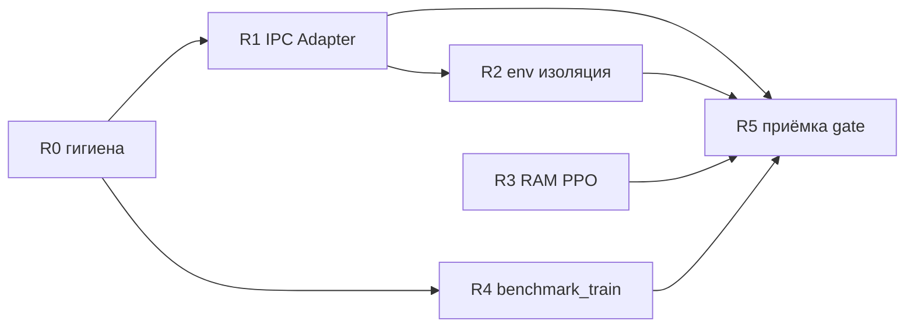

# ISSUE_FALL — провал e2e gate [5.0]

**Дата сессии:** 2026-07-10 (отчёт); stress-диагностика — 2026-07-13  
**Этап BACKLOG:** [5.0] Аудит: финальный e2e train  
**Ветка:** `main` (после merge [4.4], commit `dabb7af`)  
**Статус [5.0]:** закрыт 2026-07-13 (R5); документ фиксирует инцидент, диагностику и план устранения

**Скрипт stress:** [`scripts/stress_e2e_gate.py`](../scripts/stress_e2e_gate.py)  
**CLI-справка:** [SCRIPTS.md](SCRIPTS.md) § Parallel IPC stress / E2E gate stress

---

## Цель прогона

Повторная приёмка end-to-end train после закрытия этапов 3.0–3.3 и [4.4]:

- **Gate (tier 3):** `benchmark_train.py --mode gate` — 8 `SubprocVecEnv`, 2048 timesteps (~2 rollout'а при `n_steps=128`)
- альтернативно: `src/train/train_ppo.py --n-envs 8 --timesteps 2048`
- сравнение fps с эталоном 1.9 (~5.0 env-steps/s wall) и bridge parallel (~22 env-steps/s)

Предусловия регрессии (smoke, pytest) в начале сессии выполнены успешно.

---

## Среда

| Параметр | Значение |
| -------- | -------- |
| CPU | Intel i7-3770 |
| ОС | Windows 10 19045 |
| Python | 3.14.0 |
| `n_envs` | 8 (gate), 4 (диагностика) |
| `frame_skip` | 4 |
| `save_state` | `states/cp0.fc0` |
| `ep_len_mean` (при успешном rollout) | ≈2 |

---

## Что прошло успешно (контраст)

Эти прогоны завершились без IPC timeout и без падения workers:

| Прогон | Результат |
| ------ | --------- |
| `run_smoke.py` + `pytest tests/smoke/` | OK |
| `benchmark_bridge.py --n-envs 1` | OK (~67.8 env-steps/s) |
| `test_parallel_env.py --n-envs 8 --cycles 30` | OK, 121.8 s |
| `test_parallel_env.py --n-envs 8 --cycles 128 --reset-every 0` | OK, 442.9 s, 512 auto-reset |
| `benchmark_train.py --timesteps 256` (1 rollout) | OK, **4.78 env-steps/s**, wall 214.3 s |

Успешный короткий e2e: `ep_len_mean=2`, `ep_rew_mean=-40`, SB3 `fps=5` — метрики согласуются с вердиктом 1.9 по порядку величины.

**Вывод по контрасту:** IPC, `bridge_load_lock`, 8 параллельных FCEUX и reset storm **могут** работать без PPO gate. Падения воспроизводятся на полном gate (2048 timesteps / 2 rollout'а) и накопляются при серии повторных попыток.

---

## Что не прошло

### Gate `benchmark_train.py --mode gate` (основной сценарий [5.0])

Многократные запуски с `cleanup_bridge_sessions('train_')` перед стартом. **Ни один gate 2048 не завершился успешно** (в сессии 2026-07-10).

| Попытка | Worker | Ошибка | Wall до падения / зависания |
| ------- | ------ | ------ | --------------------------- |
| 1 | SpawnProcess-5 | `IPC timeout for STEP (30.0s)` | ~628 s |
| 2 | SpawnProcess-5 | `IPC timeout for STEP (30.0s)` | ~921 s |
| 3 | SpawnProcess-2 | `IPC timeout for STEP (30.0s)` | ~625 s (n_envs=4) |
| 4 | SpawnProcess-3 | `IPC timeout for STEP (30.0s)` → каскад `BrokenPipeError` | ~4003 s (~67 min) |
| 5 | SpawnProcess-5 | `IPC timeout for STEP (30.0s)` → каскад `BrokenPipeError` | ~7951 s (~2.2 h) |

### Gate через `train_ppo.py`

```
src/train/train_ppo.py --n-envs 8 --timesteps 2048
```

Прогон ~43 min, завершился с `exit_code=1`. В логе — многократные:

```
OpenBLAS error: Memory allocation still failed after 10 retries, giving up.
```

### `benchmark_bridge.py --n-envs 8`

Ранняя в сессии попытка (до серии gate) — `IPC timeout for STEP` на rank 4. Полный отчёт parallel n=8 в `tmp/bench/` не получен.

---

## Таксономия ошибок

Все падения gate укладываются в четыре наблюдаемых класса (иногда в одной сессии — несколько подряд):

### 1. IPC timeout на STEP

```
fceux_bridge.FceuxBridgeError: IPC timeout for STEP (30.0s)
```

Цепочка: `SubprocVecEnv` worker → `Monitor` → `CheckpointRewardWrapper` → `BaseNesEnv.step` → `FceuxBridge.request("STEP")` → таймаут `DEFAULT_TIMEOUT` (30 s).

Падает **один** worker (rank меняется: 2, 3, 4, 5, 7 — не привязан жёстко к номеру env).

### 2. Смерть процесса FCEUX

В отдельных попытках (не во всех логах):

```
FceuxBridgeError: FCEUX bridge is not running
FceuxBridgeError: FCEUX exited during STEP (code 4294967295)
```

`4294967295` = unsigned представление `-1` на Windows.

### 3. Каскад SubprocVecEnv

После падения первого worker'а остальные получают:

```
BrokenPipeError: [WinError 109] Канал был закрыт
EOFError
```

в `remote.send` / `remote.recv` — родительский процесс PPO теряет связь со всеми workers.

### 4. Исчерпание памяти (OpenBLAS)

При gate через `train_ppo.py` — ошибки аллокации в OpenBLAS на фоне 8 FCEUX + 8 worker-процессов + PPO на CPU.

---

## Причины (наблюдаемые, без интерпретации «как чинить»)

### A. Fail-fast на уровне env

`BaseNesEnv.step` не перехватывает `FceuxBridgeError`. Любой IPC timeout или смерть FCEUX **убивает worker** `SubprocVecEnv`. SB3 не изолирует сбой одного env — падает весь `VecEnv`, затем `model.learn()`.

### B. Таймаут STEP фиксирован (30 s)

При нагрузке (8 env, reset storm при `ep_len≈2`, cold start со stagger 5 s × rank) один STEP может не получить `response.json` за 30 s. Это трактуется как фатальная ошибка, а не как задержка.

### C. Неполный жизненный цикл при аварийном завершении

`cleanup_bridge_sessions()` вызывается в `finally` у `benchmark_train` и `train_ppo`, **но только если родительский Python доходит до `finally`**.

При зависании родителя на `pipe.recv()` (ожидание мёртвого worker'а) cleanup **не выполняется**. После принудительного обрыва сессии в системе оставалось до **8 процессов `fceux64.exe`** на каждую неудачную попытку gate.

`kill_orphan_fceux_bridge()` фильтрует по `CommandLine -like '*bridge.lua*'` — не гарантирует снятие всех зависших FCEUX и не затрагивает зависшие `python` (родитель train/benchmark).

### D. Накопительный эффект серии прогонов

В одной сессии подряд выполнялись: несколько gate, диагностика n=4, parallel stress 128 cycles (~443 s), короткий benchmark (OK), снова gate, `train_ppo` gate.

Каждый неуспешный gate оставлял orphan-процессы. Следующий прогон стартовал при уже занятой RAM и конкурирующих FCEUX — частота OpenBLAS OOM и IPC timeout **росла от попытки к попытке**.

### E. Различие «1 rollout» vs «2 rollout'а»

Единственный стабильно успешный PPO-прогон в сессии — **1 rollout** (1024 env-steps при target 256). Gate 2048 требует **2 rollout'а** (сбор данных → PPO update → повторный сбор). Все падения gate происходили на полном сценарии; однократный rollout воспроизводил эталонные метрики.

### F. benchmark_train слабее train_ppo по прерыванию

`benchmark_train.py` не использует `InterruptHandler` (Ctrl+C / SIGTERM). При зависании родителя восстановление и сохранение промежуточного состояния недоступны — процесс может висеть часами (зафиксировано: 67 min и 2.2 h до `exit_code=1`).

---

## Следствия

### Непосредственные

- **[5.0] не закрыт** (на момент сессии 2026-07-10): критерий «gate 8 env × 2048 без IPC timeout / worker crash» не выполнен.
- **`docs/MEASUREMENTS.md` колонка 5.0** не заполнена для gate/fps (заполнена после R5, 2026-07-13).
- **`tmp/bench/train_e2e_gate/`** — нет валидного `train_report.json` от успешного gate (на момент инцидента).
- **`benchmark_bridge` parallel n=8** — не зафиксирован в сессии.

### Каскадные (в рамках сессии)

1. Worker N падает по IPC → весь `SubprocVecEnv` рвётся.
2. Родитель либо падает с `EOFError`, либо **зависает** в ожидании workers.
3. FCEUX дочерние процессы остаются в системе.
4. Следующий `cleanup_bridge_sessions` перед новым gate снимает часть, но не всё.
5. RAM истощается → OpenBLAS OOM при PPO update.
6. Следующие gate **падают быстрее и чаще**, даже если tier-1 parallel stress без PPO проходит.

### Отличие от вердикта 1.9 (2026-07-09)

Этап 1.9 был закрыт с формулировкой: gate зелёный **после `cleanup_bridge_sessions`**, ~5 env-steps/s. В сессии [5.0] при том же кодовом базисе (post-4.4) gate **не воспроизводится стабильно** в условиях серии прогонов и накопленных orphan-процессов. Короткий одно-rollout замер регрессии по fps **не показывает**.

---

## Хронология сессии (сжато)

```
smoke / pytest / bridge n=1     → OK
benchmark_bridge n=8            → IPC timeout (ранняя попытка)
gate × N (benchmark_train)      → IPC timeout, каскады, зависания 1–2 h
parallel 8×30, 8×128            → OK
benchmark_train timesteps=256   → OK (4.78 env-steps/s, 1 rollout)
gate / train_ppo 2048           → IPC timeout / OpenBLAS OOM
```

---

## Итог (инцидент 2026-07-10)

Провал [5.0] в данной сессии — **нестабильное завершение gate tier 3**, а не отказ всей train-инфраструктуры. Smoke, parallel IPC stress и однократный PPO rollout работают.

Постоянные падения в процессе выполнения скрипта вызваны сочетанием:

1. **мгновенной смерти worker'а** при любом сбое FCEUX IPC (fail-fast без изоляции);
2. **зависания или долгого ожидания родителя** после первого упавшего worker'а;
3. **неполного автоматического снятия процессов** при аварийных путях;
4. **накопления orphan FCEUX и нехватки RAM** при повторных gate в одной сессии;
5. **разрыва между устойчивостью 1 rollout и gate на 2 rollout'а**.

Отчёт фиксирует наблюдаемые причины и следствия. **План устранения** — § [Стрессовый smoke](#стрессовый-smoke--диагностика), [Stress-тестирование](#stress-тестирование-2026-07-13) и [План работ](#план-работ-по-устранению).

---

## Стрессовый smoke — диагностика

Стрессовый smoke воспроизводит **тонкие места gate** без полного `benchmark_train.py --mode gate` (~20+ мин и нестабилен на загрязнённой машине).

### Назначение

Пять фаз повторяют слабые места из отчёта о провале:

| Фаза | Что ловит |
|------|-----------|
| **bridge_parallel** | 8 FCEUX, только STEP (падение `benchmark_bridge n=8`) |
| **vec_rollout_1** | SubprocVecEnv, ~1 rollout reset storm при `ep_len≈2` |
| **ppo_spike** | Пик CPU/RAM как PPO update (родитель, без vec) |
| **ppo_spike_with_vec** | То же при живом SubprocVecEnv / 8 FCEUX (compound B4) |
| **vec_rollout_2** | Второй rollout **в той же vec-сессии** (типичная зона падения gate) |

Отчёт JSON: `tmp/smoke/stress_e2e/report.json` (карантин `tmp/smoke/`, gitignored).

### Как запускать

```bash
# Быстрый прогон (половина глубины gate)
./.venv/Scripts/python.exe scripts/stress_e2e_gate.py --quick

# Полный gate-shaped stress
./.venv/Scripts/python.exe scripts/stress_e2e_gate.py --full

# Через smoke-facade
./.venv/Scripts/python.exe scripts/run_smoke.py --suite stress

# Одна фаза (точечная диагностика)
./.venv/Scripts/python.exe scripts/stress_e2e_gate.py --phase vec_rollout_2 --full

# pytest (маркер slow)
./.venv/Scripts/python.exe -m pytest tests/smoke/test_suites.py::test_stress_e2e_gate_quick -m "requires_fceux and slow" -v
```

#### Перед прогоном

1. `cleanup_bridge_sessions` — нет зависших `fceux64.exe` (скрипт вызывает сам в `finally`, но лучше чистая машина).
2. Не гонять серию stress/gate подряд без полной очистки — см. [§ D. Накопительный эффект](#d-накопительный-эффект-серии-прогонов).

### Оценка времени (i7-3770, 8 env, по замерам сессии [5.0])

| Прогон | Оценка wall-clock |
|--------|-------------------|
| **`--quick`** (64 cycles/rollout, bridge 64 STEP) | **~8–12 мин** |
| **`--full`** (128 cycles = как gate rollout) | **~18–25 мин** |
| **`run_smoke.py --suite stress`** (bridge+env+parallel + stress --quick) | **~10–15 мин** |
| Только **bridge_parallel** `--full` | **~1.5–2.5 мин** |
| Только **vec_rollout_1** или **_2** `--full` | **~7–8 мин** каждый |
| **ppo_spike** | **~5–40 с** |
| **ppo_spike_with_vec** | **~10–60 с** (плюс время поднятия vec при одиночном запуске) |
| `test_parallel_env` для сравнения (128 cycles) | **~7.5 мин** (эталон сессии: 443 с) |

На загрязнённой машине (orphan FCEUX, мало RAM) время может вырасти или прогон упадёт раньше — это ожидаемое поведение диагностики.

### Интеграция

- `run_smoke.py --suite stress` — **не** в дефолтном наборе (`bridge`, `env`, `parallel`), только явно.
- pytest: `test_stress_e2e_gate_quick` с маркером `slow` — отдельно от обычного `test_smoke_suite`.

### Интерпретация результатов

| Упал на фазе | Вероятная причина |
|--------------|-------------------|
| `bridge_parallel` | STEP IPC / 8 FCEUX без PPO; перегруз CPU, зависание gdscreenshot |
| `vec_rollout_1` | reset storm + `bridge_load_lock`; короткие эпизоды |
| `ppo_spike` | нехватка RAM / OpenBLAS в родителе (без vec) |
| `ppo_spike_with_vec` | compound B4: spike + 8 живых FCEUX (OpenBLAS OOM) |
| `vec_rollout_2` после зелёного `vec_rollout_1` | накопленная деградация / второй rollout (как gate 2048) |
| Всё зелёное, gate красный | полный PPO `learn()` или длительность 2 rollout'ов + артефакты сессии |

### Чеклист тестирования stress

- [x] Чистая машина: `tasklist | findstr fceux`, при необходимости `cleanup_bridge_sessions`
- [x] `stress_e2e_gate.py --full` — основной прогон (2026-07-13: `bridge_parallel` FAIL, vec-фазы OK; см. [§ Stress-тестирование](#stress-тестирование-2026-07-13))
- [x] При падении — повторить упавшую фазу с `--phase ...` (bridge 3× FAIL; vec 2× OK)
- [ ] Сравнить с `benchmark_train.py --mode gate` на той же чистой среде
- [x] Записать `tmp/smoke/stress_e2e/report.json` и wall time в заметки к [5.0]

---

## Stress-тестирование (2026-07-13)

**Скрипт:** `scripts/stress_e2e_gate.py --full`  
**Среда:** i7-3770, Windows 10 19045, Python 3.14, чистая машина (0 `fceux64.exe` до старта)  
**Отчёт:** `tmp/smoke/stress_e2e/report.json`

### Прогоны

| # | Команда | Результат | Wall |
| - | ------- | --------- | ---- |
| 1 | `--full` (fail-fast) | **FAIL** `bridge_parallel` | ~94 s |
| 2 | `--phase vec_rollout_1,ppo_spike,vec_rollout_2` | **OK** (3 фазы) | 406.7 s |
| 3 | `--phase bridge_parallel` (повтор) | **FAIL** `bridge_parallel` | 56.6 s |
| 4 | `--full --no-fail-fast` (все фазы) | **FAIL** суммарно; vec-фазы **OK** | 468.8 s |

### Результаты по фазам (прогон 4)

| Фаза | Статус | Wall | Детали |
| ---- | ------ | ---- | ------ |
| `bridge_parallel` | **FAIL** | 72.5 s | `IPC timeout for STEP (30.0s)` rank 1, 2 |
| `vec_rollout_1` | OK | 203.9 s | 512 auto_dones, `ep_len≈2` |
| `ppo_spike` | OK | 3.4 s | batch 256 × 4 epochs |
| `vec_rollout_2` | OK | 143.9 s | 512 auto_dones; зона типичного падения gate — **зелёная** |

### Сопоставление с сессией [5.0]

| Наблюдение [5.0] | Подтверждено stress 2026-07-13 |
| ---------------- | ----------------------------- |
| `benchmark_bridge n=8` → IPC timeout STEP | **Да** — `bridge_parallel` падает стабильно (3/3 прогона) |
| `test_parallel_env` 8×128 без PPO | **Да** — `vec_rollout_1` + `_2` зелёные |
| Падение на 2-м rollout gate | **Нет** на чистой машине — `vec_rollout_2` OK |
| OpenBLAS OOM при `train_ppo` gate | **Не воспроизведено** — `ppo_spike` без живых FCEUX OK; compound-эффект не смоделирован |
| Накопление orphan → ускорение падений | **Косвенно** — на чистой машине vec-путь стабилен, bridge n=8 — нет |

**Вывод:** на чистой среде узкое место **воспроизводимо** в фазе «8 FCEUX, только STEP» (класс ошибки §1). Полный vec-путь gate (2 rollout'а + CPU-spike между ними) **проходит** без IPC timeout. Расхождение с gate [5.0] указывает на **compound failure**: параллельный STEP без reset-lock + накопленные orphan/RAM + полный `model.learn()` (не покрыт stress-скриптом).

---

## Выявленные bottleneck'и

Приоритет — по воспроизводимости в stress и вкладу в каскад [5.0].

### B1. Параллельный STEP без сериализации (критический)

**Где:** `bridge_parallel`, `scripts/benchmark_bridge.py --n-envs 8`, hot path `FceuxBridge.step` → `request("STEP")`.  
**Симптом:** `IPC timeout for STEP (30.0s)` на случайном rank (0–4 в stress); wall 56–80 s до падения.  
**Механизм:** 8 процессов одновременно пишут `request.json` / ждут `response.json` в отдельных `ipc_dir`; при полной нагрузке CPU и fs notify/poll один STEP не укладывается в `DEFAULT_TIMEOUT=30 s`. `bridge_load_lock` действует только на **reset** (`LOAD_OBS`), не на STEP — в отличие от vec-rollout, где reset storm (~50% циклов) чередуется с сериализованными hot reset.  
**Связь с [5.0]:** ранняя попытка `benchmark_bridge n=8`; тот же класс ошибки в gate workers.

### B2. Fail-fast worker без изоляции (критический)

**Где:** `src/env/base_nes_env.py` → необработанный `FceuxBridgeError`; `SubprocVecEnv` (SB3).  
**Симптом:** один упавший env рвёт весь vec → `BrokenPipeError` / зависание родителя.  
**Связь:** каскад §3, зависания 67 min / 2.2 h в [5.0].

### B3. Неполный lifecycle cleanup (высокий)

**Где:** `cleanup_bridge_sessions` / `kill_orphan_fceux_bridge` — только при достижении `finally`; фильтр `*bridge.lua*`.  
**Симптом:** до 8 orphan `fceux64.exe` + зависший родитель Python после обрыва.  
**Связь:** накопительный эффект §D → рост частоты B1 и OpenBLAS OOM.

### B4. Compound RAM: FCEUX × 8 + PPO update (средний)

**Где:** `src/train/train_ppo.py` gate, OpenBLAS в процессе родителя при живых worker-FCEUX.  
**Симптом:** `OpenBLAS error: Memory allocation still failed after 10 retries`.  
**Stress:** `ppo_spike` изолированно зелёный; воспроизведение требует одновременно живых FCEUX + `learn()`.

### B5. Отсутствие прерывания в `benchmark_train` (средний)

**Где:** `scripts/benchmark_train.py` — нет `InterruptHandler` (есть в `train_ppo.py`).  
**Симптом:** зависание родителя на `pipe.recv()` без Ctrl+C / таймаута сессии.

### B6. Диагностический разрыв stress ↔ gate (низкий)

**Где:** `scripts/stress_e2e_gate.py` не вызывает `PPO.learn()` — только `ppo_spike`.  
**Следствие:** «всё зелёное в stress, gate красный» возможно даже после фиксов B1–B3; приёмка [5.0] остаётся за `benchmark_train.py --mode gate`.

---

## План работ по устранению

Ограничения [DESIGN.md](DESIGN.md): IPC в Adapter (`src/fceux_bridge.py`), домен env в `src/env/`, train-оркестрация в `src/train/` и `scripts/`; smoke через `run_smoke.py`; артефакты только в `tmp/`; без одноразовых скриптов в `scripts/`.

### Фаза R0 — гигиена и наблюдаемость (1–2 дня)

| ID | Задача | Файлы | Критерий |
| -- | ------ | ----- | -------- |
| R0.1 | **Обязательный preflight** перед gate/stress: `cleanup_bridge_sessions('train_')` + `bench_` + проверка `tasklist fceux` | `scripts/benchmark_train.py`, `scripts/stress_e2e_gate.py`, `docs/SCRIPTS.md` | Документировано; скрипты печатают предупреждение при orphan > 0 |
| R0.2 | Расширить `kill_orphan_fceux_bridge`: зависшие `python` train/benchmark по cmdline; опционально все `fceux64.exe` из `tmp/bridge/` сессий | `src/train/env_factory.py` | После kill gate mid-flight — 0 FCEUX / 0 orphan python |
| R0.3 | Записывать в JSON stress/benchmark: фаза, rank, `auto_dones`, wall, ошибка | `scripts/stress_e2e_gate.py`, `scripts/benchmark_train.py` | `report.json` пригоден для сравнения сессий |
| R0.4 | Чеклист [§ Чеклист тестирования stress](#чеклист-тестирования-stress) — отметить прогон 2026-07-13 | docs | Ссылка на этот § |

### Фаза R1 — устойчивость IPC (Adapter) (3–5 дней)

| ID | Задача | Файлы | Критерий |
| -- | ------ | ----- | -------- |
| R1.1 | **Адаптивный timeout STEP** под нагрузку: `max(DEFAULT_TIMEOUT, f(n_envs, rank))` или скользящий дедлайн при poll | `src/fceux_bridge.py` | `bridge_parallel --full` зелёный 3/3 на чистой машине |
| R1.2 | **Retry STEP** (1–2 попытки) при timeout без смерти worker; лог rank + seq | `src/fceux_bridge.py` | Нет ложных fatal при единичном сбое fs |
| R1.3 | Исследовать **лёгкую сериализацию STEP** или backpressure при `n_envs≥8` (mutex на ipc root / token bucket) — только если R1.1 недостаточно | `src/fceux_bridge.py` | `benchmark_bridge n=8` стабилен; tier 2 [1.9] |
| R1.4 | Профиль: доля времени STEP vs reset при `ep_len≈2` (продолжение [1.5]) | `scripts/benchmark_bridge.py` | JSON с breakdown для регрессии |

*Не нарушать:* v1 IPC default ([1.8]); изменения только в Adapter.

### Фаза R2 — изоляция сбоев env (2–3 дня)

| ID | Задача | Файлы | Критерий |
| -- | ------ | ----- | -------- |
| R2.1 | В `BaseNesEnv.step`: перехват `FceuxBridgeError` → **мягкий reset** env (или truncated + info) вместо kill worker | `src/env/base_nes_env.py` | Один сбой FCEUX не рвёт SubprocVecEnv |
| R2.2 | Опционально: `VecEnvWrapper` «circuit breaker» — исключение env из batch до успешного reset | `src/train/` | SB3 `learn()` доходит до конца при инжектированном сбое 1 env |
| R2.3 | Родитель: таймаут ожидания worker / ранний abort `vec_env` при EOF | `scripts/benchmark_train.py`, `src/train/train_ppo.py` | Нет зависаний > 5 min без прогресса |

### Фаза R3 — RAM и PPO (1–2 дня)

| ID | Задача | Файлы | Критерий |
| -- | ------ | ----- | -------- |
| R3.1 | Ограничить `OPENBLAS_NUM_THREADS` / `torch.set_num_threads` при `n_envs≥8` | `src/train/train_ppo.py`, `scripts/benchmark_train.py` | `train_ppo --timesteps 2048` без OpenBLAS OOM на чистой машине |
| R3.2 | Добавить в stress фазу **`ppo_spike_with_vec`**: spike при живом SubprocVecEnv (8 FCEUX) | `scripts/stress_e2e_gate.py` | Воспроизводит compound B4 или явно зелёный |
| R3.3 | `gc.collect()` / освобождение rollout buffer между rollout'ами (если нужно по замерам) | `src/train/train_ppo.py` | Память не растёт на 2-м rollout |

### Фаза R4 — инфраструктура train (1 день)

| ID | Задача | Файлы | Критерий |
| -- | ------ | ----- | -------- |
| R4.1 | `InterruptHandler` + session wall timeout в `benchmark_train.py` | `scripts/benchmark_train.py` | Ctrl+C и max wall завершают с cleanup |
| R4.2 | `run_smoke.py --suite stress` в регрессию перед [5.0] (маркер `slow`) | `tests/smoke/`, CI docs | Документировано в SCRIPTS |
| R4.3 | После каждой фазы stress — `cleanup_bridge_sessions` (уже есть; проверить при fail `bridge_parallel` + живые `bench_*`) | `scripts/stress_e2e_gate.py` | 0 orphan после FAIL |

### Фаза R5 — приёмка [5.0] (после R1–R4)

| Порядок | Команда | Tier |
| ------- | ------- | ---- |
| 1 | `run_smoke.py` + `pytest tests/smoke/` | регрессия 4.x |
| 2 | `stress_e2e_gate.py --full` | диагностика |
| 3 | `benchmark_bridge.py --n-envs 8` | tier 2 |
| 4 | `benchmark_train.py --mode gate` | tier 3, критерий [5.0] |
| 5 | `src/train/train_ppo.py --n-envs 8 --timesteps 2048` | tier 3, дубль |
| 6 | `cleanup_artifact_quarantine("bench")`, `find_stray_smoke_artifacts` → пусто | DESIGN § гигиена |

**Критерий закрытия [5.0]:** gate 8×2048 завершается **2 раза подряд** на чистой машине без IPC timeout / worker crash; fps в [MEASUREMENTS.md](MEASUREMENTS.md) без регрессии к ~5 env-steps/s (вердикт 1.9).

### Зависимости и порядок



### Вне scope (не смешивать с hotfix [5.0])

- Переход на IPC v2 / shared memory ([1.8] — out of scope train).
- Снижение `n_envs` или откат дефолтов 1.3/1.7 ([BACKLOG 1.9](BACKLOG.md) — чинить стабильность, не throughput).
- Длинный train «первая модель» — только после зелёного R5.

---

## Чеклист устранения (R0–R5)

Отмечать по мере выполнения. Критерий фазы — все шаги фазы `[x]`.

### R0 — гигиена и наблюдаемость

- [x] **R0.1** Preflight перед gate/stress: `cleanup_bridge_sessions('train_')` + `bench_`, проверка orphan FCEUX; предупреждение в скриптах
- [x] **R0.2** Расширить `kill_orphan_fceux_bridge` (зависшие python train/benchmark; FCEUX из `tmp/bridge/`)
- [x] **R0.3** JSON stress/benchmark: фаза, rank, `auto_dones`, wall, ошибка
- [x] **R0.4** Чеклист [§ Чеклист тестирования stress](#чеклист-тестирования-stress) — прогон 2026-07-13 зафиксирован

### R1 — устойчивость IPC (Adapter)

- [x] **R1.1** Адаптивный timeout STEP под нагрузку (`fceux_bridge.py`)
- [x] **R1.2** Retry STEP (1–2 попытки) при timeout; лог rank + seq
- [ ] **R1.3** (при необходимости) лёгкая сериализация STEP / backpressure при `n_envs≥8` — *не требуется после R1.1*
- [x] **R1.4** Профиль STEP vs reset при `ep_len≈2` в `benchmark_bridge.py`
- [x] **R1.✓** `bridge_parallel --full` зелёный **3/3** на чистой машине (2026-07-13, ~45 s, ~22 env-steps/s)

### R2 — изоляция сбоев env

- [x] **R2.1** `BaseNesEnv.step`: перехват `FceuxBridgeError` → мягкий reset / truncated
- [ ] **R2.2** (опц.) `VecEnvWrapper` circuit breaker для одного env
- [x] **R2.3** Таймаут ожидания worker / ранний abort `vec_env` в `benchmark_train` и `train_ppo`

### R3 — RAM и PPO

- [x] **R3.1** Лимиты `OPENBLAS_NUM_THREADS` / `torch.set_num_threads` при `n_envs≥8`
- [x] **R3.2** Фаза stress `ppo_spike_with_vec` (spike при живом SubprocVecEnv)
- [ ] **R3.3** (при необходимости) `gc.collect()` / освобождение buffer между rollout'ами

### R4 — инфраструктура train

- [x] **R4.1** `InterruptHandler` + session wall timeout в `benchmark_train.py`
- [ ] **R4.2** `run_smoke.py --suite stress` в регрессию (маркер `slow`, SCRIPTS)
- [ ] **R4.3** Проверить cleanup после FAIL `bridge_parallel` — 0 orphan FCEUX

### R5 — приёмка [5.0]

- [x] **R5.1** `run_smoke.py` + `pytest tests/smoke/` — зелёные
- [x] **R5.2** `stress_e2e_gate.py --full` — зелёный (все фазы, 561 s)
- [x] **R5.3** `benchmark_bridge.py --n-envs 8` — tier 2
- [x] **R5.4** `benchmark_train.py --mode gate` — tier 3, **прогон 1/2** (5.78 env-steps/s)
- [x] **R5.5** `benchmark_train.py --mode gate` — tier 3, **прогон 2/2** (1.95 env-steps/s, без crash)
- [x] **R5.6** `src/train/train_ppo.py --n-envs 8 --timesteps 2048` — tier 3, дубль
- [x] **R5.7** `cleanup_artifact_quarantine("bench")`; `find_stray_smoke_artifacts` → пусто
- [x] **R5.8** fps зафиксированы в [MEASUREMENTS.md](MEASUREMENTS.md)
- [x] **R5.✓** [5.0] закрыт в [BACKLOG.md](BACKLOG.md)

---

## Связанные документы

| Документ | Содержание |
| -------- | ---------- |
| [SCRIPTS.md](SCRIPTS.md) | Аргументы CLI, команды stress/gate |
| [MEASUREMENTS.md](MEASUREMENTS.md) | Эталонные fps, критерий 5.0 |
| [ISSUE_TRAIN_FPS_DEGRADATION.md](ISSUE_TRAIN_FPS_DEGRADATION.md) | Деградация fps при длинном train |
| [DESIGN.md](DESIGN.md) | Гигиена артефактов, границы слоёв |
| [BACKLOG.md](BACKLOG.md) | Этап [5.0] и зависимости |
