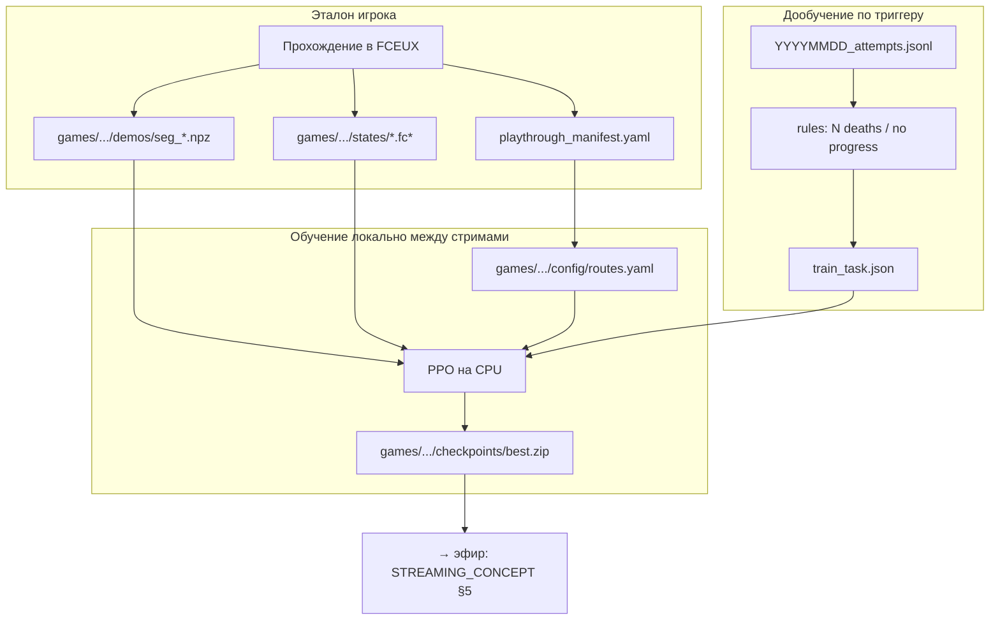

# ML_CONCEPT — AI NES Learning Stream

> **Фокус:** ML, среда, данные, обучение и дообучение.  
> Стрим: [STREAMING_CONCEPT.md](STREAMING_CONCEPT.md) · Индекс: [PROJECT_CONCEPT.md](PROJECT_CONCEPT.md) · [Скрипты](SCRIPTS.md) · [GLOSSARY.md](GLOSSARY.md)  
> **MVP:** только локальный CPU; облако — Phase 5+.  
> **Приоритет:** этап A (ML); стриминговое ПО — после [§12](#12-критерии-приёмки-ml) (этап B).

---

## Содержание

1. [Scope MVP (ML)](#1-scope-mvp-ml)
2. [Инфраструктура обучения](#2-инфраструктура-обучения)
3. [Архитектура ML](#3-архитектура-ml)
4. [ML-стек](#4-ml-стек)
5. [Игра и среда](#5-игра-и-среда)
6. [Система наград и чекпоинты](#6-система-наград-и-чекпоинты)
7. [Эталонное прохождение и дообучение](#7-эталонное-прохождение-и-дообучение)
8. [Форматы данных](#8-форматы-данных)
9. [Планируемое окружение](#9-планируемое-окружение)
10. [Структура репозитория](#10-структура-репозитория)
11. [Roadmap: ML-фазы](#11-roadmap-ml-фазы)
12. [Критерии приёмки (ML)](#12-критерии-приёмки-ml)
13. [Риски (ML)](#13-риски-ml)
14. [Roadmap игр (ML)](#14-roadmap-игр-ml)

---


## 1. Scope MVP (ML)


### Входит в MVP


| Компонент               | Описание                                                                            |
| ----------------------- | ----------------------------------------------------------------------------------- |
| Алгоритм                | PPO (stable-baselines3) + опционально BC на seg              |
| Inference | CPU локально, `predict()` — окно FCEUX, **без OBS**; логи `YYYYMMDD_attempts.jsonl` + `inference_inputs.jsonl`; FM2, achievements (retention 4 ч) |
| Обучение                | **CPU локально**; запуск **вручную** по `train_task.json`                           |
| Хостинг                 | **Только текущий ПК**; облако (RunPod/Vast) **не входит в MVP**             |
| Эталон       | FM2 + полное прохождение M1 + manifest + ≥3 seg |
| Маршрут                 | `games/rushn_attack/missions/m1/config/routes.yaml` с 4+ CP                  |
| Триггеры дообучения     | Правила (не LLM): N смертей / таймаут без прогресса                         |


### Не входит в MVP


| Компонент                                   | Когда                                              |
| ------------------------------------------- | -------------------------------------------------- |
| OBS, Twitch, overlay, тестовый эфир | Этап B — после gate [§12](#12-критерии-приёмки-ml) |
| **Удалённый GPU-хостинг** (RunPod, Vast.ai) | Phase 5+ / опционально после MVP                   |
| LLM-диспетчер задач                 | Phase 5+                                           |
| Авто-cloud по webhook                       | Phase 5+                                           |


### Цель обучения MVP (реалистичная)

Стабильно достигать **CP 2–3** на миссии 1. **Финиш миссии** — stretch goal, не блокер приёмки MVP.

На локальном CPU (i7-3770) первое обучение может занять **1–3 суток** фонового PPO; это нормально для MVP без облака.

---


## 2. Инфраструктура обучения

Железо хоста — [PROJECT_CONCEPT.md](PROJECT_CONCEPT.md#железо-хост-2026-07-05). Для ML: **CPU** (PPO, inference), **16 GB RAM** (4–8 env), **SSD** (модели, demos), PyTorch CPU-only (GTX 650 не для train).

Платформа готова к Phase 2 (апгрейд i7-3770, 2026-07).

### Правила ресурсов

```
МЕЖДУ СТРИМАМИ:  PPO на CPU (4–6 ядер, 4–8 parallel env), машина может работать ночью
В ЭФИРЕ:         обучение не запускать (см. STREAMING_CONCEPT.md)
ОБЛАКО:          не используется в MVP
```


### ПО (ML)

Python, PyTorch CPU, stable-baselines3, gymnasium, FCEUX, opencv-python-headless, PyYAML, numpy, Git.

---


## 3. Архитектура ML




### Цикл жизни модели

```
v0: PPO (или BC + PPO) на CPU между эфирами
        ↓
Inference + лог `logs/YYYYMMDD_attempts.jsonl` (retention 4 ч)
        ↓
Триггер → train_task.json + seg
        ↓
BC (optional) + PPO → v1
```

---


## 4. ML-стек


| Компонент                 | Выбор                                                               |
| ------------------------- | ------------------------------------------------------------------- |
| Алгоритм                  | PPO (`stable-baselines3`)                                   |
| Policy                    | `CnnPolicy` (grayscale 84×84, stack 4 frames)                       |
| Frame skip | 4                                                                   |
| Предобучение              | BC на `games/<game>/missions/<m>/demos/seg_*.npz` (optional) |
| Inference   | `model.predict(obs)` на CPU                                         |


**Параметры PPO на i7-3770 (план):** 4–8 `SubprocVecEnv`, `torch.set_num_threads(4–6)`, frame skip 4.

---


## 5. Игра и среда

**MVP:** **Rush'n Attack**, M1 — [PROJECT_CONCEPT.md](PROJECT_CONCEPT.md).

### Почему эта игра (RL)


| Критерий            | Rush'n Attack M1                           |
| ------------------- | ------------------------------------------ |
| Линейность          | В основном вправо, короткая миссия         |
| Сложность RL | Умеренная (проще NG, Contra)        |
| Заезженность AI     | Низкая (не SMB)                    |
| Чекпоинты           | Экраны / зоны — подходит checkpoint-модель |


### Почему не другие


| Игра              | Решение                                      |
| ----------------- | -------------------------------------------- |
| Super Mario Bros  | Не нравится автору; заезжен в AI             |
| NG         | Слишком жёстко для старта; backtrack + боссы |
| Contra            | Bullet hell — хуже для первого проекта       |
| Journey to Silius | Сильный **сезон 2**, не MVP          |


### Custom environment

Готового `gym-rushn-attack` **нет**. Среда — `games/rushn_attack/env/` поверх общего `BaseNesEnv` (FCEUX: Lua + Python bridge).

**Почему FCEUX (утверждено):**


| Критерий        | FCEUX                                                           |
| --------------- | --------------------------------------------------------------- |
| Согласованность | Один эмулятор для записи эталона, train и inference             |
| Скорость env    | Выше throughput кадров, чем у Mesen → короче T_env              |
| Эталон          | Нативная запись **FM2** + Lua-лог RAM/CP |
| Save states     | Lua `savestate.save()` / `savestate.load()`                     |


**Mesen не используется** — формат `.state` между эмуляторами несовместим.

### Пространство действий (MVP)

```
noop | left | right | down | up | right+up | left+up | A | B
```

- **B** = атака ножом.
- **A** = использование оружия, когда доступно.
- **Diagonals в MVP** — основа геймплея; прыжки: `up`, `right+up`, `left+up`.
- Комбо, rapid-fire — **не в MVP**.


### Препроцессинг наблюдений

- Grayscale
- Resize 84×84
- Stack 4 последних кадра
- Нормализация [0, 255] → float

---


## 6. Система наград и чекпоинты


### Чекпоинт и экран


| Термин           | Смысл                                                            |
| ---------------- | ---------------------------------------------------------------- |
| **Экран (room)** | Технический факт из RAM: где игрок (`room_id`, `x`, `y`) |
| **CP**    | Узел маршрута в YAML; первое достижение = награда                |


Направление (влево/вправo) **не штрафуется**. Награда только за **рост** `progress_index`.

### Формула наград (mission 1, профиль `default`)

```python
# Псевдокод одного step
reward = 0.0

if new_checkpoint > best_checkpoint:
    reward += 100 * (new_checkpoint - best_checkpoint)
    best_checkpoint = new_checkpoint

if died:
    reward -= 40

if mission_clear:
    reward += 1000

reward -= 0.005  # step penalty
```


| Компонент             | Значение MVP            | Примечание            |
| --------------------- | ----------------------- | --------------------- |
| Checkpoint bonus      | +100 за новый CP | Основной dense-сигнал |
| Death penalty         | −40                     |                       |
| Mission clear         | +1000                   | Sparse bonus          |
| Step penalty          | −0.005                  | Не стоять на месте    |
| Kill bonus            | **выкл**                | Риск фарма врагов     |
| local_delta в комнате | Phase 1.2               | Опционально после CP2 |


### Профиль `hot_zone` (дообучение)

Временно для проблемного сегмента:

```yaml
reward_profile: hot_zone
hot_zone:
  x_from: 120
  x_to: 200
  dx_scale: 0.3
milestone_x: 200
milestone_bonus: 50
```

После дообучения — вернуть `default`.

### Чекпoинты миссии 1

**4–6 узлов**, определяются после записи эталона (Phase 0). Черновая логика:

```
CP0: старт миссии
CP1: первый значимый экран
CP2: лестница / вертикальный участок
CP3: backtrack или сложная зона (если есть)
CP4: pre-boss / финальный коридор
CP5: mission clear
```

Точные `room_id` и `(x,y)` — в `games/rushn_attack/missions/m1/ram_map.md` после RAM-разведки.

---


## 7. Эталонное прохождение и дообучение


### Зачем эталон (ML)

1. **BC** — модель копирует actions из записи автора.
2. **Сегменты** — нарезка для дообучения проблемных мест.
3. **YAML** — черновик CP из лога.


### Запись эталона (Phase 0)

- Эмулятор: **FCEUX** (единый для записи, train и inference)
- **FM2** — запись inputs (frame-perfect); `reference/user_clear_v1.fm2` (в каталоге миссии)
- Lua-лог кадра → `reference/human_playthrough.jsonl`
- **Save states** на границах CP (CP0..CPn) → `states/cpN.fc`*
- Сложные места выявляются после inference из `logs/YYYYMMDD_attempts.jsonl` (окно 4 ч текущего дня)
- Видео без actions — слабый сигнал; нужен FM2 или лог кнопок


### Save state — программно

Save state эмулятора (`.fc*`) и checkpoint модели (`.zip`) — **разные сущности**:


| Сущность                               | Файл                    | Назначение                           |
| -------------------------------------- | ----------------------- | ------------------------------------ |
| Save state эмулятора                   | `states/cpN.fc*`        | Старт эпизода в FCEUX      |
| Checkpoint модели | `checkpoints/m1_vN.zip` | Веса PPO (в каталоге миссии) |


Пути в таблице — **относительно** `games/<game_id>/missions/<mission_id>/` (см. [§10](#10-структура-репозитория)).

#### Эталон (запись)

Lua-скрипт в FCEUX (`emu.registerafter`, каждый кадр):

1. Читает RAM → `room`, `x`, `checkpoint`.
2. При переходе `checkpoint` (0→1, 1→2, …) вызывает `savestate.save("states/cpN.fc*")`.
3. Фиксирует `frame` в manifest (связка state ↔ jsonl ↔ FM2).

**Ретроактивно**: load `cp0` → replay **FM2** или actions из jsonl → `savestate.save()`.

#### RL / дообучение


| Сценарий                        | Действие                                                       |
| ------------------------------- | -------------------------------------------------------------- |
| `env.reset()` для train         | Hot `LOAD` из Lua-кэша (`CACHE` при cold start); без перезапуска FCEUX |
| Inference, смерть | Лог `death_x`, `death_room` в `logs/YYYYMMDD_attempts.jsonl`   |
| Дообучение на seg       | Load save state начала seg + `hot_zone` |
| Отладка (optional)              | Save state в кадр смерти — только для анализа, не для train    |


Train стартует **до** проблемного места (граница CP). Rollout — **turbo** (FCEUX без отображения).

#### Ограничения

- Save state привязан к версии FCEUX и хэшу ROM.
- FM2 и jsonl — одна сессия или привязка по `frame` в manifest.
- Ночной train: turbo, без OBS.


### FCEUX bridge — контракт IPC

Python (`RushnAttackEnv`, `record_playthrough.py`) ↔ Lua (`fceux/lua/bridge.lua`) через файл-команды или stdin:

```
CACHE states/cp2.fc*         → savestate.save(handle) + persist в Lua-кэш (после cold start)
LOAD  states/cp2.fc*         → savestate.load(cached handle) + GET_RAM + GET_OBS
LOAD_OBS states/cp2.fc*      → hot reset: load + RAM + obs за один IPC (train)
SAVE  states/out.fc*         → savestate.save(path)
STEP  right+B                → один decision frame (frame skip)
GET_OBS                      → grayscale 84×84; train: `obs_format: raw` (7056 B `.raw`), inference: `gd`
GET_RAM  room,x,y,hp,lives,checkpoint
TURBO  on|off                → макс. скорость эмуляции (train)
```

**Hot reset:** первый `reset()` — cold start FCEUX с `-loadstate` + `CACHE`; последующие — только `LOAD` (процесс не перезапускается). Неизвестный state → cold start + `CACHE`.

Эмулятор: `fceux/portable/fceux64.exe` (см. [§10](#10-структура-репозитория), `fceux/runtime.yaml`).

Реализация: Phase 0 (`fceux/lua/bridge.lua`, `fceux/lua/record_logger.lua`), Phase 1 (`RushnAttackEnv`).

### Дообучение — что это

**Не новая модель**, а продолжение PPO с `.zip` checkpoint:

```
load checkpoints/m1_v3.zip
optional: BC на demos/seg_003.npz (5 epochs)
PPO.learn(500_000 steps), профиль hot_zone
save checkpoints/m1_v4.zip
```

(пути — относительно каталога миссии)

### Триггеры (правила, MVP)


| Триггер         | Условие                                             |
| --------------- | --------------------------------------------------- |
| `death_cluster` | ≥10 смертей в одном x_bucket за сессию |
| `no_progress`   | 120 с без роста `max_checkpoint`                    |


### Выбор seg (MVP — без LLM)

Скрипт `build_train_task.py` сопоставляет failure из RL с эталоном:

```
1. Триггер: death_cluster → room=0x06, x_bucket=160, checkpoint=2
2. Найти seg в manifest:
     checkpoint_from ≤ failure.checkpoint ≤ checkpoint_to
     AND failure.room ∈ seg.room_ids
3. Уточнить по x: в `reference/human_playthrough.jsonl` — диапазон x сегмента;
     выбрать seg, где death_x попадает в диапазон (или ближайший)
4. Взять seg.demo_file + seg.save_state
5. Построить hot_zone: x_from/x_to из гистограммы смертей в x_bucket (±1 bucket)
6. Записать `tasks/train_task.json`
7. Автор подтверждает и запускает локальное обучение (train_ppo.py)
```

Новый save state при каждом failure **не создаётся** — достаточно states на CP-границах из manifest.

**Phase 5+:** LLM читает failure report + manifest → JSON + patch YAML.

### Rollback

Если после дообучения success rate упал — откат на предыдущий `best.zip`.

---


## 8. Форматы данных

Все пути в примерах ниже — **относительно** `games/<game_id>/missions/<mission_id>/`, если не указано иное.

### `config/playthrough_manifest.yaml`

```yaml
playthrough_id: user_clear_v1
game: rushn_attack
mission: 1
recorded_at: "2026-06-29"
emulator: fceux
fceux_version: "2.6.6"
fceux_port: win32
fm2_file: reference/user_clear_v1.fm2
total_frames: 54000
reference_clear_sec: 180.0

segments:
  - id: seg_001
    name: start_to_first_ladder
    checkpoint_from: 0
    checkpoint_to: 1
    frame_start: 0
    frame_end: 4200
    room_ids: [0x01, 0x02]
    reference_clear_sec: 12.5
    demo_file: demos/seg_001.npz
    save_state: states/cp0.fc*
    note: "старт, первые враги"

  - id: seg_002
    name: ladder_section
    checkpoint_from: 1
    checkpoint_to: 2
    frame_start: 4200
    frame_end: 12000
    room_ids: [0x03, 0x04]
    reference_clear_sec: 28.0
    demo_file: demos/seg_002.npz
    save_state: states/cp1.fc*

  - id: seg_003
    name: mid_mission_alley
    checkpoint_from: 2
    checkpoint_to: 3
    frame_start: 12000
    frame_end: 19200
    room_ids: [0x05, 0x06]
    reference_clear_sec: 35.0
    demo_file: demos/seg_003.npz
    save_state: states/cp2.fc*
    note: "типичный seg для дообучения — выбирается build_train_task.py по YYYYMMDD_attempts.jsonl (текущий день, 4 ч)"
```


### `config/routes.yaml`

```yaml
game: rushn_attack
mission: 1

checkpoints:
  - id: 0
    name: start
    trigger:
      room: 0x01

  - id: 1
    name: first_screen
    trigger:
      room: 0x03

  - id: 2
    name: ladder
    trigger:
      room: 0x05

  - id: 3
    name: mid_mission
    trigger:
      room: 0x07

  - id: 4
    name: mission_clear
    trigger:
      flag: mission_complete

rewards:
  default:
    checkpoint_bonus: 100
    death_penalty: 40
    mission_clear_bonus: 1000
    step_penalty: 0.005
    kill_bonus: 0

heuristics:
  mission_complete:          # эвристика финиша (если нет RAM-флага)
    min_progress_cp: 4
    room: 0x07
    x: 129
    min_y: 60
    max_y: 72
```

Профиль `hot_zone` (дообучение) — в `rewards.hot_zone` (см. §6).

### `demos/seg_XXX.npz`


| Ключ      | Форма            | Тип                 |
| --------- | ---------------- | ------------------- |
| `obs`     | `(N, 4, 84, 84)` | float32             |
| `actions` | `(N,)`           | int64               |
| `meta`    | JSON string      | segment_id, mission |


### `logs/YYYYMMDD_attempts.jsonl`

Одна строка JSON на inference-попытку. Поля overlay — [STREAMING_CONCEPT.md §9](STREAMING_CONCEPT.md#9-метрики-и-лог-эфира).

**Путь и именование (по умолчанию, не опция):**

- Каталог: `games/<game>/missions/<m>/logs/` — **плоский**, без подпапок по дням.
- Имя файла: **`YYYYMMDD_attempts.jsonl`** (префикс — календарная дата UTC, напр. `20260705_attempts.jsonl`).
- Активный файл — за **текущий** UTC-день; при смене даты — новый файл с новым префиксом. Старые файлы остаются в том же `logs/`.

**Retention (по умолчанию, не опция):**

- При каждой записи в **файл текущего дня** удалять строки старше **4 часов** wall-clock (UTC), **но не раньше полуночи текущего UTC-дня**.
- Формула отсечения: `cutoff = max(now_utc - 4h, start_of_today_utc)`.
- Файлы **прошлых** дней не переписываются — это снимок конца того дня.
- Реализация: `AttemptLogger` / `InferenceInputLogger` / `run_inference.py`.

```json
{
  "timestamp": "2026-06-29T20:15:00Z",
  "model_version": "m1_v3",
  "mission": 1,
  "episode": 42,
  "max_checkpoint": 2,
  "final_checkpoint": 2,
  "achieved_checkpoints": [0, 1, 2],
  "died": true,
  "death_x": 156,
  "death_y": 180,
  "death_room": "0x06",
  "death_x_bucket": 9,
  "mission_clear": false,
  "episode_frames": 840,
  "episode_reward": 64.2,
  "reward_per_step": 0.076,
  "save_state": "states/cp1.fc0",
  "tags": ["deep_run"]
}
```

### `logs/YYYYMMDD_inference_inputs.jsonl`

Покадровый лог ввода из inference для replay и экспорта FM2. Каталог, префикс UTC-даты и retention 4 ч — как у `YYYYMMDD_attempts.jsonl`.

| Компонент | Путь |
| --------- | ---- |
| Запись | `run_inference.py` — `(frame, action)` из `info["action"]` + `info["ram"]["frame"]` |
| Logger | `src/inference_input_logger.py` |

```json
{
  "timestamp": "2026-07-05T20:15:00Z",
  "episode": 42,
  "step": 120,
  "frame": 480,
  "action": "right+up"
}
```

### FM2 из inference

Демонстрация прогресса модели в FCEUX (replay movie, OBS) **без** опоры на `games/…/reference/` (эталон).

| Компонент | Путь / поведение |
| --------- | ---------------- |
| Конвертер | `scripts/export_fm2.py` |
| Библиотека | `src/fm2_export.py` (`embed_savestate`, `fc0_to_savestate_hex`) |
| Заголовок ROM | шаблон из `fceux/portable/movies/*.fm2` (не `reference/`) |
| Save state | `states/inference_cp0.fc0` → `savestate 0x…` в заголовке FM2 (GUID патчится на inference) |
| Frame skip | 1 env step → 4 одинаковые строки FM2 (как в `bridge.lua`) |
| CLI inference | `--export-fm2`, `--export-fm2-dir`, `--save-episode-fm2` (embed по умолчанию; `--no-embed-savestate`) |
| CLI export | `--embed-savestate` в `export_fm2.py` |
| Просмотр FCEUX | Load ROM → Play Movie (без внешнего `-loadstate`) |
| Окно FCEUX | профиль `fceux/profiles/inference.yaml` (`headless: false`) или `--show-window` |

`YYYYMMDD_attempts.jsonl` — агрегат эпизода; FM2 — отдельный артефакт для просмотра, не для BC / seg.

### Achievements и плейлист (inference)

После inference помечать попытки **achievements** (🏆) и **антидостижениями** (💀), собирать **плейлист** FM2 по фиксированным номинациям — блоки идут на эфире **одна номинация за другой**, внутри блока попытки подряд.

| Компонент | Путь |
| --------- | ---- |
| Правила | `config/achievements.yaml` |
| Evaluator | `src/achievements/evaluator.py` |
| Batch eval | `scripts/eval_achievements.py` → `tags[]` в attempts |
| Плейлист | `scripts/build_playlist.py` → FM2 + `YYYYMMDD_playlist.json` |
| Overlay | `tmp/bridge/inference/overlay.json` → `bridge.lua` (3–5 с) |

#### Именование (плоский `logs/`, префикс UTC-даты)

```
logs/20260705_playlist.json              # manifest эфира (плоский список клипов)
logs/20260705_playlist.play.cmd          # один лаунчер на весь эфир
logs/20260705_01_mission_clear_001.fm2
logs/20260705_01_mission_clear_001.overlay.json
logs/20260705_01_mission_clear_002.fm2
logs/20260705_02_episode_reward_001.fm2
logs/20260705_03_fastest_death_001.fm2
```

Шаблон FM2: `{YYYYMMDD}_{idx:02d}_{slug}_{seq:03d}.fm2`. Индекс `idx` — **фиксированный** порядок блоков на стриме; `slug` — имя номинации; `seq` — порядок внутри блока.

Одна попытка может иметь **несколько** тегов → несколько FM2-копий в разных номинациях.

#### 8 номинаций (MVP)

| Idx | slug | Overlay (RU) | Тип | Условие |
| --- | ---- | ------------ | --- | ------- |
| 01 | `mission_clear` | Клир миссии | 🏆 | `mission_clear == true` |
| 02 | `episode_reward` | Жадина | 🏆 | top‑K по `episode_reward` за 4 ч (напр. top 3) |
| 03 | `fastest_death` | Мгновенный респawn | 💀 | `died` и `episode_frames ≤ 3` |
| 04 | `many_achievements` | Тур CP | 🏆 | `len(achieved_checkpoints) ≥ 4` за эпизод |
| 05 | `deep_run` | Почти финиш | 🏆 | `max_checkpoint ≥ 4` и не `mission_clear` |
| 06 | `deja_vu` | Déjà vu | 💀 | `died` и `(death_room, death_x_bucket)` ≥ 3 раз за 4 ч |
| 07 | `ladder_ouch` | Лестница съела | 💀 | `died` и `death_room == "0x08"` (CP ladder) |
| 08 | `new_record` | Личный рекорд | 🏆 | новый max `max_checkpoint` для `model_version` за 4 ч |

`death_x_bucket = death_x // 16` (как x_bucket в триггерах).

**Сортировка внутри блока:** 02 — `episode_reward` ↓; 03 — `episode_frames` ↑; остальные — по `timestamp` ↓.

**Порядок блоков на эфире (драматургия):** `01 → 08 → 04 → 05 → 02 → 07 → 06 → 03`.

#### Доп. поля в логе (для evaluator)

| Поле | Источник | Зачем |
| ---- | -------- | ----- |
| `achieved_checkpoints` | `CheckpointRewardWrapper` | `many_achievements` |
| `death_x_bucket` | `death_x // 16` | `deja_vu`, кластеры |
| `save_state` | reset | контекст старта |
| `hp`, `lives` при смерти | `ram` | будущие номинации |
| `reward_per_step` | `episode_reward / episode_frames` | эффективность |
| `tags[]` | rules engine | список slug после eval |

Конфиг правил: `config/achievements.yaml`.

#### Lua overlay

После эпизода `run_inference.py` пишет `tmp/bridge/inference/overlay.json`; `bridge.lua` рисует 3–5 с:

```json
{
  "achievements": [
    {"idx": 8, "slug": "new_record", "title": "Личный рекорд", "tier": "gold"},
    {"idx": 4, "slug": "many_achievements", "title": "Тур CP", "tier": "silver"}
  ],
  "stats": {"max_cp": 3, "reward": 164.2, "steps": 420},
  "show_until_frame": 180
}
```

`tier`: `gold` / `silver` / `skull` (💀).

#### Pipeline

1. `run_inference.py` → `inference_inputs` + расширенный `YYYYMMDD_attempts.jsonl` (`tags[]`)
2. `eval_achievements.py` — правила из `achievements.yaml` → теги
3. `export_fm2.py` + `build_playlist.py` → FM2 и `YYYYMMDD_playlist.json` по `{idx}_{slug}`
4. `play_inference_fm2.py` + `achievement_playlist.lua` — replay плейлиста на эфире

См. также [SCRIPTS.md](SCRIPTS.md) (inference, FM2, achievements) и [STREAMING_CONCEPT.md §9](STREAMING_CONCEPT.md#9-метрики-и-лог-эфира) (overlay на эфире).

### `tasks/train_task.json`

```json
{
  "task_id": "finetune_m1_seg003_v4",
  "created_at": "2026-06-29T23:00:00Z",
  "trigger": {
    "type": "death_cluster",
    "room": "0x06",
    "x_bucket": 160,
    "deaths": 12
  },
  "checkpoint_in": "checkpoints/m1_v3.zip",
  "checkpoint_out": "checkpoints/m1_v4.zip",
  "demo_segment": "demos/seg_003.npz",
  "segment_id": "seg_003",
  "save_state": "states/cp2.fc*",
  "route_config": "config/routes.yaml",
  "reward_profile": "hot_zone",
  "hot_zone": { "x_from": 128, "x_to": 192 },
  "bc_epochs": 5,
  "ppo_timesteps": 500000,
  "learning_rate": 1e-5,
  "reason": "12 смертей у x=150-170, room 0x06"
}
```


### `reference/human_playthrough.jsonl` (эталон, Phase 0)

```json
{
  "frame": 1840,
  "room": "0x03",
  "x": 92,
  "y": 168,
  "action": "right",
  "hp": 4,
  "lives": 3,
  "checkpoint": 1
}
```

Не показывать получение ROM на эфире — [STREAMING_CONCEPT.md §6](STREAMING_CONCEPT.md#6-сюжет-и-контент).

---


## 9. Планируемое окружение

> **На этапе концепции окружение не собирается.** Ниже — версии для этапа A.  
> Что лежит в `wait/`, а что ставится на хост — [§10 «В проекте vs окружение»](#в-проекте-vs-окружение).


### Локальная машина (Windows 10 Pro, build 19045)


| Компонент              | Версия / выбор                               | Назначение                                                                           |
| ---------------------- | -------------------------------------------- | ------------------------------------------------------------------------------------ |
| Python                 | 3.10 или 3.11                                | Скрипты, train, inference                                                            |
| PyTorch                | **CPU build**                                | train и inference на CPU                                               |
| stable-baselines3      | 2.x                                          | PPO                                                                          |
| gymnasium              | 0.29+                                        | Env API                                                                              |
| opencv-python-headless | latest                                       | Кадры                                                                                |
| PyYAML                 | latest                                       | Конфиги                                                                              |
| numpy                  | latest                                       | Demos                                                                                |
| FCEUX        | **2.6.6 win64** (classic, `fceux/portable/`) | FM2, RAM, save states; **в каталоге проекта**, не pip |
| Git                    | latest                                       | VCS (система)                                                                        |


Python-пакеты — в `.venv/` по `requirements.txt` (см. [§10](#в-проекте-vs-окружение)).

### Облако — не MVP (опционально после Phase 4)


| Параметр | Значение                                                  |
| -------- | --------------------------------------------------------- |
| Когда    | Phase 5+ или если локальное обучение слишком медленное    |
| Площадки | RunPod / Vast.ai                                          |
| GPU      | RTX 3060 12GB+ (почасово)                                 |
| Зачем    | Ускорение дообучения, не обязательно для proof-of-concept |


В MVP `cloud_train.sh` **не требуется**; `train_task.json` запускается локальным `train_ppo.py`.

---


## 10. Структура репозитория

Единственный полный список каталогов проекта.

### Принципы


| Слой             | Каталог            | Содержимое                                                                                        |
| ---------------- | ------------------ | ------------------------------------------------------------------------------------------------- |
| **Игры**         | `games/<game_id>/` | Всё игро-специфичное: ROM, миссии, эталон, модели, логи, **env-пакет**, `env_config.yaml` |
| **Код (общий)**  | `src/`, `scripts/` | FCEUX bridge, `BaseNesEnv`, награды-обёртка, train/inference — без привязки к одной игре          |
| **Эмулятор**     | `fceux/`           | Portable **FCEUX 2.6.6 win64** + Lua проекта + профили режимов                                    |
| **Документация** | `docs/`            | Концепция; `ram_map.md` — в каталоге миссии                                                       |


**Правило:** если меняется только при смене игры (действия, эвристики смерти/финиша, фабрика env) — код и конфиг лежат в `games/<game_id>/`. Общий каркас (`BaseNesEnv`, `CheckpointRewardWrapper`, `make_env(game_id)`) — в `src/`.

- `<game_id>` — slug: `rushn_attack`, `tmnt3`, `megaman2`.
- `<mission_id>` — уровень внутри игры: `m1` (Rush'n Attack), `scene01` (TMNT III).
- Пути в YAML/JSON миссии — **относительно** `games/<game_id>/missions/<mission_id>/`.
- CLI: путь к FM2 `games/<game>/missions/<mission>/reference/<file>.fm2` → корень данных миссии.


### В проекте vs окружение

Три класса артефактов:


| Класс                      | Смысл                                                     | Git                |
| -------------------------- | --------------------------------------------------------- | ------------------ |
| **A — репозиторий**        | Исходники, документация, конфиги, контракты               | да                 |
| **B — локально в** `wait/` | Portable, ROM, ML-артефакты, venv, runtime/tmp            | нет (`.gitignore`) |
| **C — окружение хоста**    | ОС, интерпретатор, системные программы, pip-пакеты в venv | вне репо           |


#### A — в репозитории (git)


| Путь                                                                     | Содержимое                                                                          |
| ------------------------------------------------------------------------ | ----------------------------------------------------------------------------------- |
| `docs/`                                                                  | Концепция                                                                           |
| `config/achievements.yaml`                                               | Номинации и правила achievements                          |
| `src/`                                                                   | Python: **общий** bridge, `BaseNesEnv`, `CheckpointRewardWrapper`, train, inference |
| `scripts/`                                                               | CLI, train-обёртки                                                                  |
| `fceux/lua/`, `fceux/profiles/`, `fceux/runtime.yaml`, `fceux/README.md` | Скрипты и контракт эмулятора                                                        |
| `games/<game>/game.yaml`                                                 | Метаданные игры, ссылка на env-пакет                                                |
| `games/<game>/env_config.yaml`                                           | Действия, диапазон `lives` и пр. параметры env                                      |
| `games/<game>/env/`                                                      | Игровой Python-пакет: `make_env()`, фабрика среды                                   |
| `games/…/missions/…/config/`                                             | `routes.yaml` (CP, награды, **heuristics**), `playthrough_manifest.yaml`            |
| `games/…/missions/…/ram_map.md`                                          | RAM-разведка                                                                        |
| `requirements.txt`                                                       | Список pip-зависимостей (версии — pin при Phase 0)                                  |
| `.gitignore`                                                             | Исключения для класса B                                                             |


#### B — в каталоге `wait/`, не в git


| Путь                     | Содержимое                      | Как появляется                                             |
| ------------------------ | ------------------------------- | ---------------------------------------------------------- |
| `fceux/portable/`        | FCEUX 2.6.6 win64 целиком       | распаковка zip ([fceux/README.md](../fceux/README.md))     |
| `games/<game>/rom/*.nes` | Образ картриджа                 | вручную (legal)                                            |
| `games/…/reference/`     | FM2, `human_playthrough.jsonl`, `scout/ram_scout.*` | запись эталона / Phase 0 scout |
| `games/…/config/`        | `routes.yaml`, `playthrough_manifest.yaml`, `ram_resolve.json`, `inference.*` | эталон + runtime RAM + кадр gameplay |
| `games/…/states/`        | `cp0..cpN.fc0` (train), `inference_cp0.fc0` (эфир) | Lua / train / inference |
| `games/…/demos/`         | `seg_*.npz`                     | нарезка эталона                                            |
| `games/…/checkpoints/`   | `m1_vN.zip`                     | train / дообучение                         |
| `games/…/logs/`          | `YYYYMMDD_attempts.jsonl`, `YYYYMMDD_inference_inputs.jsonl`, FM2-плейлист | inference (retention 4 ч) |
| `games/…/tasks/`         | `train_task.json`               | `build_train_task.py`                                      |
| `.venv/`                 | Python-пакеты (PyTorch, SB3, …) | `python -m venv .venv` + `pip install -r requirements.txt` |
| `tmp/`                   | IPC-каналы FCEUX ↔ Python       | runtime                                                    |


#### C — зависимости окружения (не в `wait/`)


| Компонент                                                                                  | Этап | Установка                        |
| ------------------------------------------------------------------------------------------ | ---- | -------------------------------- |
| **Windows 10**                                                                             | A, B | ОС хоста                         |
| **Python 3.10 / 3.11**                                                                     | A    | python.org / системный           |
| **Git**                                                                                    | A    | системный                        |
| **pip-пакеты** (PyTorch CPU, stable-baselines3, gymnasium, opencv-headless, PyYAML, numpy) | A    | в `.venv/` из `requirements.txt` |
| **Драйвер NVIDIA** + NVENC                                                                 | B    | для OBS; на этапе A не требуется |
| **OBS Studio**                                                                             | B    | после gate §12                   |
| **Twitch** (аккаунт, stream key)                                                           | B    | после gate §12                   |
| **Интернет / upload ≥5 Mbps**                                                              | B    | эфир                             |


**Правило:** всё, что нужно для **воспроизводимости ML** на другом ПК — либо в git (A), либо восстанавливается скриптом/`requirements.txt` (B+C). ROM и checkpoints переносятся копированием `games/`, не через git.

### Дерево (MVP + задел под игры)

```
wait/
├── config/
│   └── achievements.yaml               # номинации inference (§8)
├── docs/
│   ├── PROJECT_CONCEPT.md
│   ├── STREAMING_CONCEPT.md
│   └── ML_CONCEPT.md
├── games/                              # всё игро-специфичное
│   └── rushn_attack/
│       ├── game.yaml                   # env_package, env_config, rom
│       ├── env_config.yaml             # actions, lives (игро-специфично)
│       ├── env/                        # make_env() — игровой Python-пакет
│       │   └── __init__.py
│       ├── rom/                        # .nes (.gitignore)
│       │   └── rushn_attack.nes
│       └── missions/
│           └── m1/
│               ├── ram_map.md          # адреса RAM этой миссии
│               ├── config/
│               │   ├── playthrough_manifest.yaml
│               │   ├── routes.yaml
│               │   └── ram_resolve.json
│               ├── reference/          # эталон: FM2, jsonl, scout
│               │   ├── user_clear_v1.fm2
│               │   ├── human_playthrough.jsonl
│               │   └── scout/        # ram_scout.jsonl, candidates (.gitignore)
│               ├── states/             # cp0..cpN (train), inference_cp0 (gameplay / эфир)
│               ├── demos/              # seg_*.npz для BC
│               ├── checkpoints/        # m1_vN.zip
│               ├── logs/               # YYYYMMDD_*.jsonl, FM2-плейлист (flat, retention 4 ч)
│               └── tasks/              # train_task.json
│   # └── tmnt3/                      # сезон 2+: та же схема
│   #     ├── game.yaml
│   #     ├── rom/
│   #     └── missions/scene01/ ...
├── src/
│   ├── env/
│   │   ├── base_nes_env.py             # общий FCEUX + frame stack
│   │   └── loader.py                   # make_env(game_id) → games/.../env/
│   ├── rewards/checkpoint_wrapper.py   # общая обёртка наград
│   ├── attempt_logger.py
│   ├── inference_input_logger.py
│   ├── fm2_export.py
│   ├── log_utils.py
│   ├── achievements/
│   │   ├── evaluator.py
│   │   └── playlist.py
│   ├── train/
│   │   ├── train_ppo.py
│   │   └── bc_pretrain.py
│   └── stream/run_inference.py
├── fceux/                              # portable FCEUX + скрипты проекта
│   ├── portable/                       # официальный win64-дистрибутив 2.6.6 (в .gitignore)
│   │   └── fceux64.exe
│   ├── lua/
│   │   ├── bridge.lua                  # IPC train/inference + overlay
│   │   ├── achievement_overlay.lua     # справочный парсер overlay
│   │   ├── record_logger.lua           # запись эталона
│   │   └── common/                     # RAM per game (Phase 0+)
│   ├── profiles/
│   │   ├── record.yaml
│   │   ├── train.yaml
│   │   └── inference.yaml
│   ├── runtime.yaml                    # версия, binary, port
│   └── README.md
├── scripts/
│   ├── setup_venv.ps1                  # venv + requirements
│   ├── setup_all.ps1
│   ├── ram_scout.py
│   ├── export_fm2.py
│   ├── eval_achievements.py
│   ├── build_playlist.py
│   ├── segment_playthrough.py
│   ├── build_train_task.py
│   └── train_local.sh
├── requirements.txt
├── .venv/                              # Python-пакеты (класс B, не в git)
├── tmp/                                # IPC runtime (класс B)
└── .gitignore
```

`streaming/` (конфиги OBS) — этап B, класс A, когда появится.

### FCEUX: portable и режимы

**Один бинарник** — [FCEUX 2.6.6 win64 Binary](https://fceux.com/web/download.html) (classic Win32-порт, **не** Qt/SDL). Полный zip в `fceux/portable/`; контракт в `fceux/runtime.yaml`.


| Режим                          | Профиль                   | Процессов | Lua                 | Turbo   | Окно         |
| ------------------------------ | ------------------------- | --------- | ------------------- | ------- | ------------ |
| Запись эталона      | `profiles/record.yaml`    | 1         | `record_logger.lua` | выкл    | да (человек) |
| Обучение                       | `profiles/train.yaml`     | 4–8       | `bridge.lua`        | **вкл** | headless     |
| Inference (эфир) | `profiles/inference.yaml` | 1         | `bridge.lua`        | выкл    | да (OBS)     |


Launcher (Phase 1): `runtime.yaml` + `profiles/<mode>.yaml` + `--game` / `--mission`. Переопределение каталога: `FCEUX_HOME`.

**MVP-платформа:** Windows 10; portable win64. Linux/Qt/SDL — только Phase 5+ train-node, отдельное решение.

### `games/<game_id>/game.yaml` (черновик)

```yaml
game_id: rushn_attack
title: "Rush'n Attack"
platform: nes
rom_file: rom/rushn_attack.nes          # относительно games/rushn_attack/
env_class: RushnAttackEnv                # имя класса (документация / UI)
env_package: env                         # каталог games/rushn_attack/env/
env_config: env_config.yaml              # actions, lives
emulator:
  runtime: fceux/runtime.yaml           # binary, version, port
  lua_bridge: fceux/lua/bridge.lua
default_mission: m1
```

Запуск среды из общего кода:

```python
from env.loader import make_env
env = make_env("rushn_attack", "m1")  # → games/rushn_attack/env/make_env()
```


### Добавление новой игры

1. `games/<game_id>/game.yaml` + `rom/`.
2. `games/<game_id>/env_config.yaml` — список `actions`, `lives`.
3. `games/<game_id>/env/__init__.py` с `make_env()` (обычно `BaseNesEnv` + `CheckpointRewardWrapper`).
4. `missions/<mission_id>/` с `config/routes.yaml` (CP, награды, `heuristics`).
5. Запись эталона → `reference/`, `states/`, `demos/`.
6. Тот же `fceux/portable/fceux64.exe` — версия **2.6.6** на весь проект.

`cloud_train.sh`, `requirements-gpu.txt` — Phase 5+.

---


## 11. Roadmap: ML-фазы


### Phase 0 — Основа (неделя 1)


| Задача                                       | Результат                                                                            |
| -------------------------------------------- | ------------------------------------------------------------------------------------ |
| Scaffold репо, `.gitignore`                  | `games/`, `fceux/`, структура каталогов                                              |
| FCEUX portable 2.6.6 + Lua stubs             | `fceux/portable/fceux64.exe`, `runtime.yaml`, `profiles/`                            |
| RAM-разведка Rush'n Attack M1 | `scripts/ram_scout.py` → `reference/scout/ram_scout.*`, `config/ram_resolve.json`, `ram_map.md` ([SCRIPTS.md](SCRIPTS.md)) |
| Нарезка эталона                   | `config/playthrough_manifest.yaml`, 3–5 `demos/seg_*.npz`                            |
| Черновик `config/routes.yaml`                | 4+ checkpoints                                                                       |


### Phase 1 — Environment + награды (неделя 2)


| Задача                    | Результат                                                                           |
| ------------------------- | ----------------------------------------------------------------------------------- |
| `RushnAttackEnv`          | reset/step, frame skip, obs; load save state на reset |
| `CheckpointRewardWrapper` | читает `config/routes.yaml`                                                         |
| `attempt_logger.py`       | jsonl                                                                               |
| Smoke test                | random agent 100 steps, лог OK                                                      |


### Phase 2 — Обучение (неделя 3–4)


| Задача             | Результат                                                |
| ------------------ | -------------------------------------------------------- |
| `train_ppo.py`     | SubprocVecEnv 4–8, CPU, save каждые 50k                  |
| `bc_pretrain.py`   | optional перед PPO                                       |
| `train_local.sh`   | запуск по `tasks/train_task.json`                        |
| `run_inference.py` | локальный inference, логи, FM2, achievements |
| Первая модель      | `m1_v0.zip`, прогресс до CP2–3                    |


### Phase 3 — Дообучение (часть ML)


| Задача                | Результат            |
| --------------------- | -------------------- |
| `build_train_task.py` | failure → train_task |
| Тестовый цикл         | триггер → train → v1 |


### Phase 4 — ML MVP complete (gate перед стримом)

См. [критерии приёмки §12](#12-критерии-приёмки-ml). После выполнения — переход к **этапу B** ([STREAMING_CONCEPT.md §10](STREAMING_CONCEPT.md#10-roadmap)).

### Phase 5+ (ML)


| Фича                       | Описание                                 |
| -------------------------- | ---------------------------------------- |
| LLM-диспетчер      | failure report → train_task + YAML patch |
| Облачный GPU (опционально) | RunPod/Vast для ускорения train          |
| Авто-train по webhook      | cron после триггера                      |


---


## 12. Критерии приёмки (ML)

- [ ] Эталон M1: FM2 + jsonl; manifest + ≥3 seg
- [ ] `games/rushn_attack/missions/m1/config/routes.yaml` с ≥4 CP, согласован с эталоном
- [ ] `games/rushn_attack/missions/m1/ram_map.md` — ключевые адреса RAM
- [ ] `RushnAttackEnv` — smoke test
- [ ] `m1_v0.zip` обучена на CPU; inference на том же ПК
- [ ] Стабильно **CP2–3** (≥30% попыток)
- [ ] Цикл дообучения: триггер → `train_task.json` → train → новый checkpoint
- [ ] Rollback (v_new хуже → v_prev)

**Gate этапа A → B.** Стрим-критерии ([STREAMING_CONCEPT.md §11](STREAMING_CONCEPT.md#11-критерии-приёмки-стрим)) — только на **этапе B**, не блокируют ML MVP.

---


## 13. Риски (ML)


| Риск                        | Вероятность | Митигация                                        |
| --------------------------- | ----------- | ------------------------------------------------ |
| Нет gym для Rush'n Attack   | Высокая     | Custom env; FCEUX bridge       |
| RAM адреса неверны  | Средняя     | FCEUX hex editor / Lua; jsonl эталона |
| GTX 650 / CPU-only          | Высокая     | Train между стримами; не train в эфире           |
| Медленный PPO       | Средняя     | Ночной train; 1–3 суток на v0 — норма            |
| Долгое обучение M1   | Высокая     | BC + CP; MVP = CP3         |
| Переобучение на seg | Средняя     | Короткий PPO; rollback                   |


---


## 14. Roadmap игр (ML)


| Игра                                | Приоритет   | RL / награды                                  |
| ----------------------------------- | ----------- | --------------------------------------------- |
| **TMNT III** (NES) | **Высокий** | CP по сценам + boss HP                 |
| **TMNT II** (NES)  | **Высокий** | Аналогично TMNT III                           |
| Mega Man 2                          | Средний     | Checkpoints + boss HP                         |
| Journey to Silius                   | Средний     | Checkpoint graph + boss                       |
| RoboCop 2                           | Низкий      | Квоты Nuke + аресты (60%); ветка FPS-training |
| Contra                              | Низкий      | Прогресс + выживание                          |
| Ninja Gaiden                 | Низкий      | Полный room graph, backtrack                  |


### Награды по типу игры (справочно)


| Игра                        | Главный сигнал прогресса               |
| --------------------------- | -------------------------------------- |
| Rush'n Attack M1     | CP (room/x zones)               |
| TMNT II / TMNT III (scene)  | Checkpoints по scene/subzone + boss HP |
| Mega Man 2 stage            | Checkpoints + boss HP                  |
| Journey to Silius           | Checkpoint graph + boss phase          |
| RoboCop 2 level             | Прогресс + % Nuke + % арестов          |
| SMB (не используем) | delta x_pos                            |
| NG                   | Полный room graph, backtrack OK        |


Формат сезонов — [STREAMING_CONCEPT.md §13](STREAMING_CONCEPT.md#13-сезоны-и-бэклог-игр).
