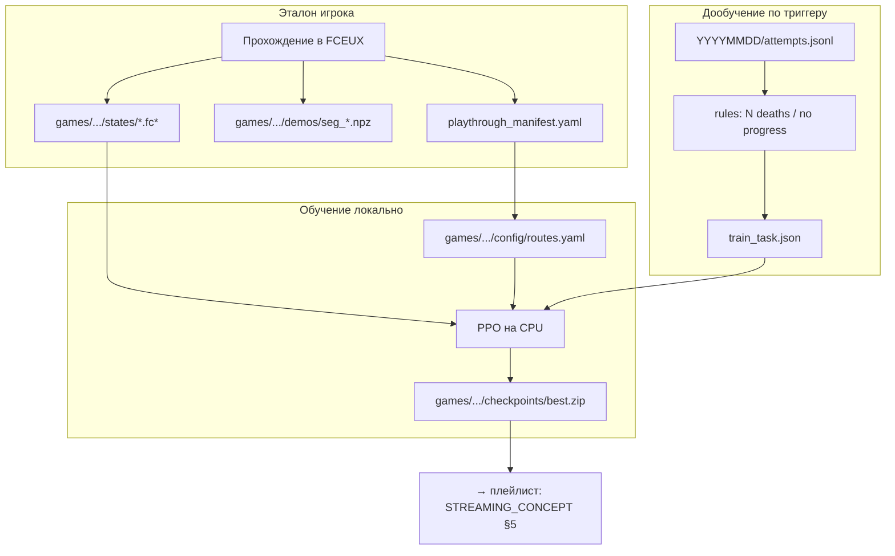

# ML_CONCEPT — AI NES Learning Stream

> **Фокус:** ML-ядро платформы: среда, данные, обучение и дообучение.  
> Индекс: [README.md](README.md) · Стрим: [STREAMING_CONCEPT.md](STREAMING_CONCEPT.md) · Пилот: [GAME_RUSHN_ATTACK.md](GAME_RUSHN_ATTACK.md) · [Скрипты](SCRIPTS.md) · [GLOSSARY.md](GLOSSARY.md)  
> **Проект:** локальный CPU.  
> **Приоритет:** этап A (ML); стриминговое ПО — после [§12](#12-критерии-приёмки-ml) (этап B).

---

## Содержание

1. [Scope проекта (ML)](#1-scope-проекта-ml)
2. [Инфраструктура обучения](#2-инфраструктура-обучения)
3. [Архитектура ML](#3-архитектура-ml)
4. [ML-стек](#4-ml-стек)
5. [Игра и среда](#5-игра-и-среда)
6. [Система наград и чекпоинты](#6-система-наград-и-чекпоинты)
7. [Эталонное прохождение и дообучение](#7-эталонное-прохождение-и-дообучение)
8. [Форматы данных](#8-форматы-данных)
9. [Планируемое окружение](#9-планируемое-окружение)
10. [Структура репозитория](#10-структура-репозитория)
11. [Roadmap: ML-фазы](#11-roadmap-ml-фазы)
12. [Критерии приёмки (ML)](#12-критерии-приёмки-ml)
13. [Риски (ML)](#13-риски-ml)

---


## 1. Scope проекта (ML)


### Входит в проект


| Компонент               | Описание                                                                            |
| ----------------------- | ----------------------------------------------------------------------------------- |
| Алгоритм                | PPO (stable-baselines3)                                      |
| Inference | CPU локально, `predict()` — **headless** FCEUX (окно: `--show-window`); логи `logs/YYYYMMDD/attempts.jsonl` + `inference_inputs.jsonl`; FM2, achievements (retention 4 ч) |
| Обучение                | **CPU локально**; запуск **вручную** по `train_task.json`                           |
| Хостинг                 | **Только текущий ПК**                                                       |
| Эталон       | FM2 + полное прохождение миссии + manifest + ≥3 seg |
| Маршрут                 | `games/<game>/missions/<m>/config/routes.yaml` с 4+ CP                  |
| Триггеры дообучения     | Правила: N смертей / таймаут без прогресса                         |


### Цель (ML)

Платформа обучения: общий env/bridge, train, inference, дообучение — для игр NES/Famicom ([README.md](README.md)).  
Пилот и критерии приёмки на нём — [GAME_RUSHN_ATTACK.md](GAME_RUSHN_ATTACK.md).

На локальном CPU (i7-3770) первое обучение может занять **1–3 суток** фонового PPO.

---


## 2. Инфраструктура обучения

Железо хоста — [README.md](README.md#железо-хост-2026-07-05). Для ML: **CPU** (PPO, inference), **16 GB RAM** (4–8 env), **SSD** (модели, demos), PyTorch CPU-only (GTX 650 не для train).

Платформа готова к Phase 2 (апгрейд i7-3770, 2026-07).

### Правила ресурсов

```
ОБУЧЕНИЕ:  PPO на CPU (4–6 ядер, 4–8 parallel env), в т.ч. ночной прогон
```


### ПО (ML)

Python, PyTorch CPU, stable-baselines3, gymnasium, FCEUX, opencv-python-headless, PyYAML, numpy, Git.

---


## 3. Архитектура ML




### Цикл жизни модели

```
v0: PPO на CPU
        ↓
Inference + лог `logs/YYYYMMDD/attempts.jsonl` (retention 4 ч)
        ↓
Триггер → train_task.json + seg
        ↓
PPO → v1
```

Плейлист эфира из attempts — [STREAMING_CONCEPT.md §5](STREAMING_CONCEPT.md#5-архитектура-эфира).

---


## 4. ML-стек


| Компонент                 | Выбор                                                               |
| ------------------------- | ------------------------------------------------------------------- |
| Алгоритм                  | PPO (`stable-baselines3`)                                   |
| Policy                    | `CnnPolicy` (grayscale 84×84, stack 4 frames)                       |
| Frame skip | 4                                                                   |
| Inference   | `model.predict(obs)` на CPU                                         |


**Параметры PPO на i7-3770 (план):** 4–8 `SubprocVecEnv`, `torch.set_num_threads(4–6)`, frame skip 4.

---


## 5. Игра и среда

Каркас платформы — `BaseNesEnv` + `make_env(game_id)`; игро-специфичное — в `games/<game_id>/` ([DESIGN.md](DESIGN.md#структура-репозитория)).

Пилот (Rush'n Attack M1): действия, env, ROM — [GAME_RUSHN_ATTACK.md](GAME_RUSHN_ATTACK.md).

### Custom environment

На каждую игру — свой пакет `games/<game_id>/env/` поверх общего `BaseNesEnv` (FCEUX: Lua + Python bridge).

**Эмулятор стека — FCEUX:**


| Критерий        | Роль                                                            |
| --------------- | --------------------------------------------------------------- |
| Единый runtime  | Запись эталона, train и inference                               |
| Throughput      | Turbo / headless → короче T_env                                 |
| Эталон          | Нативная запись **FM2** + Lua-лог RAM/CP                        |
| Save states     | Lua `savestate.save()` / `savestate.load()`                     |


### Пространство действий

Задаётся в `games/<game_id>/env_config.yaml` (кнопки / комбо конкретной игры).

### Препроцессинг наблюдений

- Grayscale
- Resize 84×84
- Stack 4 последних кадра
- Нормализация [0, 255] → float

---


## 6. Система наград и чекпоинты


### Чекпоинт и экран


| Термин           | Смысл                                                            |
| ---------------- | ---------------------------------------------------------------- |
| **Экран (room)** | Технический факт из RAM: где игрок (`room_id`, `x`, `y`) |
| **CP**    | Узел маршрута в YAML; первое достижение = награда                |


Направление (влево/вправо) **не штрафуется**. Награда только за **рост** `progress_index`.

### Формула наград (профиль `default`)

Псевдокод step; коэффициенты — в `config/routes.yaml` миссии (пилот: [GAME_RUSHN_ATTACK.md §2](GAME_RUSHN_ATTACK.md#2-награды-и-чекпоинты-m1)).

```python
reward = 0.0
if new_checkpoint > best_checkpoint:
    reward += checkpoint_bonus * (new_checkpoint - best_checkpoint)
    best_checkpoint = new_checkpoint
if died:
    reward -= death_penalty
if mission_clear:
    reward += mission_clear_bonus
reward -= step_penalty
```

Типичные компоненты: checkpoint bonus, death penalty, mission clear, step penalty.

### Профиль `hot_zone` (дообучение)

Временный профиль для проблемного сегмента (`x_from` / `x_to`, опц. milestone). После дообучения — вернуть `default`. Пример значений — в файле игры.

### Чекпоинты миссии

**4–6 узлов** в `routes.yaml`, определяются после записи эталона (Phase 0). Точные `room_id` / `(x,y)` — в `ram_map.md` миссии.

---


## 7. Эталонное прохождение и дообучение


### Зачем эталон (ML)

1. **Сегменты** — нарезка для дообучения проблемных мест.
2. **YAML** — черновик CP из лога.


### Запись эталона (Phase 0)

- Эмулятор: **FCEUX** (единый для записи, train и inference)
- **FM2** — запись inputs (frame-perfect); файл в `reference/` каталога миссии
- Lua-лог кадра → `reference/human_playthrough.jsonl`
- **Save states** на границах CP (CP0..CPn) → `states/cpN.fc`*
- Сложные места выявляются после inference из `logs/YYYYMMDD/attempts.jsonl` (окно 4 ч текущего дня)
- Видео без actions — слабый сигнал; нужен FM2 или лог кнопок


### Save state — программно

Save state эмулятора (`.fc*`) и checkpoint модели (`.zip`) — **разные сущности**:


| Сущность                               | Файл                    | Назначение                           |
| -------------------------------------- | ----------------------- | ------------------------------------ |
| Save state эмулятора                   | `states/cpN.fc*`        | Старт эпизода в FCEUX      |
| Checkpoint модели | `checkpoints/<mission>_vN.zip` | Веса PPO (в каталоге миссии) |


Пути в таблице — **относительно** `games/<game_id>/missions/<mission_id>/` (см. [DESIGN.md](DESIGN.md#структура-репозитория)).

#### Эталон (запись)

Lua-скрипт в FCEUX (`emu.registerafter`, каждый кадр):

1. Читает RAM → `room`, `x`, `checkpoint`.
2. При переходе `checkpoint` (0→1, 1→2, …) вызывает `savestate.save("states/cpN.fc*")`.
3. Фиксирует `frame` в manifest (связка state ↔ jsonl ↔ FM2).

**Ретроактивно**: load `cp0` → replay **FM2** или actions из jsonl → `savestate.save()`.

#### RL / дообучение


| Сценарий                        | Действие                                                       |
| ------------------------------- | -------------------------------------------------------------- |
| `env.reset()` для train         | Hot `LOAD` из Lua-кэша (`CACHE` при cold start); без перезапуска FCEUX |
| Inference, смерть | Лог `death_x`, `death_room` в `logs/YYYYMMDD/attempts.jsonl`   |
| Дообучение на seg       | Load save state начала seg + `hot_zone` |


Train стартует **до** проблемного места (граница CP). Rollout — **turbo** (FCEUX без отображения).

#### Ограничения

- Save state привязан к версии FCEUX и хэшу ROM.
- FM2 и jsonl — одна сессия или привязка по `frame` в manifest.
- Ночной train: turbo.


### FCEUX bridge — контракт IPC

Python (`games/.../env`, `record_playthrough.py`) ↔ Lua (`fceux/lua/bridge.lua`) через файл-команды или stdin:

```
CACHE states/cp2.fc*         → savestate.save(handle) + persist в Lua-кэш (после cold start)
LOAD  states/cp2.fc*         → savestate.load(cached handle) + GET_RAM + GET_OBS
LOAD_OBS states/cp2.fc*      → hot reset: load + RAM + obs за один IPC (train)
SAVE  states/out.fc*         → savestate.save(path)
STEP  right+B                → один decision frame (frame skip)
GET_OBS                      → grayscale 84×84; train: `obs_format: raw` (7056 B `.raw`), inference: `gd`
GET_RAM  room,x,y,hp,lives,checkpoint
TURBO  on|off                → макс. скорость эмуляции (train)
```

**Hot reset:** первый `reset()` — cold start FCEUX с `-loadstate` + `CACHE`; последующие — только `LOAD` (процесс не перезапускается). Неизвестный state → cold start + `CACHE`.

Эмулятор: `fceux/portable/fceux64.exe` (`fceux/runtime.yaml`; дерево — [DESIGN.md](DESIGN.md#структура-репозитория)).

Реализация: Phase 0 (`fceux/lua/bridge.lua`, `fceux/lua/record_logger.lua`), Phase 1 (игровой env-пакет).

### Дообучение — что это

**Не новая модель**, а продолжение PPO с `.zip` checkpoint:

```
load checkpoints/<mission>_vN.zip
PPO.learn(...), профиль hot_zone
save checkpoints/<mission>_vN+1.zip
```

(пути — относительно каталога миссии)

### Триггеры (правила)


| Триггер         | Условие                                             |
| --------------- | --------------------------------------------------- |
| `death_cluster` | ≥10 смертей в одном x_bucket за сессию |
| `no_progress`   | 120 с без роста `max_checkpoint`                    |


### Выбор seg

Скрипт `build_train_task.py` сопоставляет failure из RL с эталоном:

```
1. Триггер (death_cluster / no_progress) → room, x_bucket, checkpoint
2. Найти seg в manifest:
     checkpoint_from ≤ failure.checkpoint ≤ checkpoint_to
     AND failure.room ∈ seg.room_ids
3. Уточнить по x в `reference/human_playthrough.jsonl`
4. Взять seg.save_state (+ границы из manifest)
5. Построить hot_zone из гистограммы смертей
6. Записать `tasks/train_task.json`
7. Автор подтверждает и запускает train_ppo.py
```

Числовой пример на пилоте — [GAME_RUSHN_ATTACK.md §3](GAME_RUSHN_ATTACK.md#3-эталон-и-сегменты).

Новый save state при каждом failure **не создаётся** — достаточно states на CP-границах из manifest.


### Rollback

Если после дообучения success rate упал — откат на предыдущий `best.zip`.

---


## 8. Форматы данных

Все пути в примерах ниже — **относительно** `games/<game_id>/missions/<mission_id>/`, если не указано иное.

### `config/playthrough_manifest.yaml`

Каталог сегментов эталона: `playthrough_id`, `fm2_file`, список `segments[]` (`id`, `checkpoint_from/to`, `frame_*`, `room_ids`, `demo_file`, `save_state`).

Заполненный пример — [GAME_RUSHN_ATTACK.md §4](GAME_RUSHN_ATTACK.md#4-примеры-конфигов).

### `config/routes.yaml`

Узлы `checkpoints[]` (trigger по room/flag), блок `rewards` (`default`, опц. `hot_zone`), опц. `heuristics` финиша.

Пример пилота — [GAME_RUSHN_ATTACK.md §4](GAME_RUSHN_ATTACK.md#4-примеры-конфигов).

### `demos/seg_XXX.npz`


| Ключ      | Форма            | Тип                 |
| --------- | ---------------- | ------------------- |
| `obs`     | `(N, 4, 84, 84)` | float32             |
| `actions` | `(N,)`           | int64               |
| `meta`    | JSON string      | segment_id, mission |


### `logs/YYYYMMDD/attempts.jsonl`

Одна строка JSON на inference-попытку: прогресс CP, смерть, reward, `tags[]`.  
Путь, retention 4 ч, схема полей, CLI — [SCRIPTS.md § Inference](SCRIPTS.md#inference). Overlay-поля — [STREAMING_CONCEPT.md §9](STREAMING_CONCEPT.md#9-метрики-и-лог-эфира).

### `logs/YYYYMMDD/inference_inputs.jsonl`

Покадровый `(frame, action)` для экспорта FM2. Путь/retention — как у `attempts.jsonl` ([SCRIPTS.md](SCRIPTS.md#inference)).

### FM2 из inference

Клипы модели для просмотра / эфира (не эталон `reference/`). Self-contained FM2 + CLI — [SCRIPTS.md § FM2](SCRIPTS.md#fm2-из-inference-без-reference).

### Achievements и плейлист

Идея: после inference — теги 🏆/💀 по правилам YAML → плейлист FM2 по номинациям → replay на эфире.

Компоненты и CLI — [SCRIPTS.md § Achievements](SCRIPTS.md#achievements-и-плейлист).  
Номинации пилота — [GAME_RUSHN_ATTACK.md §5](GAME_RUSHN_ATTACK.md#5-achievements-номинации-пилота).

### `tasks/train_task.json`

Задание дообучения: `trigger`, `checkpoint_in/out`, `segment_id`, `save_state`, `reward_profile`, `hot_zone`, `ppo_timesteps`, `reason`.

Пример пилота — [GAME_RUSHN_ATTACK.md §4](GAME_RUSHN_ATTACK.md#4-примеры-конфигов).

### `reference/human_playthrough.jsonl` (эталон, Phase 0)

```json
{
  "frame": 1840,
  "room": "<room_id>",
  "x": 92,
  "y": 168,
  "action": "right",
  "hp": 4,
  "lives": 3,
  "checkpoint": 1
}
```

Не показывать получение ROM на эфире — [STREAMING_CONCEPT.md §6](STREAMING_CONCEPT.md#6-сюжет-и-контент).

---


## 9. Планируемое окружение

> **На этапе концепции окружение не собирается.** Ниже — версии для этапа A.  
> Что лежит в `wait/`, а что ставится на хост — [DESIGN.md § Структура](DESIGN.md#структура-репозитория).


### Локальная машина (Windows 10 Pro, build 19045)


| Компонент              | Версия / выбор                               | Назначение                                                                           |
| ---------------------- | -------------------------------------------- | ------------------------------------------------------------------------------------ |
| Python                 | 3.10 или 3.11                                | Скрипты, train, inference                                                            |
| PyTorch                | **CPU build**                                | train и inference на CPU                                               |
| stable-baselines3      | 2.x                                          | PPO                                                                          |
| gymnasium              | 0.29+                                        | Env API                                                                              |
| opencv-python-headless | latest                                       | Кадры                                                                                |
| PyYAML                 | latest                                       | Конфиги                                                                              |
| numpy                  | latest                                       | Demos                                                                                |
| FCEUX        | **2.6.6 win64** (classic, `fceux/portable/`) | FM2, RAM, save states; **в каталоге проекта**, не pip |
| Git                    | latest                                       | VCS (система)                                                                        |


Python-пакеты — в `.venv/` по `requirements.txt` ([DESIGN.md](DESIGN.md#структура-репозитория)).


---


## 10. Структура репозитория

**Слои:** `games/<game_id>/` — игро-специфичное; `src/`, `scripts/` — ядро; `fceux/` — portable эмулятор; `docs/` — концепция + `GAME_*.md`.

Полное дерево, классы артефактов (git / локально / хост) и режимы FCEUX — [DESIGN.md § Структура репозитория](DESIGN.md#структура-репозитория).

### `games/<game_id>/game.yaml`

Метаданные: `game_id`, `rom_file`, `env_package`, `env_config`, FCEUX runtime, `default_mission`.

```python
from env.loader import make_env
env = make_env("<game_id>", "<mission_id>")
```

Пример пилота — [GAME_RUSHN_ATTACK.md §1](GAME_RUSHN_ATTACK.md#1-env-и-действия).

### Добавление новой игры

1. `games/<game_id>/game.yaml` + `rom/`.
2. `games/<game_id>/env_config.yaml` — `actions`, `lives`, опц. `death_mode` (`life_lost` \| `game_over`).
3. `games/<game_id>/env/__init__.py` с `make_env()`.
4. `missions/<mission_id>/` + `config/routes.yaml`.
5. Эталон → `reference/`, `states/`, `demos/`.
6. Тот же FCEUX 2.6.6 portable на весь проект.

---


## 11. Roadmap: ML-фазы


### Phase 0 — Основа (неделя 1)


| Задача                                       | Результат                                                                            |
| -------------------------------------------- | ------------------------------------------------------------------------------------ |
| Scaffold репо, `.gitignore`                  | `games/`, `fceux/`, структура каталогов                                              |
| FCEUX portable 2.6.6 + Lua stubs             | `fceux/portable/fceux64.exe`, `runtime.yaml`, `profiles/`                            |
| RAM-разведка пилота | `scripts/ram_scout.py` → scout / `ram_resolve.json` / `ram_map.md` ([GAME_RUSHN_ATTACK.md](GAME_RUSHN_ATTACK.md), [SCRIPTS.md](SCRIPTS.md)) |
| Нарезка эталона                   | `config/playthrough_manifest.yaml`, 3–5 `demos/seg_*.npz`                            |
| Черновик `config/routes.yaml`                | 4+ checkpoints                                                                       |


### Phase 1 — Environment + награды (неделя 2)


| Задача                    | Результат                                                                           |
| ------------------------- | ----------------------------------------------------------------------------------- |
| Игровой env (`make_env`)  | reset/step, frame skip, obs; load save state на reset |
| `CheckpointRewardWrapper` | читает `config/routes.yaml`                                                         |
| `attempt_logger.py`       | jsonl                                                                               |
| Smoke test                | random agent 100 steps, лог OK                                                      |


### Phase 2 — Обучение (неделя 3–4)


| Задача             | Результат                                                |
| ------------------ | -------------------------------------------------------- |
| `train_ppo.py`     | SubprocVecEnv 4–8, CPU, save каждые 50k                  |
| `train_local.sh`   | запуск по `tasks/train_task.json`                        |
| `run_inference.py` | локальный inference, логи, FM2, achievements |
| Первая модель      | checkpoint пилота; прогресс по gate игры          |


### Phase 3 — Дообучение (часть ML)


| Задача                | Результат            |
| --------------------- | -------------------- |
| `build_train_task.py` | failure → train_task |
| Тестовый цикл         | триггер → train → v1 |


### Phase 4 — ML complete (gate перед стримом)

См. [критерии приёмки §12](#12-критерии-приёмки-ml). После выполнения — переход к **этапу B** ([STREAMING_CONCEPT.md §10](STREAMING_CONCEPT.md#10-roadmap)).


---


## 12. Критерии приёмки (ML)

Проверка **pipeline платформы** на пилоте. Чеклист и пороги (CP и т.д.) — [GAME_RUSHN_ATTACK.md §6](GAME_RUSHN_ATTACK.md#6-приёмка-пилота).

**Gate этапа A → B.** Стрим-критерии ([STREAMING_CONCEPT.md §11](STREAMING_CONCEPT.md#11-критерии-приёмки-стрим)) — только на **этапе B**, не блокируют приёмку ML.


---


## 13. Риски (ML)


| Риск                        | Вероятность | Митигация                                        |
| --------------------------- | ----------- | ------------------------------------------------ |
| Нет готового gym на игру    | Высокая     | Custom env на `BaseNesEnv` + FCEUX bridge        |
| RAM адреса неверны          | Средняя     | ram_scout / hex editor / jsonl эталона           |
| GTX 650 / CPU-only          | Высокая     | Ночной train на CPU; PyTorch CPU-only            |
| Медленный PPO               | Средняя     | Ночной train; 1–3 суток на v0 — норма            |
| Переобучение на seg         | Средняя     | Короткий PPO; rollback                           |

Риски пилота — [GAME_RUSHN_ATTACK.md §8](GAME_RUSHN_ATTACK.md#8-риски-игра).

---


