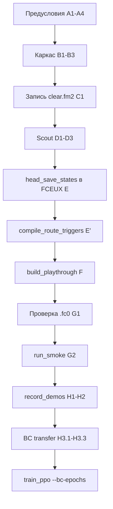

# Протокол: инициализация эталона миссии

> Пошаговый runbook: от записи FM2 до готовой среды train/inference.  
> Пример путей — пилот `rushn_attack` / `m1`. Для другой миссии замените `<game_id>` и `<mission_id>`.  
> Скрипты: [SCRIPTS.md](SCRIPTS.md) · термины: [GLOSSARY.md](GLOSSARY.md).  
> [`GAME_RUSHN_ATTACK.md`](GAME_RUSHN_ATTACK.md) — описание пилота, **не** runbook заполнения конфигов.

**Корень миссии:** `games/<game_id>/missions/<mission_id>/`

---

## Принципы (читать перед шагами)

### Источник правды

Цепочка зависимостей **строго однонаправленная**:

```
clear.fm2  →  scout (ram_scout.jsonl)  →  ram_resolve (проверенный)
           →  head_save_states (кадры под *этот* FM2)
           →  compile_route_triggers  →  route_triggers.yaml
           →  build_playthrough  →  jsonl / сегменты / .fc0
```

- **Единственный первичный артефакт прохождения** — `reference/clear.fm2` текущей сессии.
- Scout, якоря, `route_triggers`, save states, jsonl — **производные**; при замене FM2 их пересобирают заново по этой цепочке.
- `build_playthrough` **не вычисляет** номера кадров в `head_save_states` — только читает их из манифеста и снимает `.fc0`.
- `routes.yaml` (фаза B2) — **логика** маршрута (`anchor`, `requires_checkpoint`, награды); RAM-условия — в производном `route_triggers.yaml` (фаза E′).

### Запрещено

| Действие | Почему |
| -------- | ------ |
| **`git show` / `git restore` / коммиты** как источник кадров, `head_save_states`, `ram_resolve`, save states | В git — другой FM2 или устаревший тайминг; «восстановление» маскирует рассинхрон |
| Копировать `frame` из старого манифеста, бэкапа `.rar` или прошлой миссии без сверки с **текущим** `clear.fm2` | Номера кадров привязаны к конкретной записи FM2 |
| Автоподбор якорей только по scout (`min_stage`, масштабирование длины FM2) **без** просмотра в FCEUX | Scout даёт подсказки, не финальное решение |
| `build_playthrough` до scout и до заполненных `head_save_states` | Получите jsonl/сегменты на неверных предпосылках |
| Smoke / train как доказательство корректности якорей | Smoke проверяет каркас env, не «тот ли кадр» у `cp_gameplay0` |

> **Цель протокола** — понять, *что* записано в эталоне и *почему* каждый якорь на своём кадре, а не «собрать файлы и разбираться потом».

### Бэкапы

Перед заменой `clear.fm2` или `config/` — копия рядом с миссией (`reference_bcp_YYYYMMDD.rar`, `config_bcp_YYYYMMDD.rar`).  
Бэкап — для отката **после** сравнения, не как канон для `git restore`.

---

## Фаза A. Предусловия (один раз на репозиторий / игру)

### A1. Python-окружение

**Кто:** Пользователь · **Папка:** `.venv/`

```powershell
.\scripts\setup_venv.ps1
.\.venv\Scripts\python.exe scripts\verify_env.py
```

### A2. FCEUX portable

**Кто:** Пользователь · **Папка:** `fceux/portable/` (контракт **2.6.6 win64**, бинарник `fceux64.exe`).

### A3. ROM игры

**Кто:** Пользователь · **Папка:** `games/<game_id>/rom/`

### A4. Shell-разведка RAM (новая игра)

**Кто:** Пользователь (FM2) → `ram_scout.py` · **Папка:** `games/<game_id>/reference/`, `env_config.yaml`  
Пропустить, если игра уже настроена (`screen_phases`, `episode_end_title` заполнены).

```bash
./.venv/Scripts/python.exe scripts/ram_scout.py games/<game_id>/reference/<shell>.fm2
```

---

## Фаза B. Каркас миссии (без привязки к кадрам FM2)

### B1. Каталог миссии

```
missions/<mission_id>/
  config/
  reference/
  reference/demos_for_bc/
  save_states/
  models/
```

### B2. Черновик маршрута CP (только логика)

**Файл:** `config/routes.yaml` — `id`, `name`, **`anchor`** (id слота из `head_save_states`), `requires_checkpoint`, схема `rewards`.  
**Без RAM:** не писать `room`, `min_stage`, `max_*` — они появятся в `route_triggers.yaml` на фазе E′.  
Исключение: `mission_clear` и аналоги — inline `trigger: { flag: mission_complete }`.  
При `etalon_build.yaml` логический `routes.yaml` и `route_triggers.yaml` могут генерироваться на F1.

### B3. Заготовка манифеста (только схема слотов)

**Файл:** `config/playthrough_manifest.yaml` — можно завести **структуру** `head_save_states` (id, label, головы `title` / `intro` / `gameplay` / `bossfight`), **без** поля `frame` или с явными заглушками `frame: null`.  
Канон train/inference — `cp_gameplay0`.  
**Номера кадров заполняются только на шаге E** — после scout и просмотра FM2.

---

## Фаза C. Запись эталона

### C1. Запись `clear.fm2`

**Кто:** Пользователь · **Папка:** `reference/clear.fm2`  
Power-on → полное прохождение миссии → clear. Имя файла — **`clear.fm2`**.

Зафиксировать для себя (в заметках, не в git-истории):

- длина в кадрах (FCEUX / `count_fm2_frames`);
- отличается ли запись от предыдущей версии.

> С этого момента любые старые `head_save_states`, scout, jsonl, `.fc0` считаются **недействительными**, пока не пересобраны по цепочке ниже.

---

## Фаза D. RAM-разведка эталона

### D1. Scout по `clear.fm2`

**Кто:** `ram_scout.py` · **Папка:** `reference/scout/`

```bash
./.venv/Scripts/python.exe scripts/ram_scout.py \
  games/<game_id>/missions/<mission_id>/reference/clear.fm2
```

Обязателен перед `build_playthrough`. Без `ram_scout.jsonl` сборка остановится.

### D2. RAM-карта миссии

При первой миссии игры или смене адресов:

```bash
./.venv/Scripts/python.exe scripts/ram_scout.py \
  games/<game_id>/missions/<mission_id>/reference/clear.fm2 --write-ram-map
```

→ `config/ram_resolve.json`, `ram_map.md`

### D3. Сверка `ram_resolve.json` (ручная)

**Кто:** Пользователь  

Scout автоматически подбирает адреса; результат **проверить** по игре:

- совпадают ли `room`, `x`, `y` с `env_config.yaml` / прошлой проверенной картой;
- есть ли поля, которые scout не вывел (например `stage` @ `0x0030` для RnA m1) — добавить вручную с пометкой `manual` в JSON.

Без достоверной RAM-карты подсказки scout по `stage` / фазам бессмысленны.

---

## Фаза E. Якоря `head_save_states` (критический шаг)

**Файл:** `config/playthrough_manifest.yaml`  
**Кто:** Пользователь (scout — только вспомогательный инструмент)

### Порядок работы

1. Открыть **текущий** `clear.fm2` в FCEUX (тот же `fceux64.exe`, что в проекте).
2. Для каждого слота в `head_save_states` найти кадр по смыслу (`label`): title, intro, старт уровня, CP геймплея, босс, post-mission intro.
3. Записать `frame` (и при необходимости `phase_end_frame` у intro).
4. Сверить подсказки scout: на кадре `N` в `reference/scout/ram_scout.jsonl` (или после F1 — в `human_playthrough.jsonl`) должны быть ожидаемые `room` / `stage` / позиция.
5. Согласовать `routes.yaml`: поле **`anchor`** каждого CP ↔ `id` слота (`cp_gameplay1`…) — **на одном прохождении**, не из прошлого аудита.

### Чеклист слотов (пилот RnA m1)

| Слот | Смысл | Минимальная проверка |
| ---- | ----- | -------------------- |
| `cp_title0` | title screen | фаза `title` по RAM / экрану |
| `cp_intro0` | mission start intro | до геймплея; `phase_end_frame` — последний кадр intro |
| `cp_gameplay0` | **канон reset** | старт уровня, `gameplay`, `stage=0` |
| `cp_gameplay1`…`4` | узлы маршрута | `anchor` в `routes.yaml` указывает на этот слот |
| `cp_bossfight0` | босс m1 | фаза / `stage` босса |
| `cp_intro1` | post-mission intro | после clear; `phase_end_frame` ≈ последний кадр FM2 |

**Не переходить к фазе E′**, пока `cp_gameplay0` не проверен визуально в FCEUX на записанном кадре.

---

## Фаза E′. Компиляция RAM-триггеров

**Кто:** `compile_route_triggers.py` · **Выход:** `config/route_triggers.yaml`

После заполнения `frame` в `head_save_states` (E), **до** `build_playthrough` (F):

```bash
./.venv/Scripts/python.exe scripts/compile_route_triggers.py \
  games/<game_id>/missions/<mission_id>
```

Входы: `routes.yaml` (anchor), `playthrough_manifest.yaml`, `ram_scout.jsonl`, `ram_resolve.json`, правила `route_trigger_compile.yaml` (игра / миссия).

Ручная сверка: RAM на кадре каждого `anchor` в FCEUX / scout — ожидаемый прогресс узла. При расхождении — вернуться к E (кадр) или D3 (карта RAM), затем E′ снова.

`train_ppo` откажется стартовать, если в `routes.yaml` есть `anchor`, а `route_triggers.yaml` отсутствует или устарел относительно `clear.fm2`.

---

## Фаза F. Сборка производных артефактов

### F1. Полная сборка

**Кто:** `build_playthrough.py`

```bash
./.venv/Scripts/python.exe scripts/build_playthrough.py \
  games/<game_id>/missions/<mission_id>/reference/clear.fm2 --replace-states
```

Создаёт / обновляет:

- `reference/human_playthrough.jsonl`
- `config/playthrough_manifest.yaml` (сегменты, `total_frames`; **`head_save_states` не пересчитывает**)
- `save_states/cp_*.fc0`

`routes.yaml` без `etalon_build.yaml` **не перезаписывается**.

### F2. Только переснять `.fc0`

Когда jsonl и манифест уже актуальны, изменились только якоря:

```bash
./.venv/Scripts/python.exe scripts/build_playthrough.py \
  games/<game_id>/missions/<mission_id>/reference/clear.fm2 --states-only --replace-states
```

---

## Фаза G. Приёмка (после сборки, до train)

### G1. Ручная проверка save states

**Кто:** Пользователь · **Папка:** `save_states/`

В FCEUX по очереди загрузить `.fc0`, минимум:

- `cp_gameplay0.fc0` — старт уровня, фаза `gameplay`, адекватная позиция;
- при сомнениях — `cp_title0`, `cp_bossfight0`, проблемные CP.

Если кадр неверный → вернуться к **шагу E**, исправить `frame`, затем **F2**.

### G2. Smoke-тест среды

**Кто:** `run_smoke.py` · артефакты в `tmp/smoke/`, `tmp/bridge/`

```bash
./.venv/Scripts/python.exe scripts/run_smoke.py
```

Smoke **не заменяет** G1: проходит при «почти правильном» reset, но не ловит смещение якоря на сотни кадров.

---

## Фаза H. Behavioral cloning (опционально)

### H1. FM2-synced демо

Запись obs **только** через `-playmovie` эталонного FM2 (один проход). Emulation replay (`save_state` + `env.step`) не используется. Контракт obs: `(4, 112, 112)` grayscale.

```bash
./.venv/Scripts/python.exe scripts/record_demos.py \
  --game <game_id> --mission <mission_id>
```

### H2. Визуальная приёмка демо (обязательно перед BC)

```bash
./.venv/Scripts/python.exe scripts/preview_demos.py \
  --game <game_id> --mission <mission_id> --check
```

`--check` завершается с exit 1, если quality gate не пройден (чёрные/shell-кадры, низкий `gameplay_fraction` на gameplay-сегментах).

### H3. Приёмка BC transfer (обязательно перед `--bc-epochs` в train)

Проверяет, что демо **переносятся** в live env (obs + greedy pred на human-траектории), а не только учатся offline на NPZ.  
Артефакты диагностики — в `tmp/bench/…` ([гигиена артефактов](DESIGN.md)); в `games/…/logs/` пишется только явный inference.

**Когда перезапускать H3 целиком:** смена `clear.fm2`, якорей (фаза E), пересъём демо (H1), правки `bridge.lua` / `demos_for_bc.lua` / `bc_demo_record`.

#### H3.1. Согласованность obs: NPZ vs live

```bash
./.venv/Scripts/python.exe scripts/bc_obs_compare.py \
  --game <game_id> --mission <mission_id> \
  --segment seg_002 --out tmp/bench/bc_obs_compare
```

| Метрика | Порог приёмки | Провал означает |
| ------- | ------------- | --------------- |
| `mean_match_frac` (пиксели &lt; 1/255) | **≥ 0.99** | obs в env ≠ записанные демо |
| `first_diverge_frame` | **отсутствует** (MAE ≤ 0.01 на всех decision-кадрах) | рассинхрон pipeline на конкретном кадре |

При провале — чинить pipeline (gd/raw, render planes, `frame_deque`, frame drift), **не** увеличивать `--bc-epochs`.

#### H3.2. BC probe (warm-start, не overfit)

```bash
./.venv/Scripts/python.exe src/train/train_ppo.py \
  --game <game_id> --mission <mission_id> \
  --model-out tmp/bench/bc_probe/model.zip \
  --timesteps 0 --bc-epochs 5 --overwrite-model-out
```

Смотреть строку `BC demo match` в логе:

| Метрика | Порог приёмки | Комментарий |
| ------- | ------------- | ----------- |
| Offline match (все сегменты) | **60–75%** | цель warm-start перед PPO 1M |
| Offline match | **&lt; 55%** | провал: данные / masked targets / head assignment |
| Offline match | **≥ 95%** при `--bc-epochs ≤ 10` | не цель train; только диагностика «BC_CAN_LEARN» (`--timesteps 0`, больше эпох) |

Для production train на 1M: **`--bc-epochs 5`** (канон); **10** — если probe &lt; 55%. Больше 10 эпох перед полным PPO не использовать.

#### H3.3. Open-loop live transfer (главный критерий gameplay)

Human-траектория в FCEUX, greedy pred сравнивается с human (модель **не** управляет env):

```bash
./.venv/Scripts/python.exe scripts/bc_open_loop_eval.py \
  --game <game_id> --mission <mission_id> \
  --model tmp/bench/bc_probe/model.zip \
  --out tmp/bench/bc_open_loop_probe
```

Визуальный просмотр (тот же human path, OK/MISS в консоли):

```bash
./.venv/Scripts/python.exe scripts/bc_open_loop_watch.py \
  --game <game_id> --mission <mission_id> \
  --model tmp/bench/bc_probe/model.zip
```

Диапазон по умолчанию: gameplay-сегмент `seg_002`, кадры **1034–1300** (decision cadence `frame_skip=4`), reset `cp_gameplay0`.

| Метрика | Порог приёмки | Провал означает |
| ------- | ------------- | --------------- |
| Open-loop match (все decision-кадры) | **≥ 75%** | слабый transfer на human path |
| Match на действии B | **≥ 60%** | attack-кадры не переносятся |
| Attack-window B (кадры 1195–1210) | **100%** желательно; **&lt; 50%** — провал | фаза/голова или timing |
| Вердикт `PHASE_BUG` | **запрещён** | intro/title голова на attack-window |
| NPZ offline ≥ 80% **и** live open-loop &lt; 60% | **провал** (`OBS_PIPELINE_MISMATCH`) | учим одно, inference видит другое |

Отчёт: `bc_transfer_verdict.md` в `--out`. Exit code eval-скрипта не блокирует train — решение по таблице выше.

#### H3.4. Что **не** является приёмкой BC

| Сценарий | Почему не критерий |
| -------- | ------------------ |
| `run_inference` pool / `--live` (closed-loop) | агент играет сам; trajectory drift, не match с демо |
| Offline overfit ≥ 95% | подтверждает, что BC *может* учить, но не гарантирует transfer и усиливает noop-bias |
| `run_smoke` | не проверяет BC и кадры демо |

Closed-loop inference — отдельная метрика **после** train (noop_frac, max_cp), не gate для H3.

#### H3.5. Чеклист перед `train_ppo --bc-epochs`

- [ ] H2: `preview_demos --check` → exit 0  
- [ ] H3.1: obs NPZ vs live → `mean_match_frac ≥ 0.99`  
- [ ] H3.2: BC probe 5 ep → offline match 60–75%  
- [ ] H3.3: open-loop live → match ≥ 75%, B ≥ 60%, нет `PHASE_BUG` / `OBS_PIPELINE_MISMATCH`  
- [ ] Контроль: тот же бюджет с `--no-bc` (ablation) — иначе неясно, помог BC или навредил  

---

## Итог: артефакты миссии

| Артефакт | Путь | Когда появляется |
| -------- | ---- | ---------------- |
| FM2 эталона | `reference/clear.fm2` | C1 |
| Scout | `reference/scout/ram_scout.jsonl` | D1 |
| RAM-карта | `config/ram_resolve.json`, `ram_map.md` | D2–D3 |
| Якоря | `config/playthrough_manifest.yaml` → `head_save_states` | E |
| Маршрут CP (логика) | `config/routes.yaml` | B2 |
| RAM-триггеры CP | `config/route_triggers.yaml` | E′ |
| Jsonl | `reference/human_playthrough.jsonl` | F1 |
| Save states | `save_states/cp_*.fc0` | F1 |
| Demos BC | `reference/demos_for_bc/seg_*.npz` | H1 (+ приёмка H2) |
| BC transfer отчёты | `tmp/bench/bc_obs_compare/`, `tmp/bench/bc_open_loop_*` | H3 (диагностика) |

После **C1 → D → E → E′ → F → G → H (H1–H3)** среда готова к `train_ppo --bc-epochs` и `run_inference` (reset = `cp_gameplay0`).

---

## Частые ошибки

| Симптом | Причина | Действие |
| ------- | ------- | -------- |
| Якоря «как в git», но FM2 новый | `git restore` / копия старого манифеста | E заново по **текущему** FM2; git не использовать |
| `ram_scout.jsonl not found` | Пропущен D1 | `ram_scout.py` на текущий `clear.fm2` |
| `head_save_states` / gameplay start missing | F до E | Сначала E, потом F |
| Save state «не тот» кадр | `frame` не сверен с FM2 | E + G1, затем F2 |
| CP в игре не совпадают с маршрутом | `routes` / `route_triggers` и якоря из разных прохождений | Один проход: E + E′ |
| `route_triggers.yaml` missing | Пропущен E′ | `compile_route_triggers.py` |
| RAM в `routes.yaml` до FM2 | Смешение логики и эмпирики | B2: только anchor; RAM → E′ |
| Scout `x`/`y` сдвинуты на байт | Слепо доверили auto-resolve | D3, правка `ram_resolve.json` |
| BC не учится (offline &lt; 55%) | Демо не прошли quality gate / не пересобраны после смены FM2 | H1 + `preview_demos --check` |
| NPZ 95%, live open-loop ~50% | Рассинхрон obs pipeline (gd/raw, render, frame drift) | H3.1 + H3.3; чинить bridge, не эпохи BC |
| Open-loop B = 0% при высоком offline | Неверная голова на attack-window / phase bug | H3.3 вердикт `PHASE_BUG` |
| BC probe OK, closed-loop noop | Нормально для H3; closed-loop — после PPO, не gate BC | H3.4; смотреть train/inference отдельно |
| Рассинхрон jsonl и FM2 | Обновили только `.fc0` | Полный F1 от текущего `clear.fm2` |

**Важно:** save states сами по себе **не генерируют** jsonl и не доказывают правильность якорей — источник правды всегда **текущий** `clear.fm2` и цепочка **D → E → E′ → F**, с проверкой **G1** до smoke и train.

---

## Краткая схема (порядок шагов)



**Запрещённый путь:** B3 с кадрами из git → F → «что-то не так» → git restore.
