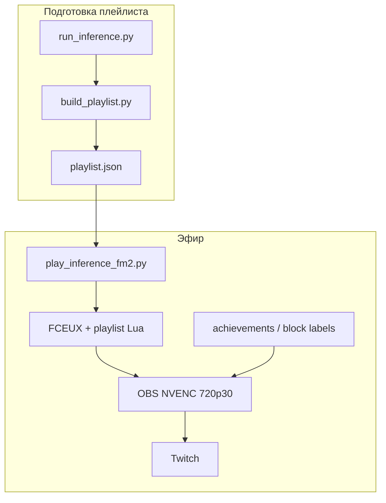

# STREAMING_CONCEPT — AI NES Learning Stream

> **Фокус:** эфир, медиа-формат, OBS, контент для зрителя.  
> ML: [ML_CONCEPT.md](ML_CONCEPT.md) · Пилот: [GAME_RUSHN_ATTACK.md](GAME_RUSHN_ATTACK.md) · Индекс: [README.md](README.md) · [GLOSSARY.md](GLOSSARY.md)  
> **Статус:** проектирование (этап B). Установка ПО — после gate [ML_CONCEPT.md §12](ML_CONCEPT.md#12-критерии-приёмки-ml).  
> Порядок этапов — [README.md](README.md#порядок-разработки).

---

## Содержание

1. [Vision](#1-vision)
2. [Позиционирование](#2-позиционирование)
3. [Scope этапа B](#3-scope-этапа-b)
4. [Инфраструктура эфира](#4-инфраструктура-эфира)
5. [Архитектура эфира](#5-архитектура-эфира)
6. [Сюжет и контент](#6-сюжет-и-контент)
7. [Игра на стриме](#7-игра-на-стриме)
8. [OBS](#8-obs)
9. [Метрики и лог эфира](#9-метрики-и-лог-эфира)
10. [Roadmap](#10-roadmap)
11. [Критерии приёмки (этап B)](#11-критерии-приёмки-стрим)
12. [Риски](#12-риски)
13. [Сезоны](#13-сезоны)

---

## 1. Vision

**Сезонное шоу на Twitch:** AI учится проходить NES попытка за попыткой; прогресс виден от стрима к стриму.

**Эфир** — replay плейлиста лучших попыток (FCEUX + OBS). Сбор попыток, train и дообучение — [ML_CONCEPT.md](ML_CONCEPT.md).

Ниша: RL-прогресс на стриме, скачки версий модели между эфирами, retro-NES эстетика. Не speedrun WR — обучение и рост CP.

---

## 2. Позиционирование

**Аудитория:** retro-gaming + AI-curious.

**Тон:** «AI реально учится» — провалы, скачки прогресса, рост CP.

**Метрики сезона (для зрителя):**

- Рост `max_checkpoint` от стрима к стриму.
- Меньше смертей в проблемных зонах.
- Клир миссии — драматургия сезона, не цель платформы ([README.md](README.md)).

---

## 3. Scope этапа B

Спецификация эфира. До gate [ML §12](ML_CONCEPT.md#12-критерии-приёмки-ml) — только проектирование, без установки OBS/Twitch. Материал плейлиста (`run_inference`, `attempts.jsonl`) — [ML_CONCEPT.md](ML_CONCEPT.md) / [SCRIPTS.md](SCRIPTS.md).

| Компонент | Описание |
| --------- | -------- |
| Платформа | Twitch |
| Эфир | FCEUX playlist replay + OBS 720p30 NVENC |
| Захват | Game Capture → FCEUX |
| Контент | `play_inference_fm2.py` + `logs/YYYYMMDD/playlist.json` |
| Overlay | `max_checkpoint`, deaths, `model_version` |
| Лог | `logs/YYYYMMDD/attempts.jsonl` ([ML §8](ML_CONCEPT.md#8-форматы-данных), [SCRIPTS.md](SCRIPTS.md#inference)) |

---

## 4. Инфраструктура эфира

Железо — [README.md](README.md#железо-хост-2026-07-05). В эфире: CPU (FCEUX playlist), GTX 650 (NVENC), upload ≥5 Mbps.

```
play_inference_fm2.py (playlist) + FCEUX + OBS (NVENC 720p30)
```

Плейлист заранее: `run_inference` → `build_playlist` — [SCRIPTS.md](SCRIPTS.md#achievements-и-плейлист).  
ПО этапа B: OBS Studio на хосте; FCEUX/venv уже из этапа A. Артефакты — [DESIGN.md § Структура](DESIGN.md#структура-репозитория).

---

## 5. Архитектура эфира



### Цикл для зрителя

```
Эфир v0 → (между стримами: дообучение) → эфир v1
```

Контекст в эфире: «застряли здесь → доучили на сегменте → сегодня vN».

---

## 6. Сюжет и контент

### Эпизод

1. **Плейлист** — попытки по номинациям achievements (`logs/YYYYMMDD/playlist.json`).
2. **Контекст** — что доучивали, где застряли, версия модели.

### ROM

Не показывать получение ROM на эфире. Локально — `.gitignore` ([DESIGN.md](DESIGN.md#структура-репозитория)).

---

## 7. Игра на стриме

Пилот: [GAME_RUSHN_ATTACK.md](GAME_RUSHN_ATTACK.md). Захват NES в 720p через FCEUX.

---

## 8. OBS

| Параметр | Значение |
| -------- | -------- |
| Разрешение | 1280×720 |
| FPS | 30 |
| Encoder | NVENC (GTX 650) |
| Bitrate | 3000–4500 kbps |
| Capture | Game Capture → окно FCEUX |
| Overlay | `max_checkpoint`, deaths, `model_version` |

Сцены / код overlay — этап B ([§10](#10-roadmap)).

---

## 9. Метрики и лог эфира

`logs/YYYYMMDD/attempts.jsonl` — одна строка на попытку.

**Для эфира / overlay:** `model_version`, `max_checkpoint`, `died`, `death_x`, `death_room`, `mission_clear`.

Схема и retention — [ML_CONCEPT.md §8](ML_CONCEPT.md#8-форматы-данных), [SCRIPTS.md](SCRIPTS.md#inference).

---

## 10. Roadmap

После gate [ML §12](ML_CONCEPT.md#12-критерии-приёмки-ml).

| Задача | Результат |
| ------ | --------- |
| OBS | Studio на хосте |
| Профиль | 720p30 NVENC, Game Capture → FCEUX |
| Overlay | `max_checkpoint`, deaths, `model_version` |
| Twitch | Канал, stream key (не на экране) |
| Тестовый эфир | `build_playlist` → `play_inference_fm2.py logs/YYYYMMDD/playlist.json` |

---

<a id="11-критерии-приёмки-стрим"></a>

## 11. Критерии приёмки (этап B)

После gate [ML §12](ML_CONCEPT.md#12-критерии-приёмки-ml); не блокируют приёмку ML.

- [ ] Тестовый эфир: `play_inference_fm2.py` + `logs/YYYYMMDD/playlist.json`, клипы подряд с overlay
- [ ] OBS: 720p30 NVENC, Game Capture FCEUX
- [ ] Overlay: `max_checkpoint`, deaths, `model_version`
- [ ] В эфире: playlist → контекст дообучения → новая версия модели

---

## 12. Риски

| Риск | Митигация |
| ---- | --------- |
| Слабый upload | 720p30, ~3000 kbps, speedtest |
| Скучный эфир | Прогресс AI, контекст версий, озвучка CP |
| ROM на стриме | Не показывать получение ROM |

---

## 13. Сезоны

Пилот и сезоны Rush'n Attack — [GAME_RUSHN_ATTACK.md §7](GAME_RUSHN_ATTACK.md#7-эфир--сезоны).  
Другие игры — после pipeline на пилоте (отдельный `GAME_*.md`).
