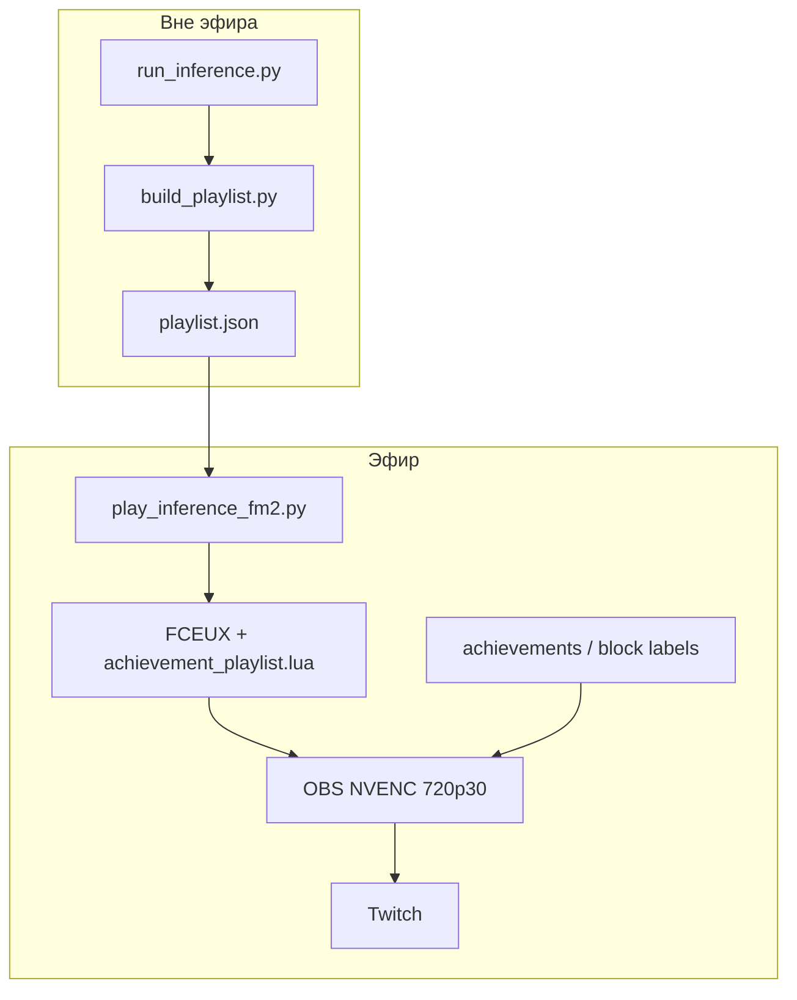

# STREAMING_CONCEPT — AI NES Learning Stream

> **Фокус:** эфир, медиа-формат, OBS, контент для зрителя.  
> ML: [ML_CONCEPT.md](ML_CONCEPT.md) · Индекс: [PROJECT_CONCEPT.md](PROJECT_CONCEPT.md) · [GLOSSARY.md](GLOSSARY.md)  
> **Статус реализации:** проектирование (этап B). Установка ПО — после gate [ML_CONCEPT.md §12](ML_CONCEPT.md#12-критерии-приёмки-ml).  
> **Текущий фокус:** ML-стек, этап A — [PROJECT_CONCEPT.md](PROJECT_CONCEPT.md#порядок-разработки).

---

## Содержание

1. [Vision](#1-vision)
2. [Позиционирование](#2-позиционирование)
3. [Scope MVP](#3-scope-mvp)
4. [Инфраструктура эфира](#4-инфраструктура-эфира)
5. [Архитектура эфира](#5-архитектура-эфира)
6. [Сюжет и контент](#6-сюжет-и-контент)
7. [Игра на стриме](#7-игра-на-стриме)
8. [OBS](#8-obs)
9. [Метрики и лог эфира](#9-метрики-и-лог-эфира)
10. [Roadmap](#10-roadmap)
11. [Критерии приёмки (этап B)](#11-критерии-приёмки-стрим)
12. [Риски](#12-риски)
13. [Сезоны и бэклог игр](#13-сезоны-и-бэклог-игр)

---


## 1. Vision

**Сезонное шоу на Twitch:** AI учится проходить NES попытка за попыткой. Прогресс виден от стрима к стриму. **Вне эфира** — inference и дообучение ([ML_CONCEPT.md](ML_CONCEPT.md)); **на эфире** — replay плейлиста лучших попыток через FCEUX + OBS.

### Чем мы НЕ являемся


| Не это                    | Почему                                                     |
| ------------------------- | ---------------------------------------------------------- |
| World record speedrun     | Цель — обучение и прогресс, не WR                   |
| 24/7 training wallpaper   | Curated шоу с сюжетом                                      |
| Классический TAS  | Frame-perfect скрипт человека; у нас RL + inference |
| «Ещё один SMB AI» | SMB не выбран (заезжен, не нравится автору)        |


### Уникальность

Ниша на стыке: RL-прогресс на стриме, скачки версий модели между эфирами, retro-NES эстетика.

---


## 2. Позиционирование

**Аудитория:** retro-gaming + AI-curious; не обязательно speedrun-комьюнити.

**Тон:** «AI реально учится» — провалы, скачки прогресса, рост CP.

**Метрики сезона (не WR):**

- Рост `max_checkpoint` от стрима к стриму.
- Меньше смертей в проблемных зонах.
- Финиш миссии 1 — долгосрочная цель.

---


## 3. Scope MVP

Спецификация **этапа B**. До gate [ML §12](ML_CONCEPT.md#12-критерии-приёмки-ml) — только проектирование, без установки ПО.

### Этап A (сейчас) — в концепте, без реализации стрима


| Компонент                                           | Где                            |
| --------------------------------------------------- | ------------------------------ |
| Сюжет, позиционирование, метрики сезона             | этот документ                  |
| Локальный inference, `attempts.jsonl` | [ML_CONCEPT.md](ML_CONCEPT.md) |
| `run_inference.py`                                  | ML Phase 1–2, не стрим         |


### Этап B (после gate) — реализация


#### Входит


| Компонент | Описание                                                   |
| --------- | ---------------------------------------------------------- |
| Платформа | Twitch                                                     |
| Эфир      | FCEUX playlist replay + OBS 720p30 NVENC |
| Захват    | Game Capture → FCEUX                             |
| Контент   | `play_inference_fm2.py` + `YYYYMMDD_playlist.json`         |
| Overlay   | `max_checkpoint`, deaths, `model_version`                  |
| Лог       | `logs/attempts.jsonl` на каждую попытку (формат — ML §8)   |


#### Не входит


| Компонент             | Когда    |
| --------------------- | -------- |
| Twitch API / chat-бот | Phase 5+ |
| Другие игры / миссии  | Сезон 2+ |


---


## 4. Инфраструктура эфира

Железо хоста — [PROJECT_CONCEPT.md](PROJECT_CONCEPT.md#железо-хост-2026-07-05). В эфире: CPU (inference + FCEUX), GTX 650 (NVENC), upload ≥5 Mbps.

### Правила в эфире

```
ЭФИР:       play_inference_fm2.py (playlist) + FCEUX + OBS (NVENC)
НЕ В ЭФИРЕ: inference, PPO, сбор плейлиста — лаги и просадки FPS
```

Обучение — только вне эфира ([ML_CONCEPT.md §2](ML_CONCEPT.md#2-инфраструктура-обучения)).

### ПО

**Этап A:** FCEUX из `fceux/portable/` (класс B), Python из `.venv/` (класс B+C).  
**Этап B:** + OBS Studio на хосте (класс C). Git — системный.

Матрица — [ML_CONCEPT.md §10](ML_CONCEPT.md#в-проекте-vs-окружение).

---


## 5. Архитектура эфира




### Цикл для зрителя

```
Эфир v0 → (между стримами: дообучение) → эфир v1
```

В эфире озвучивается контекст: «застряли здесь → доучили на seg_003 → сегодня v4».

---


## 6. Сюжет и контент


### Эпизод

1. **Плейлист** — лучшие попытки по номинациям achievements (`YYYYMMDD_playlist.json`).
2. **Контекст** — что доучивали между эфирами, где застряли, какая версия модели сегодня.


### ROM (стрим)

Не показывать скачивание ROM на эфире. Локально — `.gitignore` ([ML_CONCEPT.md §10](ML_CONCEPT.md#10-структура-репозитория)).

---


## 7. Игра на стриме

**Rush'n Attack**, M1 — [PROJECT_CONCEPT.md](PROJECT_CONCEPT.md).


| Критерий     | Значение для эфира                 |
| ------------ | ---------------------------------- |
| Узнаваемость | Action, холодная война, нож        |
| Длина        | Короткая миссия — удобный формат   |
| Визуал       | NES хорошо читается в 720p |


RL-обоснование — [ML_CONCEPT.md §5](ML_CONCEPT.md#5-игра-и-среда).

---


## 8. OBS


| Параметр    | Значение                                  |
| ----------- | ----------------------------------------- |
| Разрешение  | 1280×720                                  |
| FPS | 30                                        |
| Encoder     | NVENC (GTX 650)                 |
| Bitrate     | 3000–4500 kbps                            |
| Capture     | Game Capture → окно FCEUX       |
| Overlay     | `max_checkpoint`, deaths, `model_version` |


Код overlay — этап B. `run_inference.py` — [ML_CONCEPT.md §11](ML_CONCEPT.md#11-roadmap-ml-фазы) (этап A).

---


## 9. Метрики и лог эфира

`logs/attempts.jsonl` — одна строка на попытку.

**Для эфира и overlay:** `model_version`, `max_checkpoint`, `died`, `death_x`, `death_room`, `mission_clear`.

Полная схема — [ML_CONCEPT.md §8](ML_CONCEPT.md#8-форматы-данных).

---


## 10. Roadmap

Начинается **после gate** [ML_CONCEPT.md §12](ML_CONCEPT.md#12-критерии-приёмки-ml). Сроки не привязаны к ML-фазам.

### Phase S — стрим (этап B)


| Задача                | Результат                                                              |
| --------------------- | ---------------------------------------------------------------------- |
| Установка OBS | OBS Studio на хосте                                                    |
| Профиль эфира         | 720p30 NVENC, Game Capture → FCEUX                 |
| Сцены / overlay       | `max_checkpoint`, deaths, `model_version`                              |
| Twitch                | Канал, stream key (не показывать на эфире)                             |
| Тестовый эфир         | `build_playlist` → `play_inference_fm2.py logs/YYYYMMDD_playlist.json` |


### Phase 5+

Twitch chat (`!progress`, `!deaths`).

ML-фазы 0–4 — [ML_CONCEPT.md §11](ML_CONCEPT.md#11-roadmap-ml-фазы) (**этап A**, текущий приоритет).

---

---


## 11. Критерии приёмки (этап B)

Выполняются **после** gate [ML §12](ML_CONCEPT.md#12-критерии-приёмки-ml). Не блокируют ML MVP.

- [ ] Тестовый эфир: `play_inference_fm2.py` с `YYYYMMDD_playlist.json`, клипы подряд с overlay
- [ ] OBS: 720p30 NVENC, Game Capture FCEUX
- [ ] Overlay: `max_checkpoint`, deaths, `model_version`
- [ ] В эфире: playlist replay → контекст дообучения → новая версия модели

ML-критерии (gate этапа A) — [ML_CONCEPT.md §12](ML_CONCEPT.md#12-критерии-приёмки-ml).

---


## 12. Риски


| Риск                  | Митигация                                              |
| --------------------- | ------------------------------------------------------ |
| Лаги в эфире          | Не совмещать PPO и OBS                 |
| Слабый upload         | 720p30, 3000 kbps, speedtest                           |
| Скучный эфир          | Прогресс AI, контекст версий, озвучка CP |
| ROM на стриме | Не показывать получение ROM                    |


---


## 13. Сезоны и бэклог игр


| Этап        | Игра                    | Формат сезона            |
| ----------- | ----------------------- | ------------------------ |
| MVP | Rush'n Attack M1 | Миссия 1                 |
| Сезон 1b    | Rush'n Attack M2–M6     | Миссия за блок стримов   |
| Сезон 2+    | Бэклог                  | После отработки pipeline |


### Бэклог (привлекательность для стрима)


| Игра                            | Приоритет | Формат сезона        | Интерес       |
| ------------------------------- | --------- | -------------------- | ------------- |
| TMNT III (NES) | Высокий   | 1 Scene за блок (8)  | Очень высокий |
| TMNT II (NES)  | Высокий   | 1 stage за блок (~6) | Очень высокий |
| Mega Man 2                      | Средний   | 1 Robot Master       | Высокий       |
| Journey to Silius               | Средний   | Act / stage          | Высокий       |
| Contra                          | Низкий    | 1 level              | Высокий       |
| NG                       | Низкий    | Act                  | Высокий       |
| RoboCop 2                       | Низкий    | 1 level              | Средний       |


После Rush'n Attack: **TMNT III Scene 1** или **TMNT II Stage 1** (одна игра на сезон).

RL-аспекты — [ML_CONCEPT.md §14](ML_CONCEPT.md#14-roadmap-игр-ml).
