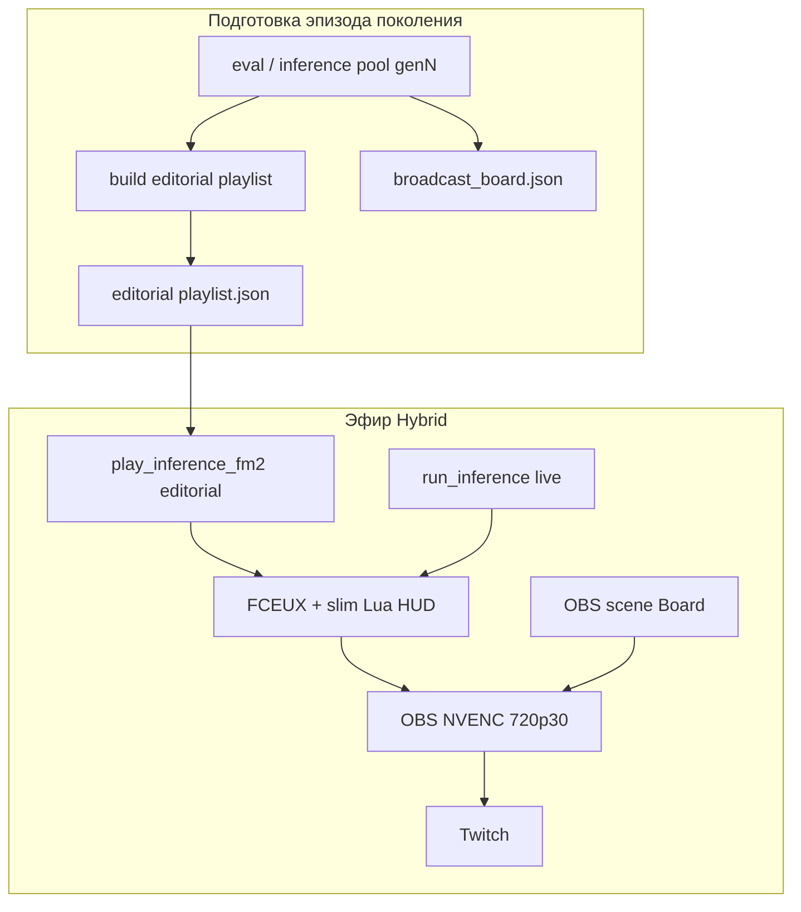

# STREAMING_CONCEPT — AI NES Learning Stream

> **Фокус:** эфир, медиа-формат, OBS, контент для зрителя (content production).  
> ML: [ML_CONCEPT.md](ML_CONCEPT.md) · Пилот: [GAME_RUSHN_ATTACK.md](GAME_RUSHN_ATTACK.md) · Индекс: [README.md](README.md) · [GLOSSARY.md](GLOSSARY.md)  
> **Статус:** проектирование (этап B). Установка ПО — после gate [ML_CONCEPT.md §12](ML_CONCEPT.md#12-критерии-приёмки-ml).  
> Порядок этапов — [README.md](README.md#порядок-разработки).  
> Реализация целевой модели: [TASK_GEN_LOG_POOL](tasks/archive/TASK_GEN_LOG_POOL.md) (done), [TASK_HYBRID_BROADCAST](tasks/TASK_HYBRID_BROADCAST.md).

---

## Содержание

1. [Vision](#1-vision)
2. [Позиционирование](#2-позиционирование)
3. [Scope этапа B](#3-scope-этапа-b)
4. [Инфраструктура эфира](#4-инфраструктура-эфира)
5. [Архитектура эфира](#5-архитектура-эфира)
6. [Сюжет и контент](#6-сюжет-и-контент)
7. [Слои информации на экране](#7-слои-информации-на-экране)
8. [Игра на стриме](#8-игра-на-стриме)
9. [OBS](#9-obs)
10. [Метрики и логи](#10-метрики-и-логи)
11. [Roadmap](#11-roadmap)
12. [Критерии приёмки (этап B)](#12-критерии-приёмки-стрим)
13. [Риски](#13-риски)
14. [Сезоны](#14-сезоны)

---

## 1. Vision

**Сезонное шоу на Twitch:** AI учится проходить NES; прогресс виден **от поколения к поколению** ([`genN`](GLOSSARY.md#поколение-модели-genn)), а не от календарной даты к дате.

**Единица эфира** — [эпизод поколения](GLOSSARY.md#эпизод-поколения): витрина того, на что способна `genN`, на фоне `genN−1` (и при необходимости эталона человека). Сезон = миссия; внутри сезона идут эпизоды поколений и, при необходимости, отчёты с той же `genN` на текущей [границе](GLOSSARY.md#граница-прогресса-frontier) («просто тренируем, пока не получится» — без обещаний сроков и прорывов).

**Формат эфира (Hybrid):**

1. **Editorial** — короткий кураторский пакет клипов поколения (ориентир **8–15 мин** realtime), не часовой «набитый» плейлист.
2. **Live-inference** — основное тело слота: модель играет сейчас на границе прогресса.
3. Между режимами — [broadcast board](GLOSSARY.md#broadcast-board) (перебивка вне окна NES).

Ниша: RL-прогресс на стриме, смена поколений модели, retro-NES эстетика. Не speedrun WR — обучение и рост CP.

**Не входит в этот документ:** chatting / podcasting / развлекательное ведение эфира. Только content production.

---

## 2. Позиционирование

**Аудитория:** retro-gaming + AI-curious.

**Тон:** «AI реально учится» — провалы, скачки прогресса, рост CP, честный застой на границе. Без обещаний «в следующем эфире пробьём». Без явного давления на донат; скромная возможность «поддержать проект» (панель Twitch / мелкая ссылка на board) допустима.

**Метрики сезона (для зрителя):**

- Рост `max_checkpoint` / сдвиг границы **по поколениям** (`genN` vs `genN−1`).
- Меньше смертей в проблемных зонах (стена на границе).
- Клир миссии — драматургия сезона, не цель платформы ([README.md](README.md)).

**Follow:** подписка на сериал поколений и на текущую границу миссии, а не на «стрим за дату».

---

## 3. Scope этапа B

Спецификация эфира. До gate [ML §12](ML_CONCEPT.md#12-критерии-приёмки-ml) — только проектирование, без установки OBS/Twitch.

Материал editorial и live опирается на inference / FM2 / achievements — [ML_CONCEPT.md](ML_CONCEPT.md) / [SCRIPTS.md](SCRIPTS.md). **Пул попыток** — [пул поколения](GLOSSARY.md#пул-поколения) (`logs/genN/…`), не календарный день.

| Компонент | Описание |
| --------- | -------- |
| Платформа | Twitch |
| Эфир | Hybrid: editorial replay + live `run_inference` + OBS 720p30 NVENC |
| Захват | Game Capture → окно FCEUX (режим Game); отдельно сцена Board |
| Editorial | короткий `playlist.json` поколения (без pad «до часа») |
| Live | стохастический inference на границе, тот же захват FCEUX |
| HUD в кадре | тонкий Lua overlay (инженерный вид) |
| Перебивки / контекст | broadcast board (OBS Browser Source или эквивалент) |
| Лог | целевой: `logs/genN/attempts.jsonl` (+ inputs); см. §10 |

---

## 4. Инфраструктура эфира

Железо — [README.md](README.md#железо-хост-2026-07-05). В эфире: CPU (FCEUX playlist и/или live inference), GTX 650 (NVENC), upload ≥5 Mbps.

```
editorial: play_inference_fm2.py (короткий playlist) + FCEUX
live:      run_inference --show-window (или эквивалент операторского live)
board:     OBS сцена без NES (HTML/JSON board)
encode:    OBS NVENC 720p30 → Twitch
```

ПО этапа B: OBS Studio на хосте; FCEUX/venv уже из этапа A. Артефакты — [DESIGN.md § Структура](DESIGN.md#структура-репозитория).

**Операторский смысл (целевой, не обязательный CLI as-is):**

- Собрать eval/attempts для `genN` → собрать **короткий** editorial без `--target-airtime` как способа заполнить час.
- Открыть эфир: Board → Editorial → Board → Live → Board (финал).
- Длина Twitch-слота (часто ~1 ч) = editorial + live + перебивки; **не** = длина кураторского плейлиста.

Исторический флаг `--target-airtime` / pad до 1 ч — наследие модели «эфир = плейлист дня»; в целевой модели не является режиссёрским дефолтом (снятие/замена — [TASK_HYBRID_BROADCAST](tasks/TASK_HYBRID_BROADCAST.md)).

---

## 5. Архитектура эфира



### Роли носителей

| Носитель | Роль | Длина (ориентир) |
| -------- | ---- | ---------------- |
| Editorial | внимание + доказательство прогресса (`genN` vs `genN−1`) | 8–15 мин |
| Live | удержание, suspense на границе | остаток слота |
| Board | контекст, дельта поколений, смена режима | 20–60 с на перебивку |

### Цикл для зрителя

```
эпизод genN → (между эфирами: дообучение, без обещаний срока) → эпизод genN+1
         ↘ при той же gen: frontier report на той же стене
```

---

## 6. Сюжет и контент

### Эпизод поколения (каркас)

1. **Board** — `genN`, карта CP, граница, карточка дельты vs `genN−1` (если есть данные).
2. **Editorial** — мало клипов, высокий сигнал (см. ниже).
3. **Board** — переход: «live на границе».
4. **Live** — попытки на frontier; периодические мини-итоги блока на Board или компактной карточке.
5. **Board** — статус без обещаний («продолжаем тренировать»); скромно «поддержать проект» при желании оператора.

### Состав editorial (сигнальные клипы)

Ориентир: хук → contrast `genN−1`/`genN` → стена (кластер смертей) → редкий breakthrough/clear.  
Не цель — закрыть номинациями час эфира.

### Achievements (драматургия)

Целевые слои (деталь пилота — [GAME_RUSHN_ATTACK.md §5](GAME_RUSHN_ATTACK.md#5-achievements-номинации-пилота); код/YAML — задачи ниже):

| Слой | Примеры смысла | Роль |
| ---- | -------------- | ---- |
| Сюжетные | `new_frontier`, `wall`, `breakthrough`, `mission_clear`, дельта поколений | каркас editorial / board |
| Честность | `regression`, откат поколения | доверие |
| Второстепенные | быстрая смерть, узкие death-gag | B-roll, не наполнители слота |

Пул тегов/`top_k`/`deja_vu` — **поколение**, не календарный день.

### ROM

Не показывать получение ROM на эфире. Локально — `.gitignore` ([DESIGN.md](DESIGN.md#структура-репозитория)).

---

## 7. Слои информации на экране

Два слоя с разными задачами. Lua overlay **сохраняем** (технологичный, «инженерный» вид), но не перегружаем картинку NES.

### A. Lua HUD (в кадре игры)

Работает только пока идёт FCEUX (editorial clip или live).

**Минимум на экране:** `genN` / `model_version`, текущий `max_checkpoint` (или CP), краткий тег номинации клипа (если есть), при смерти — компактно `room`/`x` или маркер стены.

Не дублировать на Lua полную карту миссии, длинные таблицы дельты и CTA — это Board.

Реализация as-is: `fceux/lua/achievement_overlay_*.lua` + sidecar `.overlay.json`; целевое ужатие полей — [TASK_HYBRID_BROADCAST](tasks/TASK_HYBRID_BROADCAST.md).

### B. Broadcast board (перебивка / контекст)

OBS-сцена **без** зависимости от текущего FM2/live-кадра (Browser Source по JSON/HTML или заранее собранные карточки).

**Показывает:** поколение, лестница `gen0…genN`, карта CP / граница, дельта eval `genN` vs `genN−1`, название режима (Editorial / Live / Frontier report), при желании скромная строка «поддержать проект».

**Когда:** открытие эфира, стык editorial↔live, финал, пауза между блоками live.

---

## 8. Игра на стриме

Пилот: [GAME_RUSHN_ATTACK.md](GAME_RUSHN_ATTACK.md). Захват NES в 720p через FCEUX.

Live по возможности играет **на границе** (релевантный старт / фокус попыток), а не бесконечный «с нуля миссии» без режиссёрского смысла.

---

## 9. OBS

| Параметр | Значение |
| -------- | -------- |
| Разрешение | 1280×720 |
| FPS | 30 |
| Encoder | NVENC (GTX 650) |
| Bitrate | 3000–4500 kbps |
| Сцена Game | Game Capture → окно FCEUX + Lua HUD |
| Сцена Board | Browser Source / статика из `broadcast_board` |
| Переходы | Game ↔ Board по каркасу эпизода |

Профиль сцен и источник board — этап B / [TASK_HYBRID_BROADCAST](tasks/TASK_HYBRID_BROADCAST.md).

---

## 10. Метрики и логи

**Раскладка:** `games/…/missions/<m>/logs/genN/` — `attempts.jsonl`, `inference_inputs.jsonl`, editorial `playlist.json`, артефакты board.

**Поля для эфира / HUD / board:** `model_version` (`genN`), `max_checkpoint`, `died`, `death_x`, `death_room`, `mission_clear`, теги achievements; для board дополнительно агрегаты eval и дельта к предыдущему поколению.

Устаревший day-layout — [retention window](GLOSSARY.md#retention-window-устарело).

**Airtime** в целевой модели — длина **editorial**-пакета (и вспомогательная метрика длины клипов), а не обязательство заполнить час плейлистом. Длина Twitch-слота задаётся оператором (editorial + live).

---

## 11. Roadmap

После gate [ML §12](ML_CONCEPT.md#12-критерии-приёмки-ml).

| Задача | Результат |
| ------ | --------- |
| [TASK_GEN_LOG_POOL](tasks/archive/TASK_GEN_LOG_POOL.md) | пул `logs/genN/`, без day-retention как сюжетной/отборочной рамки |
| [TASK_HYBRID_BROADCAST](tasks/TASK_HYBRID_BROADCAST.md) | editorial короткий + live + Board + slim Lua |
| OBS / Twitch | профиль 720p30, сцены Game/Board, stream key не на экране |
| Тестовый эфир | каркас Board → editorial → Board → короткий live |

---

<a id="12-критерии-приёмки-стрим"></a>
<a id="11-критерии-приёмки-стрим"></a>

## 12. Критерии приёмки (этап B)

После gate [ML §12](ML_CONCEPT.md#12-критерии-приёмки-ml); не блокируют приёмку ML.

- [ ] Тестовый hybrid-эфир: короткий editorial + live-фрагмент + перебивка Board
- [ ] OBS: 720p30 NVENC; сцены Game и Board
- [ ] Lua HUD: минимальный набор полей, картинка NES читаема
- [ ] Board: поколение, граница/CP, смена режима; без агрессивного донат-CTA
- [ ] Сравнение прогресса в сюжете — по `genN`, не по дате папки логов
- [x] Пул attempts для номинаций editorial — поколение ([TASK_GEN_LOG_POOL](tasks/archive/TASK_GEN_LOG_POOL.md))

---

## 13. Риски

| Риск | Митигация |
| ---- | --------- |
| Слабый upload | 720p30, ~3000 kbps, speedtest |
| Скучный live | фокус на границе; короткие блоки + Board-итог |
| Перегруз HUD | вынести контекст на Board; Lua только компактный |
| Дорогой часовой плейлист | editorial 8–15 мин, без pad-до-часа |
| ROM на стриме | не показывать получение ROM |

---

## 14. Сезоны

Пилот и сезоны Rush'n Attack — [GAME_RUSHN_ATTACK.md §7](GAME_RUSHN_ATTACK.md#7-эфир--сезоны).  
Другие игры — после pipeline на пилоте (отдельный `GAME_*.md`).
