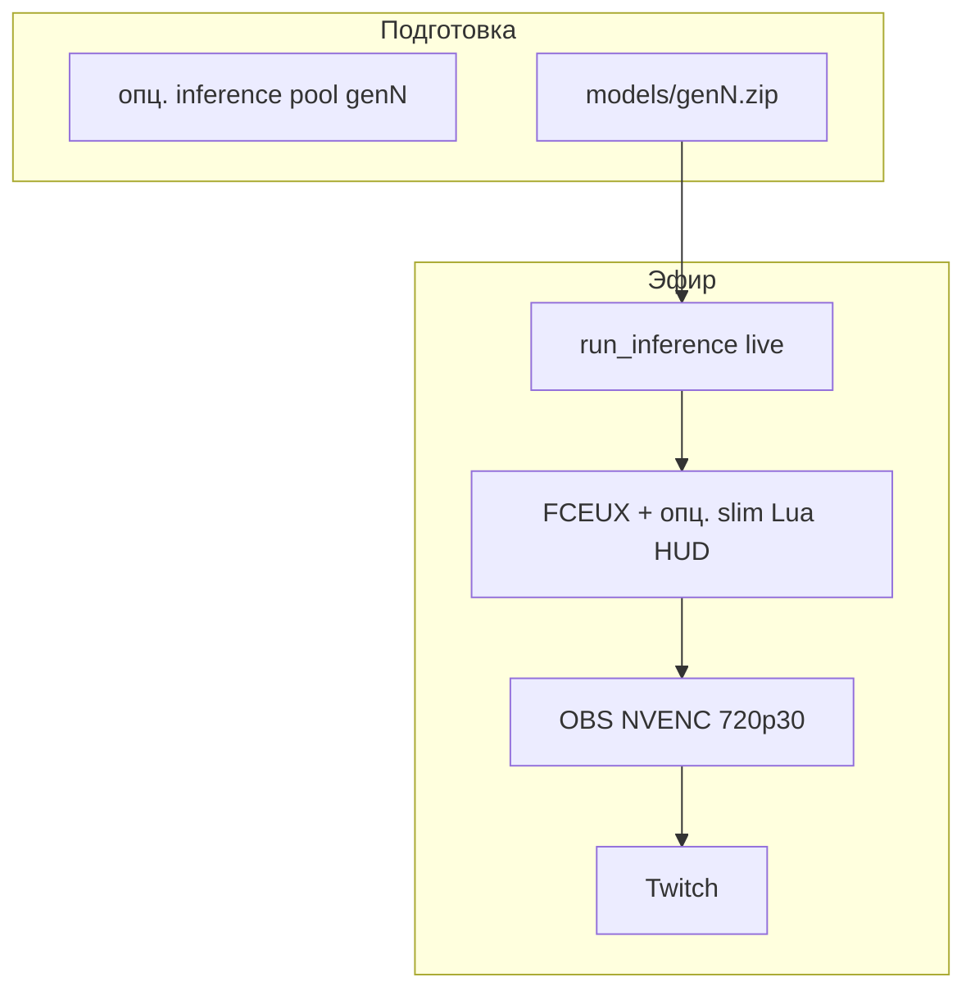

# STREAMING_CONCEPT — AI NES Learning Stream

> **Фокус:** эфир, медиа-формат, OBS, контент для зрителя (content production).  
> ML: [ML_CONCEPT.md](ML_CONCEPT.md) · Пилот: [GAME_RUSHN_ATTACK.md](GAME_RUSHN_ATTACK.md) · Индекс: [README.md](README.md) · [GLOSSARY.md](GLOSSARY.md)  
> **Статус:** проектирование (этап B). Установка ПО — после gate [ML_CONCEPT.md §12](ML_CONCEPT.md#12-критерии-приёмки-ml).  
> Порядок этапов — [README.md](README.md#порядок-разработки).  
> Каркас: live-inference + пул `logs/genN/` (см. [SCRIPTS.md](SCRIPTS.md)); OBS/Twitch — после gate.

---

## Содержание

1. [Vision](#1-vision)
2. [Позиционирование](#2-позиционирование)
3. [Scope этапа B](#3-scope-этапа-b)
4. [Инфраструктура эфира](#4-инфраструктура-эфира)
5. [Архитектура эфира](#5-архитектура-эфира)
6. [Сюжет и контент](#6-сюжет-и-контент)
7. [Слои информации на экране](#7-слои-информации-на-экране)
8. [Игра на стриме](#8-игра-на-стриме)
9. [OBS](#9-obs)
10. [Метрики и логи](#10-метрики-и-логи)
11. [Roadmap](#11-roadmap)
12. [Критерии приёмки (этап B)](#12-критерии-приёмки-стрим)
13. [Риски](#13-риски)
14. [Сезоны](#14-сезоны)

---

## 1. Vision

**Сезонное шоу на Twitch:** AI учится проходить NES; прогресс виден **от поколения к поколению** ([`genN`](GLOSSARY.md#поколение-модели-genn)), а не от календарной даты к дате.

**Единица эфира** — [эпизод поколения](GLOSSARY.md#эпизод-поколения): витрина того, на что способна `genN`, на фоне `genN−1` (и при необходимости эталона человека). Сезон = миссия; внутри сезона идут эпизоды поколений и, при необходимости, отчёты с той же `genN` на текущей [границе](GLOSSARY.md#граница-прогресса-frontier) («просто тренируем, пока не получится» — без обещаний сроков и прорывов).

**Формат эфира (этап B):**

1. **Live-inference** — основное тело слота: модель играет сейчас на границе прогресса (`run_inference --live`).
2. Захват окна FCEUX в OBS → Twitch (720p30 NVENC).

Кураторский пакет клипов, editorial-плейлист и broadcast board **не** входят в продуктовый путь этапа B.

Ниша: RL-прогресс на стриме, смена поколений модели, retro-NES эстетика. Не speedrun WR — обучение и рост CP.

**Не входит в этот документ:** chatting / podcasting / развлекательное ведение эфира. Только content production.

---

## 2. Позиционирование

**Аудитория:** retro-gaming + AI-curious.

**Тон:** «AI реально учится» — провалы, скачки прогресса, рост CP, честный застой на границе. Без обещаний «в следующем эфире пробьём». Без явного давления на донат; скромная возможность «поддержать проект» (панель Twitch) допустима.

**Метрики сезона (для зрителя):**

- Рост `max_checkpoint` / сдвиг границы **по поколениям** (`genN` vs `genN−1`).
- Меньше смертей в проблемных зонах (стена на границе).
- Клир миссии — драматургия сезона, не цель платформы ([README.md](README.md)).

**Follow:** подписка на сериал поколений и на текущую границу миссии, а не на «стрим за дату».

---

## 3. Scope этапа B

Спецификация эфира. До gate [ML §12](ML_CONCEPT.md#12-критерии-приёмки-ml) — только проектирование, без установки OBS/Twitch.

Материал эфира опирается на live-inference и при необходимости одиночные FM2-клипы — [ML_CONCEPT.md](ML_CONCEPT.md) / [SCRIPTS.md](SCRIPTS.md). **Пул попыток** (для анализа / дообучения) — [пул поколения](GLOSSARY.md#пул-поколения) (`logs/genN/…`), не календарный день.

| Компонент | Описание |
| --------- | -------- |
| Платформа | Twitch |
| Эфир | Live `run_inference --live` + OBS 720p30 NVENC |
| Захват | Game Capture → окно FCEUX |
| Live | стохастический inference на границе |
| HUD в кадре | опциональный тонкий Lua overlay (инженерный вид); без кураторского пакета |
| Лог | целевой: `logs/genN/attempts.jsonl` (+ inputs); см. §10 |

---

## 4. Инфраструктура эфира

Железо — [README.md](README.md#железо-хост-2026-07-05). В эфире: CPU (live inference / опц. replay одного `.fm2`), GTX 650 (NVENC), upload ≥5 Mbps.

```
live:   run_inference --live   # до Ctrl+C, без записи пула
encode: OBS NVENC 720p30 → Twitch
```

ПО этапа B: OBS Studio на хосте; FCEUX/venv уже из этапа A. Артефакты — [DESIGN.md § Структура](DESIGN.md#структура-репозитория).

**Операторский смысл:**

- Pool (офлайн): `inference_local.sh --episodes N` → `logs/genN/` для анализа / дообучения (не обязательный блок эфира).
- Эфир: Live (`--live` до Ctrl+C) в окне FCEUX под OBS.
- Длина Twitch-слота задаётся оператором (live); отдельного кураторского пакета нет.

---

## 5. Архитектура эфира


```mermaid
flowchart TB
    subgraph prep [Подготовка]
        Pool["опц. inference pool genN"]
        Model["models/genN.zip"]
    end
    subgraph air [Эфир]
        Live[run_inference live]
        FCEUX[FCEUX + опц. slim Lua HUD]
        OBS[OBS NVENC 720p30]
        Live --> FCEUX
        FCEUX --> OBS
        OBS --> Twitch[Twitch]
    end
    Model --> Live
```

### Роли носителей

| Носитель | Роль | Длина (ориентир) |
| -------- | ---- | ---------------- |
| Live | удержание, suspense на границе; доказательство `genN` | слот эфира |
| Опц. replay `.fm2` | точечный показ клипа (не пакет) | по решению оператора |

### Цикл для зрителя

```
эпизод genN → (между эфирами: дообучение, без обещаний срока) → эпизод genN+1
         ↘ при той же gen: frontier report на той же стене
```

---

## 6. Сюжет и контент

### Эпизод поколения (каркас)

1. Краткий вход: `genN`, граница / CP (устно или статичная карточка оператора — вне кода board).
2. **Live** — попытки на frontier.
3. Финал слота — статус без обещаний («продолжаем тренировать»); скромно «поддержать проект» при желании.

### ROM

Не показывать получение ROM на эфире. Локально — `.gitignore` ([DESIGN.md](DESIGN.md#структура-репозитория)).

---

## 7. Слои информации на экране

Lua overlay **допустим** (технологичный, «инженерный» вид), но не перегружаем картинку NES. Broadcast board / кураторский JSON-пакет **не** входят в этап B.

### Lua HUD (в кадре игры)

Работает только пока идёт FCEUX (live или одиночный replay `.fm2`).

**Минимум на экране (целевой):** `genN` / `model_version`, текущий `max_checkpoint` (или CP), при смерти — компактно `room`/`x`.

Карта миссии, длинные таблицы дельты и CTA — вне кадра NES (панель Twitch / устно).

---

## 8. Игра на стриме

Пилот: [GAME_RUSHN_ATTACK.md](GAME_RUSHN_ATTACK.md). Захват NES в 720p через FCEUX.

Live по возможности играет **на границе** (релевантный старт / фокус попыток), а не бесконечный «с нуля миссии» без режиссёрского смысла.

---

## 9. OBS

| Параметр | Значение |
| -------- | -------- |
| Разрешение | 1280×720 |
| FPS | 30 |
| Encoder | NVENC (GTX 650) |
| Bitrate | 3000–4500 kbps |
| Сцена Game | Game Capture → окно FCEUX (+ опц. Lua HUD) |
| Переходы | по решению оператора; отдельной сцены Board нет |

Профиль сцен OBS — этап B (после gate ML).

---

## 10. Метрики и логи

**Раскладка:** `games/…/missions/<m>/logs/genN/` — `attempts.jsonl`, `inference_inputs.jsonl` (пул поколения; не материал эфирного пакета).

**Поля для анализа / HUD:** `model_version` (`genN`), `max_checkpoint`, `died`, `death_x`, `death_room`, `mission_clear`.

Устаревший day-layout — [retention window](GLOSSARY.md#retention-window-устарело).

Длина Twitch-слота задаётся оператором (live).

---

## 11. Roadmap

После gate [ML §12](ML_CONCEPT.md#12-критерии-приёмки-ml).

| Задача | Результат |
| ------ | --------- |
| Пул логов по поколению | `logs/genN/`, без day-retention как сюжетной рамки |
| Live + OBS | `run_inference --live` + захват FCEUX; без кураторского пакета / board JSON |
| OBS / Twitch | профиль 720p30, сцена Game, stream key не на экране |
| Тестовый эфир | короткий live под OBS локально / на Twitch |

---

<a id="12-критерии-приёмки-стрим"></a>
<a id="11-критерии-приёмки-стрим"></a>

## 12. Критерии приёмки (этап B)

После gate [ML §12](ML_CONCEPT.md#12-критерии-приёмки-ml); не блокируют приёмку ML.

- [x] Live (`run_inference --live`) — локально без Twitch
- [ ] OBS: 720p30 NVENC; сцена Game (после gate ML / установка ПО)
- [ ] Опц. slim Lua HUD (gen, CP / смерть) без перегруза кадра
- [x] Сравнение прогресса в сюжете — по `genN`, не по дате папки логов
- [x] Пул attempts для анализа / дообучения — поколение (`logs/genN/`)
- [x] Нет зависимости эфира от editorial-плейлиста / broadcast board JSON

---

## 13. Риски

| Риск | Митигация |
| ---- | --------- |
| Слабый upload | 720p30, ~3000 kbps, speedtest |
| Скучный live | фокус на границе; короткие блоки |
| Перегруз HUD | Lua только компактный; контекст вне кадра |
| ROM на стриме | не показывать получение ROM |

---

## 14. Сезоны

Пилот и сезоны Rush'n Attack — [GAME_RUSHN_ATTACK.md §6](GAME_RUSHN_ATTACK.md#6-эфир--сезоны).  
Другие игры — после pipeline на пилоте (отдельный `GAME_*.md`).
